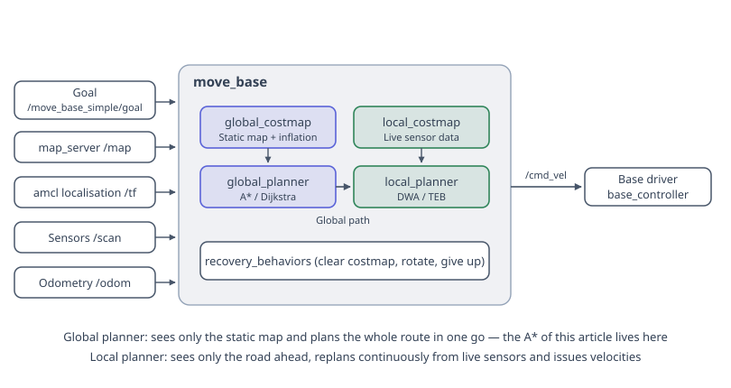
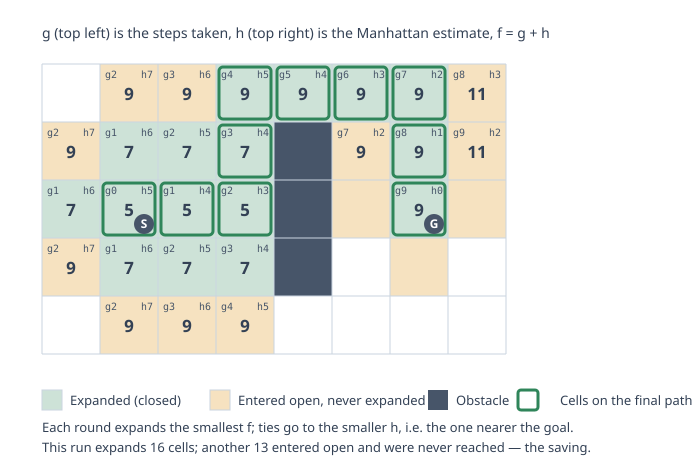
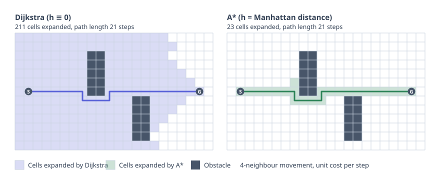
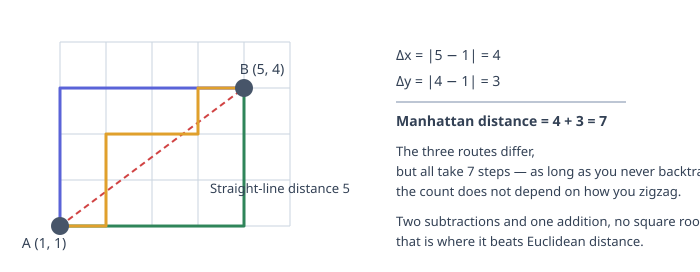

A\* is Dijkstra with a sense of direction: swapping the sorting criterion from "how far we've already come" to "how far we've already come plus an estimate of how far we still need to go." The difference this one change makes can be dramatic—in the comparison figure in this article, Dijkstra expands 211 cells on the same grid while A\* expands only 23, yet both produce paths of equal length.

<!-- more -->

## Where it fits in the navigation stack

Before diving into A\*, let's be clear about where it actually sits in the architecture. ROS's built-in `move_base` splits path planning into two layers:



- **Global planner** looks at the static map and computes the entire path from current position to goal once—setting the big direction. A\* and Dijkstra operate at this layer.
- **Local planner** takes this global path, plans only a small segment ahead, and repeatedly optimizes it using real-time sensor data to avoid collisions, drift, and ensure smooth execution. DWA and [TEB](/en/blogs/teb-algorithm/) operate at this layer.

So this article covers only "finding a path from A to B on a known grid map"—not whether the chassis can actually execute it. That's the local planner's job.

## Starting with Dijkstra

Dijkstra maintains each node's **known shortest distance** from the start $g(n)$, then repeatedly does one thing:

> From all unconfirmed nodes, pick the one with the smallest $g$, mark it as confirmed, and use it to update the $g$ of its neighbors.

It guarantees the shortest path because of a simple induction: when a node is picked, all unconfirmed nodes have $g$ values no smaller than it, and since edge weights are non-negative, any detour would be longer—at that moment, $g$ is already the true shortest distance.

The trade-off is that Dijkstra **has no idea where the goal is**. It simply radiates outward from the start in all directions, layer by layer, until the goal happens to be reached. If 80% of the cells point away from the goal, it processes them all anyway.

In scenarios requiring real-time re-planning, this waste is a killer. And in practice, we don't always need the strictly shortest path—walking a few extra steps is fine if we get a huge reduction in computation.

## Adding a sense of direction

Enter the **heuristic function** $h(n)$: it doesn't need to be exact, just roughly estimate "how much farther from $n$ to the goal." Then change the sorting criterion to

$$
f(n) = g(n) + h(n)
$$

$g(n)$ is the **actual cost already paid**, $h(n)$ is the **estimate of remaining cost**, and $f(n)$ is roughly "the total path length if we go from $n$ onward." Each step, we expand the node with the smallest $f$—this is A\*.

Two extremes are worth noting:

| How to choose $h$ | Result | Property |
| --- | --- | --- |
| $h \equiv 0$ | Degenerates to Dijkstra | Optimal, but slow |
| Consider only $h$, ignore $g$ | Greedy best-first search | Fast, but may go way off course |
| $f = g + h$ | A\* | Fast and optimal when $h$ is reasonable |

The greedy best-first approach (looking only at $h$) is often confused with A\*, but it charges straight at the goal and gets trapped in concave obstacles. The $g$ term's role is "remembering the cost already paid," pulling the algorithm back.

Here's what the three numbers on each cell look like during A\* expansion:



Notice the cells blocked by walls: their $g$ is still small, but the detour raises $f$, so the sort naturally pushes them back in the queue. The algorithm doesn't need to "know" there's a wall ahead—$f$ changes do the talking.

## How big is the difference?

Run Dijkstra and A\* on the same map and the gap is obvious:



Dijkstra explores nearly the entire map (211 cells), while A\* sweeps only a thin band from start to goal (23 cells), **and both paths are identical in length—21 steps each**.

The savings come from all those cells that are "clearly going the wrong way." You can see A\* briefly explores a few extra cells downward while navigating around the first wall—it doesn't know how long the wall is, so it has to feel its way out via rising $f$ values. This shows that the heuristic is just a "guess"; the better the guess, the more we save; a bad guess degrades back to Dijkstra.

## How to choose the heuristic function

The principle for choosing $h$ is: **it must match the actual movement rules on your map**.

- Four directions only (up, down, left, right) → **Manhattan distance**
- Eight directions (with diagonal) → **Octile distance** (or eight-neighbor distance)
- Any angle → **Euclidean distance**

$$
h_{\text{Manhattan}} = |x_1 - x_2| + |y_1 - y_2|
$$

$$
h_{\text{octile}} = (d_x + d_y) + (\sqrt{2} - 2)\min(d_x, d_y)
$$

$$
h_{\text{Euclid}} = \sqrt{(x_1 - x_2)^2 + (y_1 - y_2)^2}
$$

where $d_x = |x_1 - x_2|$ and $d_y = |y_1 - y_2|$, and the octile formula assumes straight movement costs 1 and diagonal costs $\sqrt{2}$.

Manhattan distance is the fastest—just two subtractions and one addition, no square root:



The three paths shown take different routes but all are 7 steps. As long as you don't backtrack, the step count is independent of the exact zigzag—this is why Manhattan distance is "accurate" on four-neighbor grids: it gives the true step count when there are no obstacles.

## When can we still guarantee the shortest path?

Here's a correction to a widespread misconception: **A\* is not "trading optimality for speed."** As long as $h$ satisfies this condition, A\* finds a path just as short as Dijkstra.

**Admissibility**: $h$ never overestimates the true remaining cost.

$$
h(n) \le h^{*}(n)
$$

where $h^{*}(n)$ is the true shortest cost from $n$ to the goal. Intuitively: if $h$ is conservative, then $f(n) = g(n) + h(n)$ is a lower bound on total path cost; once the goal is picked, all remaining queued nodes have lower bounds no smaller, so no shorter path is possible.

A stronger condition is **consistency** (or monotonicity), which requires $h$ to satisfy a triangle-inequality-like property:

$$
h(n) \le c(n, n') + h(n')
$$

A consistent $h$ is automatically admissible and guarantees that when a node is first expanded, its $g$ is already optimal—so we can safely add it to the closed set and never revisit it. Manhattan distance on four-neighbor grids and Euclidean distance on arbitrary graphs are both consistent.

**So when is A\* not optimal?** When $h$ overestimates. The classic case is exactly the scenario mentioned in the earlier article: the robot can move in eight directions, but you still use Manhattan distance as the heuristic.

From $(0,0)$ to $(4,4)$, the true path requires only 4 diagonal steps, but Manhattan distance reports 8—an overestimate by a factor of two. This makes the search **more aggressive**: fewer cells expanded, faster running, but the path might be longer than optimal.

In competitions, this is often a good trade-off: a few extra steps are fine if planning is twice as fast. **The key is knowing what you're trading for**, not mistakenly thinking A\* is inherently suboptimal.

Taken to the extreme, this becomes **weighted A\***:

$$
f(n) = g(n) + \varepsilon \cdot h(n), \qquad \varepsilon > 1
$$

The path length won't exceed $\varepsilon$ times the optimal—a dial you can turn. At $\varepsilon = 1$ it's plain A\*; larger $\varepsilon$ means faster and coarser.

## An easy detail to overlook: tie-breaking

On uniform-cost grids, many cells have equal $f$ values—within the rectangle from start to goal, all monotone paths have the same $f$. How you **break ties directly determines whether A\* looks like "a thin band" or "a big blob."**

A common rule is: when $f$ is equal, prefer the node with smaller $h$ (closer to the goal). Both figures above use this rule. Another approach is multiplying $h$ by a tiny coefficient (e.g., $1.0 + 10^{-3}$) to artificially create preference, at the cost of strict optimality loss.

## The code change is really just one line

With all this analysis, A\* and Dijkstra code look nearly identical—only the sorting key changes from $g$ to $g + h$:

```python
def a_star(start, goal, h):
    open_set = [(h(start), 0, start)]      # (f, g, node)
    g_score = {start: 0}
    parent = {}
    closed = set()

    while open_set:
        f, g, cur = heapq.heappop(open_set)   # Dijkstra pops by g here
        if cur in closed:
            continue
        if cur == goal:
            return reconstruct(parent, goal)
        closed.add(cur)

        for nxt, cost in neighbors(cur):
            if nxt in closed:
                continue
            ng = g + cost
            if ng < g_score.get(nxt, INF):
                g_score[nxt] = ng
                parent[nxt] = cur
                heapq.heappush(open_set, (ng + h(nxt), ng, nxt))   # the only difference
    return None
```

Replace `h` with a function that always returns 0 and this becomes Dijkstra.

## In ROS

The default global planner in `move_base` is `navfn`, which uses a variant of Dijkstra (Navigation Function). To switch to A\*, use the `global_planner` package, which exposes several options as parameters:

| Parameter | Default | Description |
| --- | --- | --- |
| `use_dijkstra` | `true` | Set to `false` to use A\* instead |
| `use_grid_path` | `false` | `true` strictly follows the grid; `false` uses gradient descent for smoother paths |
| `use_quadratic` | `true` | Use quadratic approximation for the potential field, more precise than linear |
| `cost_factor` | 0.55 | Coefficient for converting costmap values to planning costs |

Worth noting: the global planner operates on the `global_costmap`, and obstacles in the costmap are **expanded** (by the robot's radius), so whether "the planned path hits walls" largely depends on tuning the expansion parameters correctly—not on A\* itself.

## Summary

| | Dijkstra | A\* |
| --- | --- | --- |
| Sorting by | $g$ | $f = g + h$ |
| Expansion shape | Uniform radiating from start | Directional sweep along start–goal |
| Is it optimal? | Yes (non-negative weights) | Yes when $h$ is admissible |
| Example in this article | 211 cells | 23 cells |
| When to use | Distances to all nodes; or no suitable $h$ | Single point-to-point with a good $h$ |

One sentence: A\* is not "faster but worse Dijkstra," it's "Dijkstra that knows where the goal is." How well it works depends entirely on picking $h$ correctly.

## References

- P. E. Hart, N. J. Nilsson, B. Raphael. *A Formal Basis for the Heuristic Determination of Minimum Cost Paths.* IEEE Transactions on Systems Science and Cybernetics, 1968.
- I. Pohl. *Heuristic search viewed as path finding in a graph.* Artificial Intelligence, 1970. (Weighted A\*)
- [Amit's A\* Pages](https://theory.stanford.edu/~amitp/GameProgramming/) — the clearest resource on heuristics and tie-breaking
- [global_planner — ROS Wiki](https://wiki.ros.org/global_planner)
- <https://www.bilibili.com/video/BV1J64y1o7YW>
