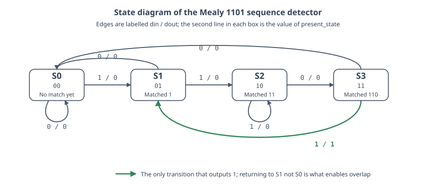
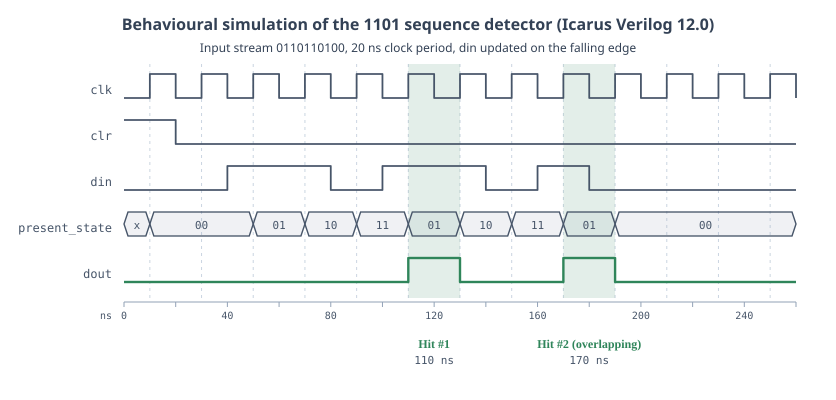
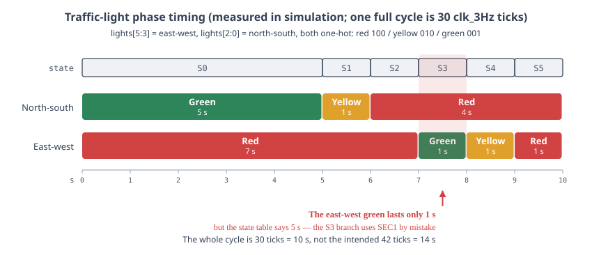

Two small designs using Mealy state machines on FPGA: a 1101 sequence detector and a traffic light controller.
<!--more-->

> This is a note from a 2020 digital circuits lab course. When I reorganized it in 2026, the three simulation screenshots that were originally hosted on object storage had long since expired. So I re-ran the code and test files from back then using [Icarus Verilog](https://steveicarus.github.io/iverilog/) 12.0, redrawing all figures from the simulation results. Along the way, I discovered two issues that went unnoticed back then, which I've included below.

## Mealy State Machines

There are two conventions for where the output of a finite state machine comes from:

- **Moore type**: the output depends only on the current state, $y = \lambda(S)$. The output follows the state register, naturally free of glitches, but often requires extra states.
- **Mealy type**: the output depends on both the current state **and the current input**, $y = \lambda(S, x)$. The same functionality usually requires fewer states, but the price is a combinatorial path from input straight to output, so glitches on the input pass through to the output unchanged.

The 1101 sequence detector illustrates this: a Moore design would need a fifth state just to indicate "just detected," whereas Mealy doesn't—"detection" is marked on an **edge**, not occupying a state.

The approach in this article takes one step further: the output `dout` is also registered (the C2 module in the code below uses `always @(posedge clk)`). This keeps the Mealy advantage of one fewer state while cutting off the combinatorial path and eliminating glitches; the cost is that `dout` goes high one clock cycle after "detection" actually occurs. This is often called a **registered-output Mealy machine**, and it's far more common in real engineering than a bare Mealy.

## 1101 Sequence Detector

### State Encoding

Four states, each representing "which prefix of 1101 have we matched so far":

| State | `present_state` | Meaning |
| ---- | --------------- | ---- |
| S0   | `00`            | No match yet |
| S1   | `01`            | Matched `1` |
| S2   | `10`            | Matched `11` |
| S3   | `11`            | Matched `110` |

Drawing out the state transition diagram:



A few edges that are easy to draw wrong deserve separate explanation:

- **S2 receiving `1` loops back to itself**, not to S0. Because the bitstream `111` still ends with `11`, so the prefix match length doesn't degrade.
- **S3 receiving `1` goes to S1, not S0**, and this is the only edge in the entire diagram that outputs `1`. Going to S1 means: in the just-matched `1101`, that final `1` can serve as the start of the next match. This edge enables **overlapping detection**—the bitstream `1101101` contains two `1101` sequences.
- **S1 receiving `0` goes to S0** because no suffix of `10` is a prefix of `1101`.

### Implementation Code

```verilog
`timescale 1ns / 1ps

module seqdetb(
    input wire clk,
    input wire clr,
    input wire din,
    output reg dout
    );

    reg [1:0] present_state, next_state;
    parameter S0=3'b00, S1=3'b01,S2=3'b10,S3=3'b11;
    //State register
    always @ (posedge clk or posedge clr)
        begin
            if (clr==1)
                present_state <= S0;
            else
                present_state <= next_state;
        end
        //C1 block
        always@ (*)
            begin
                case(present_state)
                    S0: if(din == 1)
                            next_state <= S1;
                        else
                            next_state <= S0;
                    S1: if(din == 1)
                            next_state <= S2;
                        else
                            next_state <= S0;
                    S2: if(din == 0)
                            next_state <= S3;
                        else
                            next_state <= S2;
                    S3: if(din == 1)
                            next_state <= S1;
                        else
                            next_state <= S0;
                    default
                        next_state <= S0;
                endcase
            end

        //C2 block
        always @ (posedge clk or posedge clr)
            begin
                if(clr==1)
                    dout <= 0;
                else if( (present_state == S3) && (din == 1))
                    dout <=1;
                else
                    dout <= 0;
            end
endmodule
```

The code itself is correct—functional simulation and synthesis both work fine. But there are two style issues that would draw lint complaints today:

- C1 is pure combinatorial logic and should use blocking assignment `=`. Here it uses `<=`, which happens to work when only one `always` block drives `next_state`, but breaks with race conditions the moment you split the combinatorial logic across multiple blocks.
- The `parameter S0=3'b00, ...` is declared as 3 bits, but `present_state` is `reg [1:0]`. On comparison and assignment, the high bit gets truncated, which just happens not to cause errors, but the bit widths should be aligned to 2 bits.

### The Original Test File Produces Nothing

The test file written back then looked like this:

```verilog
`timescale 1ns / 1ps

module seqdetb_test(
    );
    reg clk;
    reg clr;
    reg din;
    wire dout;
    parameter period = 100;
    seqdetb seqdetb1(
    .clk(clk), .clr(clr), .din(din), .dout(dout)
    );
    initial
        begin
            clk = 0;
            clr = 1;
            din = 0;
        end

    always #(period/2)  begin clk = ~clk;  end
    always #(period*2)  begin din = ~din;  end
    always #period      begin clr = ~clr;  end
endmodule
```

The clock period is 100 ns, and `clr` toggles every 100 ns—**the reset signal is high half the time**, clearing the state machine back to S0 on every cycle. Meanwhile, `din` only toggles every 200 ns, so it changes only once every two clock cycles and can never produce a `1101` pattern.

Running it through Icarus Verilog for 1000 ns gives:

- `dout` stays `0` from 0 ns onward, never changing;
- `present_state` briefly reaches `01` (S1) only at 350 ns and 750 ns, never entering S2 or S3.

So the simulation screenshot in the original article actually shows nothing—`dout` is just a flat low line. I didn't notice at the time and went straight to synthesis.

### The Corrected Test File

To verify the detector, we need `clr` high only at the start, then feed the bitstream one bit per clock. Here we feed `0110110100`, which contains two **overlapping** `1101` sequences:

```verilog
`timescale 1ns / 1ps

module seqdetb_tb;
    reg clk = 0;
    reg clr = 1;
    reg din = 0;
    wire dout;
    integer i;
    reg [0:9] stream = 10'b0110110100;

    seqdetb uut(.clk(clk), .clr(clr), .din(din), .dout(dout));

    always #10 clk = ~clk;          // 20 ns period

    initial begin
        clr = 1;
        @(negedge clk);             // Reset held for one cycle
        clr = 0;
        for (i = 0; i < 10; i = i + 1) begin
            din = stream[i];        // Change bit at falling edge to avoid setup/hold window
            @(negedge clk);
        end
        din = 0;
        repeat (2) @(negedge clk);
        $finish;
    end
endmodule
```

The resulting waveform:



Checking cycle by cycle (the `din` column is the value sampled on the rising edge, the `present_state` column is the new state after that rising edge):

| Rising edge | `din` | `present_state` | Transition | `dout` |
| ------ | ----- | --------------- | ---- | ------ |
| 30 ns  | 0 | `00` | S0 → S0 | 0 |
| 50 ns  | 1 | `01` | S0 → S1 | 0 |
| 70 ns  | 1 | `10` | S1 → S2 | 0 |
| 90 ns  | 0 | `11` | S2 → S3 | 0 |
| 110 ns | 1 | `01` | S3 → S1 | **1** |
| 130 ns | 1 | `10` | S1 → S2 | 0 |
| 150 ns | 0 | `11` | S2 → S3 | 0 |
| 170 ns | 1 | `01` | S3 → S1 | **1** |
| 190 ns | 0 | `00` | S1 → S0 | 0 |

The two detections correspond exactly to the two `1101` sequences in the bitstream, with the second one overlapping—the final `1` of the first `1101` is also the first `1` of the second. At 110 ns, the state jumps from S3 to S1 rather than S0; that's what enables overlapping detection.

Each `dout` pulse is high for exactly one clock cycle, and appears one cycle after "the last `1` was sampled," which is the latency introduced by registering the output.

> A simulation gotcha: if you use `$display` inside `always @(posedge clk)` to print `dout`, you get **the previous cycle's** value. Because `dout` uses non-blocking assignment, the update happens after `$display` executes. The table and figure above came from reading the VCD waveform file directly, not from `$display`.

After synthesis, the design successfully generates a BitStream file.

## Traffic Light Controller with State Machine

### State Transition Table

| State | North-South | East-West | Duration/s |
| ---- | -------- | -------- | ------ |
| 0    | Green       | Red       | 5      |
| 1    | Yellow       | Red       | 1      |
| 2    | Red       | Red       | 1      |
| 3    | Red       | Green       | 5      |
| 4    | Red       | Yellow       | 1      |
| 5    | Red       | Red       | 1      |

States S2 and S5 have identical light colors (both directions red), serving as the intersection all-red interval; they're distinguished by state because "who gets green next" differs.

### Implementation

```verilog
`timescale 1ns / 1ps

module traffic(
    input wire clk_3Hz,
    input wire clr,
    output reg [5:0] lights
    );

    reg [2:0] state;
    reg [3:0] count;
    parameter S0=3'b000, S1=3'b001, S2=3'b010,//states
                S3=3'b011, S4=3'b100, S5=3'b101;
    parameter SEC5=4'b1110, SEC1=4'b0010;
    always @ (posedge clk_3Hz or posedge clr)
        begin
            if(clr==1)
                begin
                    state <= S0;
                    count <= 0;
                end
            else
                case(state)
                    S0:
                        if(count<SEC5)
                            begin state <= S0; count <= count +1; end
                        else
                            begin state <= S1; count <= 0; end
                    S1:
                        if(count<SEC1)
                            begin state <= S1; count <= count +1; end
                        else
                            begin state <= S2; count <= 0; end
                    S2:
                        if(count<SEC1)
                            begin state <= S2; count <= count +1; end
                        else
                            begin state <= S3; count <= 0; end
                    S3:
                        if(count<SEC1)                  // ← Should be SEC5
                            begin state <= S3; count <= count +1; end
                        else
                            begin state <= S4; count <= 0; end
                    S4:
                        if(count<SEC1)
                            begin state <= S4; count <= count +1; end
                        else
                            begin state <= S5; count <= 0; end
                    S5:
                        if(count<SEC1)
                            begin state <= S5; count <= count + 1; end
                        else
                            begin state <= S0; count <= 0; end
                    default state <= S0;
                    endcase
                end
            always @(*)
                begin
                    case(state)
                        S0: lights=6'b100001;
                        S1: lights=6'b100010;
                        S2: lights=6'b100100;
                        S3: lights=6'b001100;
                        S4: lights=6'b010100;
                        S5: lights=6'b100100;
                        default lights=6'b100001;
                    endcase
                end
endmodule
```

### Bit Allocation for `lights`

The original article didn't explain how these 6 bits map; I had to reverse-engineer it from the code: high 3 bits are east-west, low 3 bits are north-south, each group using **one-hot encoding**.

| Bits | Direction | `100` | `010` | `001` |
| ---- | ---- | ----- | ----- | ----- |
| `lights[5:3]` | East-West | Red | Yellow | Green |
| `lights[2:0]` | North-South | Red | Yellow | Green |

Verifying with S3's `6'b001100`: high 3 bits `001` = east-west green, low 3 bits `100` = north-south red, which matches the state table.

The top-level module connects `lights` directly to `ld[5:0]`, the six LEDs on the dev board.

### Timing Constants

`SEC5 = 4'b1110 = 14` and `SEC1 = 4'b0010 = 2`. The condition `count < SECn` continues the same state, so actual duration is $\text{SECn} + 1$ cycles: `SEC5` holds 15 cycles, `SEC1` holds 3 cycles. With a 3 Hz clock, 15 cycles = 5 s and 3 cycles = 1 s, matching the state table.

### Simulation Results and the S3 Bug

```verilog
`timescale 1ns / 1ps

module traffic_tb;
    reg clk_3Hz = 0;
    reg clr = 1;
    wire [5:0] lights;
    traffic uut(.clk_3Hz(clk_3Hz), .clr(clr), .lights(lights));

    always #10 clk_3Hz = ~clk_3Hz;

    initial begin
        clr = 1;
        @(negedge clk_3Hz);     // Deassert reset on falling edge to avoid race
        clr = 0;
        #1300 $finish;
    end
endmodule
```

The "3 Hz" in simulation is just a label; the clock runs at 20 ns period for speed. The seconds in the figure below are calculated as 3 cycles = 1 s.



One complete cycle measured: S0 holds 15 cycles, S1–S5 each hold 3 cycles, total **30 cycles = 10 s**. But according to the table, S0 and S3 should each be 5 s, so the cycle should be $15 + 3 + 3 + 15 + 3 + 3 = 42$ cycles $= 14$ s.

The discrepancy is in S3: **the condition in the S3 branch is `count < SEC1` but should be `SEC5`**. As a result, east-west green is only 1 second while north-south green is 5 seconds—the intersection timing is biased. One line fix:

```verilog
                    S3:
                        if(count<SEC5)
                            begin state <= S3; count <= count +1; end
                        else
                            begin state <= S4; count <= 0; end
```

The expired simulation screenshot from back then probably showed this bug too, but I didn't count the cycles carefully. It's a good reminder that "the waveform looks like it's changing" is not the same as "the simulation is correct"—you have to compare the waveform against the numbers in your design document.

> One more detail: the original test file had `clr=1; #10; clr=0;`, and the first rising edge of `always #10 clk_3Hz=~clk_3Hz;` also happens at 10 ns—they race. Icarus reports the first S0 as only 14 cycles, then stabilizes at 15. Moving reset deassertion to the falling edge eliminates this issue.

### Frequency Divider

The dev board crystal is 100 MHz; to get 3 Hz we divide:

```verilog
`timescale 1ns / 1ps

module clkdiv(
    input wire clk_100MHz,
    input wire clr,
    output wire clk_3Hz
    );
    reg [24:0] q;
    //25bit counter
    always @ (posedge clk_100MHz or posedge clr)
        begin
            if(clr==1)
                q <= 0;
            else
                q <= q + 1;
        end
    assign clk_3Hz=q[24] ;//3Hz
endmodule
```

`q[24]` toggles every $2^{24}$ input cycles; one complete period is $2^{25}$ input cycles:

$$
f = \frac{100\ \text{MHz}}{2^{25}} = \frac{10^8}{33554432} \approx 2.98\ \text{Hz}
$$

For a traffic light, this error is negligible. One thing to note: the `clk_3Hz` produced this way is **one bit from a combinatorial counter**, and using it directly as a clock drives regular routing instead of the global clock network. On larger designs this causes clock skew problems. The proper approach is to generate a clock-enable signal and run all registers at 100 MHz, using the enable to reduce speed. This works fine on a lab board, but don't copy it for a real project.

### Top-Level Module

```verilog
`timescale 1ns / 1ps

module traffic_lights_top(
    input wire clk_100MHz,
    input wire [4:4] s,
    output wire [5:0] ld
    );
    wire clr, clk_3Hz;
    assign clr=s;
    clkdiv U1(.clk_100MHz(clk_100MHz),
                .clr(clr),
                .clk_3Hz(clk_3Hz)
              );
    traffic U2(.clk_3Hz(clk_3Hz),
                .clr(clr),
                .lights(ld)
              );
endmodule
```

The `input wire [4:4] s` is a single-bit slice, written this way to directly map to the dev board's DIP switch `SW4` in the constraints file, using it as reset.

After synthesis, BitStream generation succeeds.

## Reproduction

The two waveforms above were generated like this (Icarus Verilog 12.0, Ubuntu 24.04):

```bash
iverilog -g2012 -o seqdet.vvp seqdetb.v seqdetb_tb.v && vvp seqdet.vvp
```

Add `$dumpfile("x.vcd"); $dumpvars(0, module_name);` to the test file to export the VCD, then view it with [GTKWave](https://gtkwave.sourceforge.net/) or [Surfer](https://surfer-project.org/). Vivado's built-in simulator gives the same results, just without having to write those two lines by hand.
