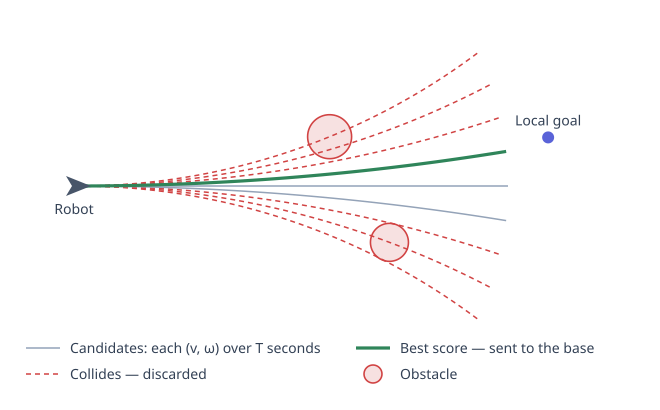
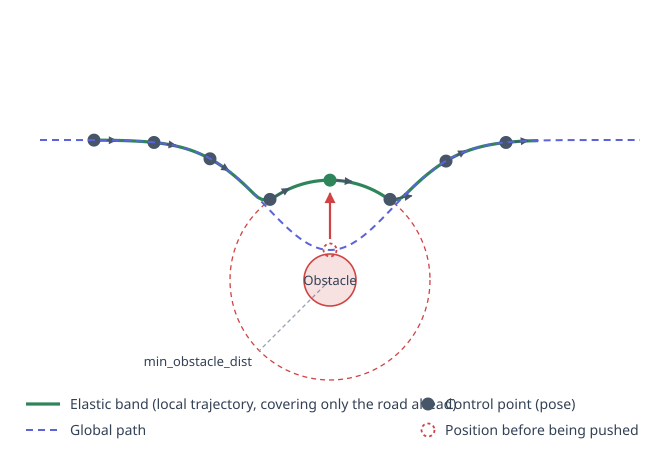
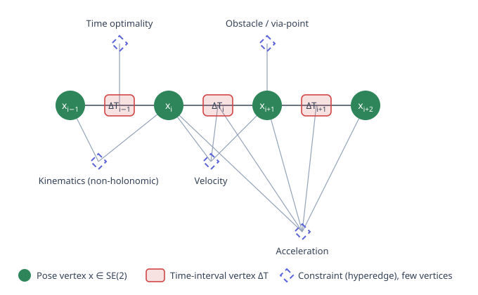

TEB (Timed Elastic Band) formulates local trajectory planning as a sparse nonlinear least-squares problem. This article starts with where elastic bands came from, how they're modeled as a hypergraph, how to squeeze inequality constraints into least squares, why it can run at 20 Hz, and finally a parameter reference.

<!-- more -->

## What problem does the local planner solve?

The global planner in the navigation stack outputs a **geometric path**: it knows what the map looks like, but has no idea whether your robot can actually follow that line. It might squeeze you through a gap narrower than the robot itself, might require you to shift sideways in place, or might place a turning point at a corner with curvature too tight for your chassis to handle. Plus it's computed on a **static** map—it knows nothing about a person who suddenly appears after planning is done.

The local planner is responsible for bringing this path to life: looking only at a small section ahead, combining real-time sensor data and the chassis's own capabilities, producing velocity commands that can be sent directly to the chassis.

## First, how DWA does it

DWA (Dynamic Window Approach) is very straightforward in its thinking: since what ultimately needs to be sent is a pair $(v, \omega)$, just **sample directly in velocity space**.

The chassis has upper and lower limits on linear and angular velocity. Combined with the current velocity and acceleration limits, the set of reachable $(v,\omega)$ pairs in the next control cycle forms a finite rectangular region—this is the "dynamic window". Sample uniformly some $(v,\omega)$ pairs from this window, assume each stays constant for the next $T$ seconds, and you can compute a corresponding circular arc trajectory (uniform circular motion; it degenerates to a line when angular velocity is zero). Then check each one: toss out trajectories that hit obstacles, score the rest with a weighted evaluation function—how far from the global path, angular error toward the goal, distance to nearest obstacle, speed—pick the one with the highest score and send its corresponding $(v,\omega)$ down.



The problem with DWA is that its search space has only two dimensions, and it merely **samples** rather than **optimizes**:

- Throughout the $T$ seconds, velocity is constant—can't express maneuvers like "slow down to turn, then speed up" that require changing speed;
- The evaluation function is a weighted sum of terms; the dimensionless trade-offs between weights are all hand-tuned, and different scenarios often require re-tuning;
- It easily gets stuck in local minima in narrow corridors and U-shaped obstacles—all candidate trajectories score poorly, but it can only pick the least bad one;
- Backing up and repeated back-and-forth adjustments, moves that require "backing up a step then going forward", are hard to naturally emerge from sampling.

## From Elastic Bands to Timed Elastic Bands

TEB's ancestor is the **Elastic Band** proposed by Quinlan and Khatib in 1993. The idea is: imagine the global path as a rubber band that has **internal forces** from its own contraction (making the path shorter and smoother) and **external forces** from obstacles pushing it away. Under the balance of these two forces, the rubber band deforms to a new shape—this is the corrected path. As obstacles move, the rubber band deforms in real time—no replanning needed.

But elastic bands have a fundamental flaw: **they're just a path with no time dimension**. How long it takes to traverse any two points on the path, what velocity you're at when you reach that spot—the elastic band knows none of these. So velocity limits, acceleration limits, nonholonomic constraints—anything time-related—it can't express at all; these have to be computed separately and tacked on afterward as a velocity profile, and this profile may not be compatible with the path shape.

In 2012, Rösmann and colleagues made one essential change: **make the time interval between adjacent poses another optimization variable**.

Now "path" becomes "trajectory," and $v$, $\omega$, $a$ can all be computed directly from the variables; kinematics and dynamics constraints finally have a place to exist. And since time is now a variable, "total time as short as possible" can be written directly into the objective—TEB is naturally time-optimal.

## Formalization

A TEB consists of two parts. **Pose sequence**:

$$
Q = \{\mathbf{x}_i\}_{i=0}^{n-1},\qquad
\mathbf{x}_i = (x_i,\ y_i,\ \beta_i)^{\mathsf T} \in \mathbb{R}^2 \times S^1
$$

and **time interval sequence**:

$$
\tau = \{\Delta T_i\}_{i=0}^{n-2}
$$

where $\Delta T_i$ is the time the robot takes to move from $\mathbf{x}_i$ to $\mathbf{x}_{i+1}$. Together:

$$
\mathcal{B} = (Q,\ \tau)
$$

The planning problem is to solve

$$
\mathcal{B}^{*} = \arg\min_{\mathcal{B}} \; \sum_{k} \gamma_k \, f_k(\mathcal{B})
$$

Each term $f_k$ is the cost of one class of constraints (velocity, acceleration, obstacles, time, ...), and $\gamma_k$ is its corresponding weight. Note that the start $\mathbf{x}_0$ and end $\mathbf{x}_{n-1}$ are fixed and don't participate in optimization.

The key point is that **each term is written in squared form** $f_k = \sum e_k^2$, so the whole problem is a nonlinear least squares that can be handed directly to g2o and solved with Levenberg–Marquardt. The weight $\gamma_k$ is the information matrix of each edge in g2o.

### How to squeeze inequality constraints into least squares

Least squares naturally handles only "equals zero" residuals, but "speed not exceeding 0.4" is an inequality. TEB's approach is to introduce **piecewise linear penalty functions**: when the constraint is satisfied, the residual is always zero (contributing nothing to the objective); when violated, the residual grows linearly with the violation amount.

Lower bound constraint $x > a$:

$$
e_{>}(x, a, \varepsilon) =
\begin{cases}
a + \varepsilon - x, & x < a + \varepsilon \\[2pt]
0, & \text{otherwise}
\end{cases}
$$

Interval constraint $a < x < b$:

$$
e_{[\,]}(x, a, b, \varepsilon) =
\begin{cases}
a + \varepsilon - x, & x < a + \varepsilon \\[2pt]
0, & a + \varepsilon \le x \le b - \varepsilon \\[2pt]
x - (b - \varepsilon), & x > b - \varepsilon
\end{cases}
$$

Here $\varepsilon$ (parameter `penalty_epsilon`) moves the boundary **inward** into the interval as a safety margin. Because penalty methods are fundamentally soft constraints, the solution converges only near the boundary rather than strictly inside it. A small margin ensures the final result truly stays in the legal range. The downside: increasing $\varepsilon$ prevents the robot from reaching its nominal maximum speed.

## Various constraints

### Velocity

Velocity is determined by two adjacent poses and the time interval between them. Denote

$$
\Delta \mathbf{p}_i = \begin{pmatrix} x_{i+1} - x_i \\ y_{i+1} - y_i \end{pmatrix},
\qquad
\Delta \beta_i = \mathrm{normalize}(\beta_{i+1} - \beta_i)
$$

The naive approach treats the distance between two points as the travel distance, i.e., $\lVert \Delta\mathbf{p}_i \rVert$. But the robot actually travels along a circular arc, so there's an "exact arc length" option (`exact_arc_length`): two poses uniquely determine a circular arc segment, whose radius and arc length are

$$
r_i = \frac{\lVert \Delta\mathbf{p}_i \rVert}{2\sin(\Delta\beta_i / 2)},
\qquad
s_i = \lvert \Delta\beta_i \cdot r_i \rvert
$$

Thus

$$
v_i = \frac{s_i}{\Delta T_i} \cdot \operatorname{sgn}\!\left(
\Delta\mathbf{p}_i^{\mathsf T}
\begin{pmatrix}\cos\beta_i \\ \sin\beta_i\end{pmatrix}
\right),
\qquad
\omega_i = \frac{\Delta \beta_i}{\Delta T_i}
$$

That sign term determines whether this step is forward or backward: project the displacement onto the current heading direction—same direction gives positive, opposite gives negative. The implementation doesn't use a true $\operatorname{sgn}$ but a steep sigmoid approximation instead, because $\operatorname{sgn}$ is non-differentiable at zero and would corrupt gradients.

The residuals are

$$
e_v = e_{[\,]}(v_i,\ -v_{\text{back,max}},\ v_{\max},\ \varepsilon),
\qquad
e_\omega = e_{[\,]}(\omega_i,\ -\omega_{\max},\ \omega_{\max},\ \varepsilon)
$$

Note that forward and backward speed limits are separate (`max_vel_x` and `max_vel_x_backwards`).

### Acceleration

Acceleration needs **three poses and two time intervals**—first compute the velocities of the two segments, then take the difference:

$$
a_i = \frac{2\,(v_{i+1} - v_i)}{\Delta T_i + \Delta T_{i+1}},
\qquad
\dot\omega_i = \frac{2\,(\omega_{i+1} - \omega_i)}{\Delta T_i + \Delta T_{i+1}}
$$

The denominator is half the sum of the two time intervals ($v_i$ is the average velocity of segment $i$, considered to occur at the midpoint of that segment; the two midpoints are separated by $(\Delta T_i + \Delta T_{i+1})/2$). Again, apply interval penalties.

The two ends also have separate edges to connect the acceleration at the trajectory start to **current actual velocity**—otherwise the planned first step might require the chassis to change speed instantaneously.

### Nonholonomic kinematic constraint

This is the most interesting term in TEB. A differential-drive chassis can't slide sideways, so adjacent poses must be connectable by a single **constant-curvature circular arc**. This condition is:

$$
\left[
\begin{pmatrix}\cos\beta_i \\ \sin\beta_i\end{pmatrix}
+
\begin{pmatrix}\cos\beta_{i+1} \\ \sin\beta_{i+1}\end{pmatrix}
\right]
\times \Delta\mathbf{p}_i = 0
$$

Expanding to a scalar (2D cross product):

$$
h_i = \big\lvert (\cos\beta_i + \cos\beta_{i+1})\,\Delta y_i - (\sin\beta_i + \sin\beta_{i+1})\,\Delta x_i \big\rvert = 0
$$

Geometric meaning: the direction of the sum of the two heading vectors is their angular bisector, and requiring it to be parallel to the displacement vector $\Delta\mathbf{p}_i$ is equivalent to **the chord bisecting the headings at both ends**—this is exactly the property of a circular arc. Satisfy it, and this step is what the chassis can actually drive; violate it, and it means there has to be a sideways shift in the middle.

This is an **equality** constraint, no need for a penalty function; write the residual directly as the absolute value. Its weight `weight_kinematics_nh` defaults to as high as 1000, orders of magnitude larger than other terms—because it's not a "preference," it's a physical impossibility.

The same edge also carries a second residual, requiring $\Delta\mathbf{p}_i$'s projection onto the heading to be positive, i.e., favoring forward over backward. Its weight is `weight_kinematics_forward_drive`, which defaults to only 1, so when backing up is needed, it yields.

For Ackermann (car-like) chassis (`min_turning_radius > 0`), the second residual is replaced with a minimum turning radius constraint:

$$
e_r = e_{>}\!\left(\left\lvert \frac{\lVert \Delta\mathbf{p}_i \rVert}{2\sin(\Delta\beta_i/2)} \right\rvert,\ r_{\min},\ 0\right)
$$

### Obstacles

For each pose and each obstacle:

$$
e_{\text{obs}} = e_{>}\big(d(\mathbf{x}_i,\ \mathcal{O}_j),\ d_{\min},\ \varepsilon\big)
$$

$d(\cdot)$ comes from the robot's shape model (point, circle, two circles, line segment, polygon), and $d_{\min}$ is `min_obstacle_dist`. When distance exceeds the safety distance, cost is zero; when smaller, it grows linearly, pushing control points outward.



With only hard constraints, the robot walks right along the safety distance edge—going farther away doesn't lower cost. So there's also an "inflation" edge (`inflation_dist`, default 0.6 > `min_obstacle_dist` 0.5), applying small nonzero cost over a larger range to make trajectories prefer to stay a bit farther from obstacles. This term's weight (`weight_inflation`) is very small, a preference rather than a constraint.

One engineering detail: associating **every** obstacle with **every** pose would explode the edge count. The implementation only associates an obstacle with the pose in the trajectory nearest to it, plus several neighbors on each side (`obstacle_poses_affected`, default 30).

### Global path guidance

TEB only optimizes a small section ahead (`max_global_plan_lookahead_dist`, default 3 meters), but can't deform however it likes—it must follow the global path, otherwise after dodging an obstacle it might wander onto a different route entirely.

The implementation extracts a sequence of **path points** (via-points) from the global path at intervals of `global_plan_viapoint_sep`, then penalizes the trajectory's distance to these points. This parameter defaults to $-0.1$; negative means **disabled**—so by default this guidance is off, relying on the trajectory start/end being pinned and the natural "take the shortcut" tendency from the time-optimal term. Turn it on only when you need to hug the global path (like in corridors or lanes).

### Time optimal

The simplest term: each time interval by itself is a single-variable edge, and the residual equals it directly.

$$
f_{\text{time}} = \sum_i \Delta T_i^{\,2}
$$

Squaring has two effects: **total time gets shorter** (every term wants to be small), and **time intervals become uniform** (with total sum fixed, the sum of squares is minimized when all terms are equal). The latter corresponds exactly to "don't spike the accelerator then slam the brakes"—uniform time intervals mean smooth velocity changes.

## Hypergraph and sparsity

Each constraint above involves only **a few** variables: time optimal 1, obstacles 1, kinematics 2, velocity 3, acceleration at most 5. No term needs to see the entire trajectory.

Treating poses and time intervals as vertices and each constraint as a **hyperedge** connecting several vertices, the whole problem is a hypergraph:



This is exactly g2o's input format. And because edges only connect vertices **with adjacent indices**, the Hessian matrix of this graph is **banded sparse**—the vast majority of elements are always zero. g2o uses sparse Cholesky decomposition to solve, and complexity scales essentially linearly with trajectory length instead of cubic with dense solving. This is the direct reason TEB can run at 20 Hz on embedded platforms.

## Optimization loop

One `optimizeTEB` is a double loop: outer loop `no_outer_iterations` (default 4), inner loop `no_inner_iterations` (default 5). Each outer loop round does three things:

1. **Autosize**: adjust the number of poses. If some $\Delta T_i$ exceeds `dt_ref + dt_hysteresis`, insert a pose in the middle; if less than `dt_ref - dt_hysteresis`, delete one. This way temporal resolution stays near `dt_ref` (default 0.3 s), while trajectory length can grow or shrink freely.
2. **Rebuild graph**: since the number of poses changed, obstacle nearest-neighbor associations change too, so rebuild the graph each round.
3. **Run LM**: inner loop iterates several times, then clear the graph.

There's one easily-overlooked detail: after each outer loop round, the obstacle term's weight is multiplied by `weight_adapt_factor` (default 2.0). In other words, obstacle constraints are **tightened round by round**—start loose to let the trajectory take rough shape, then push it away from obstacles over later rounds. This converges more easily than using a large weight from the start.

Finally, the velocity command sent is taken from the **beginning** of the trajectory: reverse-compute $(v, \omega)$ from $\mathbf{x}_0$, $\mathbf{x}_k$, and the time sum between them, where $k$ is determined by `control_look_ahead_poses`. The rest of the trajectory gets re-optimized next cycle—this is a typical receding horizon approach.

## Local minima and homotopy classes

Up to here, TEB still faces an unavoidable problem: **it's a local optimization**. If there's a pillar in front, do you go around the left or the right? They're topologically different paths separated by a cost ridge. Gradient descent takes you to the bottom of the current "valley," it never crosses the ridge to see if the other side is better.

TEB's solution: **optimize multiple paths in parallel**. The approach:

1. Sample points between start and goal to build a graph (like PRM), search for several topologically different candidate paths;
2. Use **H-signature** to judge whether two paths belong to the same homotopy class. This is an invariant from complex analysis—treat the plane as the complex plane, each obstacle center $\zeta_l$ as a pole, and do a line integral along the trajectory:

$$
\mathcal{H} = \int_{\mathcal{T}} \sum_{l} \frac{A_l}{z - \zeta_l}\ \mathrm{d}z,
\qquad
A_l = \frac{f_0(\zeta_l)}{\prod_{j \ne l}(\zeta_l - \zeta_j)}
$$

By the residue theorem, this integral's value depends only on how the trajectory winds around each pole, independent of the trajectory's exact shape. If two trajectories' $\mathcal{H}$ values are equal, they can continuously deform into each other and belong to the same class—keep just one. In implementation, accumulate $A_l\left[\ln(z_{m+1}-\zeta_l) - \ln(z_m-\zeta_l)\right]$ along trajectory segments; complex logarithm is multi-valued, so take the branch where the argument difference is smallest in absolute value.

3. Keep one path per class, run full TEB optimization for each (at most `max_number_classes`), then compare total costs and execute the best one.

When considering dynamic obstacles (`include_dynamic_obstacles`), homotopy classes are judged in 3D $x$-$y$-$t$ spacetime—passing in front of an obstacle versus detouring around it may look the same when projected onto the plane but is completely different in spacetime.

This whole thing is on by default (`enable_homotopy_class_planning`; note it's a static ROS parameter, not in dynamic_reconfigure—restart needed if you change it). The price is computation grows by orders of magnitude—the 18 parameters in the `HCPlanning` group basically all control this component's overhead.

## Test drive

The package comes with a test node that doesn't require a real robot; you can drag obstacles around and watch the trajectory deform in real time:

```shell
roslaunch teb_local_planner test_optim_node.launch
```

Use rqt for tuning:

```shell
rosrun rqt_reconfigure rqt_reconfigure
```

## Parameter quick reference

`teb_local_planner` exposes **95 parameters in dynamic_reconfigure, divided into 12 groups**:

| Group | Count | Manages |
| --- | --- | --- |
| Trajectory | 15 | Temporal resolution, automatic pose insertion/deletion, lookahead distance, exact arc length switch |
| ViaPoints | 2 | Interval and orientation for extracting path points from the global path |
| Robot | 8 | Velocity/acceleration limits, robot shape model |
| Carlike | 3 | Minimum turning radius, steering angle and angular rate |
| Omnidirectional | 3 | Lateral and diagonal speed limits for omnidirectional chassis |
| GoalTolerance | 5 | Goal reached criteria (position and heading tolerances) |
| Obstacles | 10 | Safety distance, inflation, costmap association, dynamic obstacle prediction |
| Reduce velocity near obstacles | 3 | Auto-reduce speed when close to obstacles |
| Optimization | 24 | Individual term weights, inner/outer iteration counts, penalty margins |
| HCPlanning | 18 | Graph search and filtering for homotopy class parallel planning |
| Recovery | 2 | Temporarily shrink robot footprint when stuck to escape |
| Divergence Detection | 2 | Detect optimization divergence and abort |

Picking the most commonly tweaked parameters from the constraint classes above (default values from the `noetic-devel` branch's `TebLocalPlannerReconfigure.cfg`; what actually takes effect is what's in your yaml):

| Constraint | Parameter | Default | Explanation |
| --- | --- | --- | --- |
| Temporal resolution | `dt_ref` | 0.3 | Target time interval between adjacent poses, usually set to the scale of the control period |
| | `dt_hysteresis` | 0.1 | Hysteresis band for insertion/deletion, typically 10% of `dt_ref` |
| | `teb_autosize` | True | Whether to auto-insert/delete poses during optimization |
| Lookahead range | `max_global_plan_lookahead_dist` | 3.0 | Maximum global path length participating in optimization (meters); 0 means unlimited |
| Obstacles | `min_obstacle_dist` | 0.5 | Desired minimum distance from obstacles |
| | `inflation_dist` | 0.6 | Inflation band width; must be greater than `min_obstacle_dist` to take effect |
| | `obstacle_poses_affected` | 30 | How many neighbors on each side of the nearest pose each obstacle associates with |
| | `weight_obstacle` | 50 | Obstacle term weight (further multiplied by `weight_adapt_factor` each outer iteration) |
| Kinematics / Dynamics | `max_vel_x` | 0.4 | Maximum forward linear velocity |
| | `max_vel_x_backwards` | 0.2 | Maximum backward linear velocity |
| | `max_vel_theta` | 0.3 | Maximum angular velocity |
| | `acc_lim_x` | 0.5 | Maximum linear acceleration |
| | `acc_lim_theta` | 0.5 | Maximum angular acceleration |
| | `min_turning_radius` | 0.0 | Minimum turning radius; set to 0 for differential drive |
| | `weight_kinematics_nh` | 1000 | Nonholonomic constraint weight; it's a hard physical constraint, don't reduce |
| | `weight_kinematics_forward_drive` | 1 | Penalizes backing up; increase to discourage backing |
| Global path guidance | `global_plan_viapoint_sep` | -0.1 | Path point extraction interval; negative means disabled |
| | `weight_viapoint` | 1 | Weight for matching path points |
| Fastest path | `weight_optimaltime` | 1 | Time-optimal term weight; increase for more aggressive time optimization |
| Solver | `no_inner_iterations` | 5 | How many times LM runs per outer iteration |
| | `no_outer_iterations` | 4 | Number of outer iterations (each rebuilds autosize and graph) |

## DWA and TEB side by side

| | DWA | TEB |
| --- | --- | --- |
| Decision variables | A single $(v, \omega)$ pair, 2D | Entire trajectory's poses and time intervals, $3n + (n-1)$ dimensional |
| Solving method | Sample in velocity space then score | Nonlinear least-squares optimization |
| Time | Fixed simulation duration, constant speed within a segment | Time intervals are decision variables |
| Time optimality | Only indirect through "faster speed scores higher" | Direct in the objective function |
| Backing up / multiple adjustments | Hard to naturally emerge | Supported; leanings tunable by weight |
| Ackermann chassis | Needs extra handling | Built-in minimum turning radius constraint |
| Local minima | No dedicated mechanism | Homotopy class parallel planning |
| Computation | Small and constant | Large but controllable (sparse structure + capped iteration) |

One sentence: DWA **picks** one reasonable option from a tiny search space; TEB **optimizes** a good solution from a huge search space. The price is an order of magnitude more parameters and an order of magnitude more tuning hassle.

## References

- S. Quinlan, O. Khatib. *Elastic bands: connecting path planning and control.* ICRA 1993.
- C. Rösmann et al. *Trajectory modification considering dynamic constraints of autonomous robots.* ROBOTIK 2012.
- C. Rösmann et al. *Efficient trajectory optimization using a sparse model.* ECMR 2013.
- C. Rösmann et al. *Integrated online trajectory planning and optimization in distinctive topologies.* Robotics and Autonomous Systems, 2017.
- S. Bhattacharya et al. *Search-based path planning with homotopy class constraints.* AAAI 2010.
- R. Kümmerle et al. *g2o: A general framework for graph optimization.* ICRA 2011.
- Source code: [rst-tu-dortmund/teb_local_planner](https://github.com/rst-tu-dortmund/teb_local_planner) (equations in the article correspond to the `noetic-devel` branch's `g2o_types/` directory)
- Documentation: [teb_local_planner — ROS Wiki](https://wiki.ros.org/teb_local_planner)
