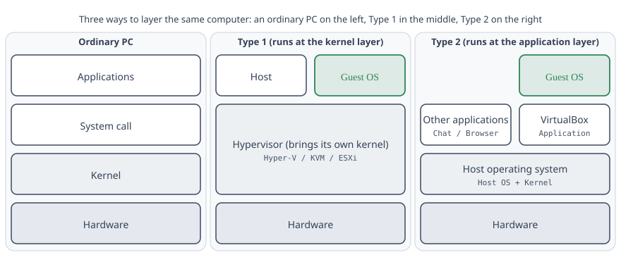

> This is a quick-start guide on how to install an Ubuntu virtual machine using VirtualBox.
> It covers some basic knowledge about computers and virtual machines, as well as how to set up an Ubuntu VM in VirtualBox.
> The writing was hurried and impatient, hence the title "grumpy beginner's guide."
> Hope it's useful anyway.

> **About this article**: The original was written in 2021 using VirtualBox 6.1 and Ubuntu 20.04.
> It was rewritten in 2026 and now covers **VirtualBox 7.2** and **Ubuntu 26.04.1 LTS (Resolute Raccoon)**.
> Update version numbers in the links as needed—don't just blindly copy-paste them. The URL still contains `20-04` to avoid breaking old links, so don't worry about it.

## Virtual Machine Overview

First, let's look at the layering of a computer system. At the core is the system kernel, above that are system calls, and above that are the applications you use daily.



Virtual machines involve two basic concepts: the host (Host), which is the main operating system you're currently using, and the guest (Guest), which is the operating system running inside the virtual machine.

There are two main types of virtual machines in use today. The first type (Type 1) runs at the System Call layer—directly on the Kernel. It places a Kernel layer, then runs a management program (the Host) and virtual machines (Guests) on top of that Kernel. Common examples on Windows include Hyper-V, KVM on Linux, and VMware's ESXi (a server OS). In this case, the Host and Guest run at the same level on the Kernel.

The second type (Type 2) runs at the application layer—as a normal application on top of the OS. Common examples are VirtualBox and VMware Workstation. Here, the Guest runs on the Host as just another application.

If you use Type 1 virtualization, any software that depends on Type 2 virtualization won't work—for example, various Android emulators and some security software's sandboxing features. However, Type 1 virtualization has better performance.

> A note that wasn't in the original 2021 article: the "either-or" situation on Windows is less absolute now. VirtualBox 7.x automatically switches to Windows's Hypervisor Platform interface when it detects Hyper-V is enabled (you'll see a small turtle icon in the UI). It's a bit slower, but it still works. If you've installed WSL2, Docker Desktop, or enabled "Core Isolation," then Hyper-V is already on—don't panic at the turtle. If performance really bothers you, you can go to "Turn Windows features on or off" and disable Hyper-V and Virtual Machine Platform, then restart. But that will also disable WSL2, so weigh your options.

Given that we're just learning, we'll choose VirtualBox—a free, open-source Type 2 hypervisor that works well on Windows.

Official website: [www.virtualbox.org](https://www.virtualbox.org)

For reasons everyone knows, downloading software from overseas is often a hassle. It's not always about needing "magic"—sometimes the routing is just slow. That's where mirrors come in. Some major companies in China regularly download common software to servers within China and create mirrors. When you download from these mirrors, you get much faster speeds. Switching your download source from the original website to a mirror is called "changing the source."

Common Chinese mirrors include:

- Tsinghua Mirror: `mirrors.tuna.tsinghua.edu.cn` — operated by Tsinghua TUNA Association students, technically solid, decent speeds
- USTC Mirror: `mirrors.ustc.edu.cn` — also maintained by student organizations, very complete
- Aliyun Mirror: `mirrors.aliyun.com`
- Tencent Cloud Mirror: `mirrors.cloud.tencent.com`

I said in the original article that I preferred Tencent Cloud because it had everything. **I have to take that back—partially.** Tencent Cloud has dropped their VirtualBox directory and the `ubuntu-releases` directory (where ISO files are hosted). Only the `/ubuntu/` directory for apt still exists. So the ISO addresses below point to Tsinghua and USTC mirrors.

Xiamen University once had its own mirror, but it fell into disrepair and nobody maintained it, so it's gone now. Hopefully future generations can revive it if they're capable. :smiley:

### Download VirtualBox

There are no domestic mirrors for VirtualBox anymore, so just grab it directly from the official download server. You should be able to download it fine. The latest version when I was writing this was **7.2.18**—don't be lazy and just copy-paste the link below; swap out the version number yourself if needed. The rest is the same.

- Main program: <https://download.virtualbox.org/virtualbox/7.2.18/VirtualBox-7.2.18-175117-Win.exe>
- Extension Pack: This adds support for copying and pasting between host and guest directly, and provides USB 3.0 support for VMs. It's worth having. The download link is right next to the main program.
  <https://download.virtualbox.org/virtualbox/7.2.18/Oracle_VirtualBox_Extension_Pack-7.2.18.vbox-extpack>

> Note that the Extension Pack was renamed starting in 7.1. It used to be `Oracle_VM_VirtualBox_Extension_Pack-*`, but now the `VM_` in the middle is gone, so it's `Oracle_VirtualBox_Extension_Pack-*`. If you find old tutorial screenshots with the old name, that's not a mistake on your part.
>
> Also, the Extension Pack license is PUEL. Personal learning and educational use are free, **but commercial use by companies requires payment.** Play around with it at home as much as you want.

After downloading, just click next through the installer and **install the main program first.** The 7.x installer will ask about Python support and desktop shortcuts—defaults are fine.

Then you'll see the Extension Pack icon turn into a green square. Just double-click to install it. When installing the Extension Pack, you need to scroll down the license agreement to the bottom before you can click agree.

After installation, it should look something like this. When you don't have any VMs yet, it shows you a "Get started with VirtualBox" guide page. Your screen after installation will definitely look different from my screenshots—I'm running the English version (you can change that), and I've already set up some VMs while you'll have none. Don't get confused when things don't match exactly; learn to adapt.


Next, a bit of setup. The 7.x menu bar has been simplified down to just File / Machine / Help. Global settings are in the **Preferences** button on the toolbar (or the same option in the File menu).


In "General," change the "Default machine folder" to somewhere with plenty of space and fast disk I/O. Ideally on your C: drive if it's large enough. This folder holds your VM files and virtual hard disks, which are read and written frequently when the VM is running. If it's slow, your VM will lag terribly. Don't put it on a USB drive, SD card, or mechanical disk.


In "Input" → "Virtual Machine," the "Host Key" field—pick a key on your keyboard that you have but don't press often. The reason to change this is that some laptop keyboards don't have a right Ctrl key (mine doesn't), so you need to pick a key you actually have.

That's basically enough.

### Prepare the System Image

Now we'll create a virtual machine. First, we need a system image for the VM. Ubuntu is a Linux distribution.

Let me explain the concept of a distribution. First, Linux is not an operating system—it's a kernel. Different vendors can build on this kernel and customize everything above it (system calls, user-mode tools, package managers, desktop environments) to create different distributions. Common Linux distributions include Ubuntu, Debian, RHEL (Red Hat Enterprise Linux), Rocky Linux, Alma Linux, and Arch.

Domestically, CentOS was popular in the past, and most CSDN articles you find online are about CentOS. But CentOS eventually declined (well, not quite declined—to put it simply, it was originally stable and inexpensive so everyone used it, but then the official team made CentOS Stream into RHEL's upstream testing platform, which meant new features landed there first. This wasn't appealing to enterprises seeking stability over new features, so adoption dropped). CentOS 7 ended support completely in June 2024, and it's been succeeded by Rocky Linux and Alma Linux. So pay close attention to the differences between RHEL-based and Ubuntu systems. Don't ask me why `yum install` doesn't work when you're on Ubuntu, and don't ask why you get permission denied without `sudo`—that's because RHEL systems run as root by default, while Ubuntu disables the root user for security. I'll explain more later. In short, searching online is good, but use your brain when reading answers.

For Ubuntu, there are two major releases each year, with a new LTS (Long Term Support) version every two years. LTS versions receive security and feature updates over a longer period. As I mentioned earlier, production environments prioritize stability—which is why you'll find many companies still using decades-old technology, with the logic being "if it ain't broke, don't fix it."

The Ubuntu version we're downloading is the latest LTS: **Ubuntu 26.04 LTS, codenamed Resolute Raccoon, released in April 2026**. Standard support runs until April 2031. We're grabbing **26.04.1**, the first point release, which comes out about half a year after the main release—it's generally recommended to wait for the .1 release so others can hit the early bugs.

> If your existing tutorials, courses, or company environment are tied to 24.04, then install **24.04.5 LTS (Noble Numbat)**, supported until 2029. The steps below are basically identical; just swap the codename from `resolute` to `noble` when changing mirrors.

Ubuntu comes in both server and desktop editions. The server edition is optimized for server scenarios and doesn't provide a graphical desktop. We'll use the desktop edition, which has a GUI.

To install a system, you need an installation medium—something that copies the system to your computer (or virtual computer) and handles other tasks like basic configuration and disk formatting. This medium is usually an `.iso` file. An ISO file is originally a disk image, like a CD, copied to a file. To install a system on your VM, you need one of these ISO files. You can download one from the [official website](https://ubuntu.com), but I'll just give you the mirror links.

- Tsinghua Mirror: <https://mirrors.tuna.tsinghua.edu.cn/ubuntu-releases/26.04.1/ubuntu-26.04.1-desktop-amd64.iso>
- USTC Mirror: <https://mirrors.ustc.edu.cn/ubuntu-releases/26.04.1/ubuntu-26.04.1-desktop-amd64.iso>

The file is about 6 GB, quite a bit bigger than the 2.7 GB of 20.04 back then. Check your disk space before downloading.

## Create a Virtual Machine

Click "New" on the main window. **VirtualBox 7.x's creation wizard looks completely different from 6.1**, which is the main reason this article was rewritten.

There's an "Expert Mode" button in the lower left of the wizard. **I recommend clicking it right away.** Guided Mode takes you through one page at a time, and some options (like virtual disk format) aren't even shown; Expert Mode puts Name and Operating System / Unattended Install / Hardware / Hard Disk into collapsible sections in one window. Click the section you want to edit, make changes, and then click **Finish** when you're done. **Expert Mode has no summary page**, so don't look for one. All the screenshots below are from Expert Mode.


The first section, **Name and Operating System**: Give it a name, choose where to store the VM (it defaults to the location we set up earlier), and select your downloaded ISO in the **ISO Image** field. Once selected, the **Type** and **Version** fields will automatically detect Ubuntu (64-bit)—no need to choose manually.

In the next **Unattended Install** section, there's a checkbox for **"Proceed with Unattended Installation."** **Leave it unchecked.**

This is a new feature in 7.x. When checked, VirtualBox takes over the entire installation, auto-filling username, password, timezone, and installing everything. Sounds great, but:

1. You don't learn anything—this guide becomes pointless.
2. What it fills in often isn't what you expect, so if something breaks you won't know where to look.
3. It also installs Guest Additions, and version mismatches can make things worse.

So we skip it and do it manually. By the way, **this section is grayed out until you select an ISO**—it's normal if you can't click it yet. Select the ISO first.


The third section, **Hardware**, sets the VM's memory and CPU.

About memory: when I wrote the 20.04 article and suggested 2GB, **that advice is now outdated.** Ubuntu 26.04 desktop officially requires a minimum of 6 GB of RAM, and GNOME 50 is indeed heavier than the GNOME 3.36 of back then. So:

- Your physical machine has 16 GB: give the VM **8192 MB**
- Your physical machine has 8 GB: give **4096 MB**—it'll work, but don't expect smoothness; opening a browser will be tight
- Your physical machine has 8 GB or less: skip the desktop edition and install Ubuntu Server instead; 2 GB will genuinely work there

The green/yellow/red bar below the slider shows VirtualBox's recommended range. **Don't drag the slider into the red zone**—that means you're starving the host, and both Windows and the VM will lag.

Set the processor cores to match your computer's physical cores or half that. My computer has 4 cores, so I set it to 4. If you don't know how many cores your processor has, open Task Manager (right-click the Start button → Task Manager) and look at the "Performance" → "CPU" tab for "Cores."


On the same section, there's also a checkbox **"Use EFI (special OSes only)."** **Check it.** Don't be scared by "special OSes only"—modern computers don't use legacy BIOS anymore, and Ubuntu's partition layout under EFI is more like real hardware, making it easier to experiment with dual-boot setups later.


The last section, **Hard Disk**, is the virtual hard drive. **60 GB** is fine—Ubuntu 26.04 needs 25 GB just for the system itself, so the 50 GB from back then is a bit tight now.

Keep the "Hard Disk File Type" on the right at the default **VDI**. This option only appears in Expert Mode; Guided Mode just locks it to VDI without showing you. Only change it to VMDK/VHD if you need to share the disk with VMware or mount it on the Host.

Three checkboxes below:

- **Pre-allocate Full Size**: Don't check it. Unchecked means dynamic allocation—"use what you need, grow as you go." Checked means Fixed size—all 60 GB are reserved immediately. Pre-allocation has a slight performance edge, but it doesn't really matter for what we're doing.
- **Split Into 2GB Parts**: Don't check it. This is for old file systems like FAT32 that can't handle files over 4 GB. Your NTFS doesn't need it.
- Leave the rest at defaults.

Once all four sections are done, click **Finish** in the lower right. No summary page—it creates the VM right away and shows it on the left side of the window.


## Make Some Adjustments

Before starting the VM, select it and click "Settings." There are two more things to tweak.

The 7.2 settings window has **Basic / Expert** tabs at the top. Basic compresses settings into scrollable cards with just the most common options; Expert is the full interface from older versions with categories on the left and subcategories on the right. The things we need to change are in Basic.


In **General**, set both Shared Clipboard and Drag'n'Drop to **Bidirectional**. This lets you copy on the Host and paste in the Guest.

> These features only really work after the system is installed and Guest Additions are set up, but configure them now.


In **Display**, crank Video Memory up to **128 MB**. The Graphics Controller and 3D Acceleration settings aren't visible in the Basic tab—you'd need to go to the Expert tab's "Display" category to change them. But VirtualBox automatically sets it to VMSVGA for Linux guests, which is fine.

Scroll down to **Storage**. If you selected an ISO in the creation wizard, it should already be attached to the IDE controller's drive (that `ubuntu-26.04.1-desktop-amd64.iso` in the screenshot). If not, click the empty CD icon, select "Choose a disk file" from the dropdown, and pick your downloaded ISO.

> **About nested virtualization**: Old versions of this article would tell you to check Nested VT-x/AMD-V in "System" → "Processor." You mostly don't need to worry now—Windows 11 has "Core Isolation / Memory Integrity" on by default, which means the whole machine is actually running on Hyper-V. VirtualBox uses the Hyper-V backend, **so this option won't even appear**. If it doesn't appear, that's not a problem; the VM still runs fine, it's just a bit slower than with the native backend.

That's enough. Click OK below, and then you can click "Start."

## Now Install the System

> This section has barely any screenshots on purpose. The 26.04 installer is so streamlined that "just hit Next all the way" works perfectly. Each page has big text explaining what it does. Adding twenty screenshots just pads the article. Follow the text and match what's on your screen to the relevant section.

When you power on, the first thing you see is the GRUB boot menu. Just pick the first option here, but let me explain each one anyway:

- **Try or Install Ubuntu** — Standard, no-frills Ubuntu installation
- **Ubuntu (safe graphics)** — Run the first option in a safer graphics mode, trading some performance for better compatibility to prevent graphical glitches on weird video cards. **If you get stuck on a purple screen or see artifacts after boot, come back and pick this.**
- **OEM install (for manufacturers)** — If you're a computer manufacturer selling computers with Ubuntu pre-installed, this mode leaves the account creation step for the end user
- **Boot from next volume** — Don't install; boot from the next disk
- **UEFI Firmware Settings** — Enter the VM's UEFI settings; more on that later

> The 26.04 installer is no longer the old Ubiquity—it's been rewritten in Flutter with a cleaner interface and slightly different step order. I'm going by the current order below, but **different point releases may have pages in different orders; go by what you actually see on screen**, don't memorize it.

The first step asks you to pick a language. **Strongly recommend English. Strongly recommend English. Strongly recommend English!!!**

Why? Because Linux is fundamentally designed around English input and usage. Using Chinese causes all kinds of weird problems—most directly: your home directory gets Chinese directory names like `桌面`, `下载`, `文档`, and trying to `cd` into them in the terminal later will show you real pain.

Next is Accessibility settings—skip it if you don't need it.

Pick English (US) for the keyboard layout and continue.

Then networking. The VM defaults to NAT, which usually just works. Next.

Then it asks: "Try Ubuntu" or "Install Ubuntu"? Pick Install.

"How do you want to install?" Pick **Interactive installation**. The other option, Automated installation, reads a YAML autoinstall config—that's not what we're doing.

Next, choose what software to install. **Default selection** is enough. Extended selection adds the full LibreOffice suite, which you won't use in a VM and just takes up space and slows the install.

The next page is "Optimize your computer" with two checkboxes: install third-party graphics and Wi-Fi drivers, and install multimedia codecs.

**Uncheck both for now.** By default, Ubuntu including the installer downloads packages from Ubuntu's official repository at `http://archive.ubuntu.com`. But since the official servers are overseas, downloading from China is very slow. Checked, the install bar can hang for half an hour. We'll continue, then after the system is installed, switch to a domestic mirror and come back to install these later—much faster. Besides, there's no third-party GPU or Wi-Fi driver to install in a VM anyway.

At the disk step, unless you know what you're doing, pick the default **Erase disk and install Ubuntu**.

Some people panic here: Erase my disk? What about Windows? Relax. That "disk" is the 60 GB virtual hard disk we created earlier. To the Host, it's just a file—it can't touch your real hardware. This is exactly why we use VMs to learn Linux: you can mess around freely and just recreate it.

The "Advanced features" section at the bottom has LVM and full-disk encryption options—leave them alone for now.

The next page has a lot to fill in:

- **Your name** — Your name as it appears in various account contexts; like a nickname
- **Your computer's name** — A short name representing this VM; sometimes you'll need this to connect to the VM from elsewhere
- **Username** — Your login name; keep it short, one word, **all lowercase, no spaces**
- **Password** — Enter twice. Make it easy to remember and easy to type. You'll be typing this password a lot (every `sudo` command), so pick something convenient to enter

Pick a timezone; `Shanghai` works.

Finally, a confirmation page telling you it will format the disk (virtual) and install the system. Confirm and click Install.

Wait for it to finish. It'll prompt you to reboot—just follow the prompt. During reboot it might say "press Enter to remove the installation media"—just hit Enter, and VirtualBox will eject the ISO itself.


After installation, it looks something like this (these two images are official Ubuntu 26.04 publicity screenshots from Canonical, licensed under GPL, so they're cleaner than my own VM screenshots, hence why I'm using them). The bar on the left is the Dock; the system menu is in the top right.

## Switch to a Domestic Mirror

As discussed, we're switching to a domestic mirror for packages. First, find Terminal in the applications list, or just press <kbd>Ctrl</kbd>+<kbd>Alt</kbd>+<kbd>T</kbd> on the desktop to open it.

> 26.04's default terminal switched to **Ptyxis** (formerly GNOME Terminal). The icons and tab appearance are different, but it works the same way.


The applications list looks like this. Click the nine-dot grid icon at the bottom of the Dock to open it. Just start typing to search.

After opening the terminal, the first line should look something like:

```text
charlie@ubuntu-vm:~$
```

`charlie` is your username, `ubuntu-vm` is the computer name you picked, the `~` after the colon is your current working directory (your home directory), and `$` at the end means you're a regular user. If you ever see `#` instead, you're running as root—be careful what you do.

A note about Linux's user system.

Back when computers were less common, sometimes a single lab computer was shared by many people. Different users needed isolation from each other and their own permissions. You couldn't access things you didn't have permission for.

Besides users, there were user groups—a group of people might all have permission to access a file, but others don't. So user groups existed.

There's also a superuser with unlimited power on the system, able to view any file and add, delete, or modify user passwords. This superuser is root—the god of the computer with great power and great danger. If a bad actor gets this account, your system is gone. Ubuntu disables this account by default. When you need root privileges, you prefix the command with `sudo`.

For instance, the software source list is important and normally only root can edit it (imagine anyone being able to change where you download software!), so you need `sudo` to open it.

**This section has the biggest change in this rewrite**: 20.04's sources list was `/etc/apt/sources.list`, one source per line in an old format. Starting with 24.04, Ubuntu switched to **DEB822 format** and moved the file to `/etc/apt/sources.list.d/ubuntu.sources`, which looks like a config file. Those old tutorials online that say "modify sources.list" won't work on 26.04—**that file is now empty**.

First, back it up in case something goes wrong:

```bash
sudo cp /etc/apt/sources.list.d/ubuntu.sources /etc/apt/sources.list.d/ubuntu.sources.bak
```

Then open it. **The original article used `sudo gedit`, but that command doesn't work anymore** for two reasons: gedit isn't Ubuntu's default editor anymore (it's now `gnome-text-editor`), and 26.04's GNOME is pure Wayland, so `sudo` can't launch graphical apps. Just use a terminal editor:

```bash
sudo nano /etc/apt/sources.list.d/ubuntu.sources
```

This file is about forty lines, but **the first thirty-plus lines are all comments starting with `#`**, explaining what the file does and pointing to documentation for version upgrades. Only the last two sections do anything, and they look like this:

```text
Types: deb
URIs: http://cn.archive.ubuntu.com/ubuntu/
Suites: resolute resolute-updates resolute-backports
Components: main universe restricted multiverse
Signed-By: /usr/share/keyrings/ubuntu-archive-keyring.gpg

Types: deb
URIs: http://security.ubuntu.com/ubuntu/
Suites: resolute-security
Components: main universe restricted multiverse
Signed-By: /usr/share/keyrings/ubuntu-archive-keyring.gpg
```

Only change the **`URIs:` line in the first section** to a domestic mirror:

```text
URIs: https://mirrors.tuna.tsinghua.edu.cn/ubuntu
```

A few points:

- The `resolute` in the `Suites:` line is 26.04's codename. If you installed 24.04, it'd be `noble`—**don't just copy mine.** Unsure? Run `lsb_release -cs` and it'll tell you.
- The original address might not be `cn.archive.ubuntu.com`. Depending on your timezone/region choice during install, or if you're on WSL/Server, it might just be plain `archive.ubuntu.com`. **Go by what's actually in your file**, don't just sed my line.
- **Don't change the second `security` section.** Mirrors have sync delays; security updates from official sources are more reliable anyway, and security update packages are small.
- Use `https` mirrors, not `http`.
- Leave the `Components:` line alone. The order of those four words doesn't matter; `apt` doesn't care.

After editing in nano, press <kbd>Ctrl</kbd>+<kbd>O</kbd> then Enter to save, then <kbd>Ctrl</kbd>+<kbd>X</kbd> to exit.

If manual editing sounds tedious, here's a one-liner (but you need to understand what it's doing first, and the source address needs to match what's in your file):

```bash
sudo sed -i 's|http://cn.archive.ubuntu.com/ubuntu/|https://mirrors.tuna.tsinghua.edu.cn/ubuntu|' /etc/apt/sources.list.d/ubuntu.sources
```

Once changed, run this in the terminal:

```bash
sudo apt update
```

The output should look something like:

```text
Hit:1 https://mirrors.tuna.tsinghua.edu.cn/ubuntu resolute InRelease
Get:2 https://mirrors.tuna.tsinghua.edu.cn/ubuntu resolute-updates InRelease [126 kB]
Get:3 https://mirrors.tuna.tsinghua.edu.cn/ubuntu resolute-backports InRelease [126 kB]
Get:4 http://security.ubuntu.com/ubuntu resolute-security InRelease [126 kB]
...
Fetched 28.1 MB in 4s (7,021 kB/s)
Reading package lists... Done
All packages are up to date.
```

If the first few lines show Tsinghua's address and speeds are several MB/s instead of tens of kB/s, the mirror switch succeeded. While you're at it, upgrade:

```bash
sudo apt upgrade
```

Now you should really feel the difference of a domestic mirror.

## Finally: Install Guest Additions

After switching mirrors, it's a good idea to install Guest Additions, which enable the VM window to auto-resize, bidirectional copy-paste, and shared folders.

In the VM window menu, click "Devices" → "Insert Guest Additions CD image." Then in the VM:

```bash
sudo apt install -y build-essential dkms linux-headers-$(uname -r)
cd /media/$USER/VBox_GAs_*/
sudo ./VBoxLinuxAdditions.run
```

Reboot the VM after installation. Now when you resize the VirtualBox window, Ubuntu's desktop resolution follows along, and the bidirectional clipboard starts working.

> Ubuntu's repositories also have a `virtualbox-guest-utils` package, but its version may not match your VirtualBox version. Using the one from the CD image is safer.

---

**Image sources**: The VirtualBox and Windows screenshots are mine. The Ubuntu desktop and applications menu images are from Wikimedia Commons, by Canonical Limited, licensed under GPL ([default desktop](https://commons.wikimedia.org/wiki/File:Ubuntu_26.04_LTS_default_desktop_-_English.png), [applications menu](https://commons.wikimedia.org/wiki/File:Ubuntu_26.04_LTS_applications_menu_-_English.png)).
