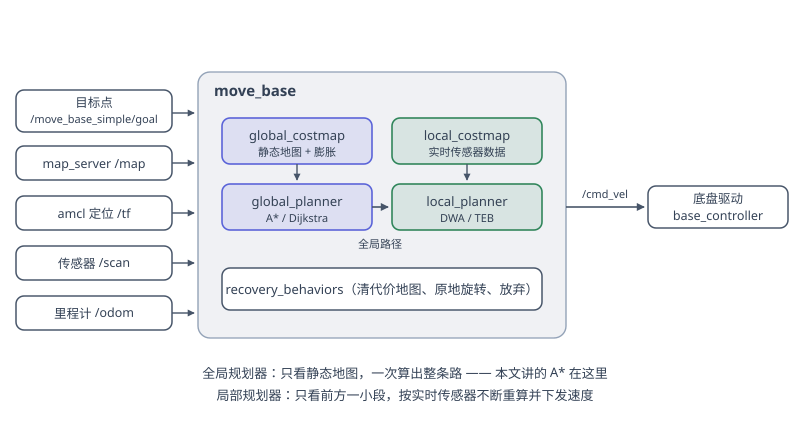
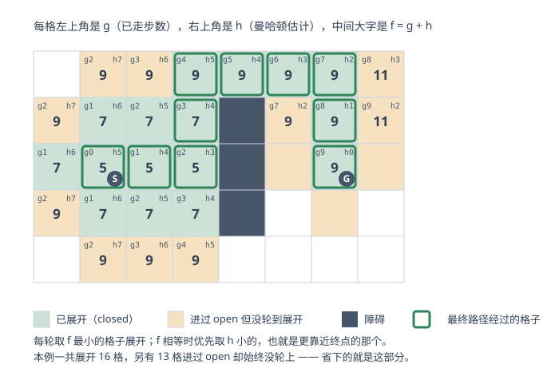
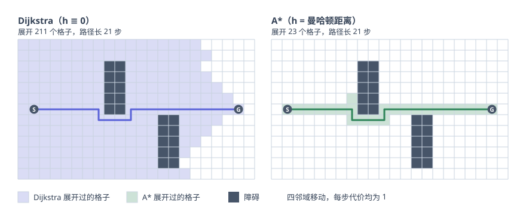
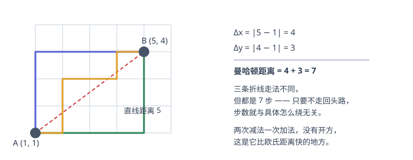

A\* 就是给 Dijkstra 加了一点"方向感"：把排序依据从"已经走了多远"换成"已经走了多远 + 估计还要走多远"。这一改动带来的差别可以非常夸张——本文那张对比图里，同一张地图上 Dijkstra 展开了 211 个格子，A\* 只展开了 23 个，而两者给出的路径一样长。

<!-- more -->

## 先看它在导航栈里的位置

在讲 A\* 之前，先说清楚它到底被用在哪一环。ROS 自带的 `move_base` 把路径规划拆成了两层：



- **全局规划器**只看静态地图，一次性算出从当前位置到目标的整条路——定下大方向。A\* 和 Dijkstra 就在这一层。
- **局部规划器**读取这条全局路径，只规划前方一小段，并结合实时传感器数据反复优化，保证不磕碰、不飘移、稳稳当当地走过去。DWA 和 [TEB](/zh/blogs/teb-algorithm/) 在这一层。

所以本文讨论的全是"在一张已知的栅格地图上找一条从 A 到 B 的路"，不涉及底盘能不能开出来——那是局部规划器的事。

## 从 Dijkstra 说起

Dijkstra 维护每个点到起点的**已知最短距离** $g(n)$，然后反复做一件事：

> 从还没确定的点里，挑 $g$ 最小的那个，把它标记为已确定，再用它去更新邻居的 $g$。

它之所以能保证最短，靠的是一个简单的归纳：当一个点被挑中时，所有还没确定的点的 $g$ 都不小于它，而边权非负，所以再绕路过来只会更长——此刻它的 $g$ 就已经是真正的最短距离了。

代价是，Dijkstra **完全不知道终点在哪**。它只是以起点为中心，按距离一层层地向四面八方摊开，直到终点碰巧被摊到。地图上有 80% 的格子和终点方向完全相反，它也一样老老实实地算一遍。

在需要实时重规划的场合，这个浪费是要命的。而实际使用中，我们往往并不真的需要严格最短的那一条——多走两步无所谓，如果能换来运算量的巨量减少，那就是血赚。

## 加一点"方向感"

于是引入一个**启发函数** $h(n)$：不需要精确，只要能大致估计"从 $n$ 到终点还有多远"。然后把排序依据改成

$$
f(n) = g(n) + h(n)
$$

$g(n)$ 是**已经走过的实际代价**，$h(n)$ 是**还要走多远的估计**，$f(n)$ 就是"如果最终从 $n$ 走过去，全程大概多长"。每次取 $f$ 最小的点展开——这就是 A\*。

值得注意的是这两个极端：

| $h$ 的取法 | 得到什么 | 性质 |
| --- | --- | --- |
| $h \equiv 0$ | 退化成 Dijkstra | 最优，但慢 |
| 只看 $h$，忽略 $g$ | 贪婪最佳优先搜索 | 很快，但可能绕远甚至绕很远 |
| $f = g + h$ | A\* | 在 $h$ 合理时又快又最优 |

只看 $h$ 的那种做法（greedy best-first）常被误当成 A\*，但它会一头扎向终点方向，撞上凹形障碍就在里面来回折腾。$g$ 这一项的作用正是"记住已经付出的代价"，把算法拽回来。

下图是 A\* 展开过程中每个格子上的三个数：



注意看那几个被墙挡住的格子：它们的 $g$ 还很小，但绕路让 $f$ 涨了上去，于是排序自然把它们往后压。算法不需要"知道"前面有堵墙，$f$ 的变化会替它说话。

## 差距有多大

把 Dijkstra 和 A\* 放在同一张图上跑，差别一目了然：



Dijkstra 几乎把整张图都摊了一遍（211 格），A\* 只沿着起点到终点那条带扫了一遍（23 格），**而且两条路径一样长，都是 21 步**。

省下来的就是那些"明显走反了"的格子。图里能看到 A\* 在绕过第一堵墙时短暂地向下多探了几格——它并不知道墙有多长，只能靠 $f$ 的上涨慢慢摸出来。这也说明启发函数只是"猜测"，猜得越准省得越多，猜得离谱就退化回 Dijkstra。

## 启发函数怎么选

选 $h$ 的原则是：**和这张图上真实的移动方式一致**。

- 只允许上下左右四个方向 → **曼哈顿距离**（Manhattan distance）
- 允许八个方向（带斜走）→ **对角距离 / 八分距离**（octile distance）
- 允许任意角度 → **欧几里得距离**（Euclidean distance）

$$
h_{\text{Manhattan}} = |x_1 - x_2| + |y_1 - y_2|
$$

$$
h_{\text{octile}} = (d_x + d_y) + (\sqrt{2} - 2)\min(d_x, d_y)
$$

$$
h_{\text{Euclid}} = \sqrt{(x_1 - x_2)^2 + (y_1 - y_2)^2}
$$

其中 $d_x = |x_1 - x_2|$，$d_y = |y_1 - y_2|$，八分距离假定直走代价 1、斜走代价 $\sqrt 2$。

曼哈顿距离是其中最快的——两次减法一次加法，没有开方：



图里三条折线走法各不相同，但都是 7 步。只要不走回头路，步数就和具体怎么绕无关——这正是曼哈顿距离在四邻域栅格上"算得准"的原因：它给出的就是无障碍时的真实步数。

## 什么时候还能保证最短

这里要纠正一个流传很广的说法：**A\* 并不是"为了速度牺牲最优性"**。只要 $h$ 满足下面这个条件，A\* 找到的路径和 Dijkstra 一样短。

**可采纳性（admissible）**：$h$ 永远不高估真实剩余代价。

$$
h(n) \le h^{*}(n)
$$

其中 $h^{*}(n)$ 是从 $n$ 到终点的真实最短代价。直觉上：只要 $h$ 保守，$f(n) = g(n) + h(n)$ 就是全程代价的下界；一旦终点被取出，说明所有还在排队的点的下界都不比它小，那条路就不可能更短了。

更强一点的条件是**一致性（consistent）**，它要求 $h$ 满足类似三角不等式的性质：

$$
h(n) \le c(n, n') + h(n')
$$

一致的 $h$ 必然可采纳，而且保证每个点第一次被展开时 $g$ 就已经是最短的——这样就可以放心地把展开过的点丢进 closed 集不再回头看。曼哈顿距离在四邻域栅格上、欧氏距离在任意图上，都是一致的。

**那什么时候会不最优？** 当 $h$ 高估的时候。最典型的情形恰好就是原来这篇里提到的那个做法：车辆能往八个方向走，却仍然用曼哈顿距离做启发。

此时从 $(0,0)$ 到 $(4,4)$ 真实只要 4 步斜走，曼哈顿距离却报 8 ——高估了一倍。这会让搜索**更加激进**，展开的格子更少、跑得更快，但给出的路径可能比最短路长一些。

这在比赛里往往是划算的：路径长个几步无所谓，规划快一倍才是真的。**关键是要知道自己在拿什么换什么**，而不是以为 A\* 天生就不最优。

把这件事推到极致就是**加权 A\***：

$$
f(n) = g(n) + \varepsilon \cdot h(n), \qquad \varepsilon > 1
$$

它给出的路径长度不会超过最优解的 $\varepsilon$ 倍——一个可以拧的旋钮，$\varepsilon = 1$ 时就是普通 A\*，越大越快越糙。

## 一个容易忽略的细节：平局

在均匀代价的栅格上，大量格子的 $f$ 是相等的——从起点到终点的矩形区域里，所有单调路径的 $f$ 全都一样。这时候**怎么打破平局，直接决定了 A\* 看起来是"一条细带"还是"一大片"**。

常用的做法是 $f$ 相等时优先取 $h$ 小的，也就是更靠近终点的那个。上面两张图用的都是这个规则。另一种做法是给 $h$ 乘一个极小的系数（比如 $1.0 + 10^{-3}$）人为制造微小的偏好，代价是失去严格最优性。

## 代码上要改的其实只有一行

有了以上分析，可以发现 A\* 和 Dijkstra 的代码几乎一样，只是排序的键从 $g$ 换成了 $g + h$：

```python
def a_star(start, goal, h):
    open_set = [(h(start), 0, start)]      # (f, g, node)
    g_score = {start: 0}
    parent = {}
    closed = set()

    while open_set:
        f, g, cur = heapq.heappop(open_set)   # Dijkstra 这里是按 g 取最小
        if cur in closed:
            continue
        if cur == goal:
            return reconstruct(parent, goal)
        closed.add(cur)

        for nxt, cost in neighbors(cur):
            if nxt in closed:
                continue
            ng = g + cost
            if ng < g_score.get(nxt, INF):
                g_score[nxt] = ng
                parent[nxt] = cur
                heapq.heappush(open_set, (ng + h(nxt), ng, nxt))   # 唯一的区别
    return None
```

把 `h` 换成恒返回 0 的函数，这段代码就是 Dijkstra。

## 在 ROS 里

`move_base` 默认的全局规划器是 `navfn`，用的是 Dijkstra 的一个变体（Navigation Function）。想换成 A\*，通常用 `global_planner` 这个包，它把几个选项暴露成了参数：

| 参数 | 默认 | 说明 |
| --- | --- | --- |
| `use_dijkstra` | `true` | 置为 `false` 即改用 A\* |
| `use_grid_path` | `false` | `true` 则严格沿栅格走，`false` 用梯度下降得到更平滑的路径 |
| `use_quadratic` | `true` | 用二次近似计算势场，比线性更精确 |
| `cost_factor` | 0.55 | 代价地图取值转换成规划代价时的系数 |

值得一提的是，全局规划器工作在 `global_costmap` 上，而代价地图里的障碍是**膨胀**过的（按机器人半径外扩），所以"规划出来的路撞不撞墙"很大程度上取决于膨胀参数调得对不对，而不是 A\* 本身。

## 小结

| | Dijkstra | A\* |
| --- | --- | --- |
| 排序依据 | $g$ | $f = g + h$ |
| 扩散形状 | 以起点为中心均匀摊开 | 沿起点—终点方向定向展开 |
| 是否最优 | 是（边权非负） | $h$ 可采纳时是 |
| 本文例子 | 展开 211 格 | 展开 23 格 |
| 什么时候用 | 需要到所有点的距离；或没有合适的 $h$ | 单点到单点，且能构造出 $h$ |

一句话：A\* 不是"更快但更差的 Dijkstra"，而是"知道终点在哪的 Dijkstra"。差得好不好，全看 $h$ 挑得对不对。

## 参考

- P. E. Hart, N. J. Nilsson, B. Raphael. *A Formal Basis for the Heuristic Determination of Minimum Cost Paths.* IEEE Transactions on Systems Science and Cybernetics, 1968.
- I. Pohl. *Heuristic search viewed as path finding in a graph.* Artificial Intelligence, 1970.（加权 A\*）
- [Amit's A\* Pages](https://theory.stanford.edu/~amitp/GameProgramming/) —— 讲启发函数与打破平局最清楚的一份材料
- [global_planner — ROS Wiki](https://wiki.ros.org/global_planner)
- <https://www.bilibili.com/video/BV1J64y1o7YW>
