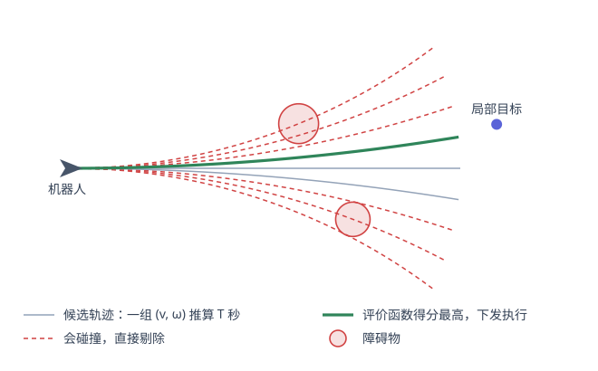
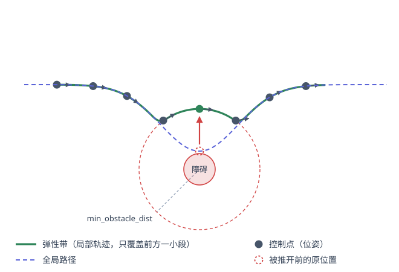
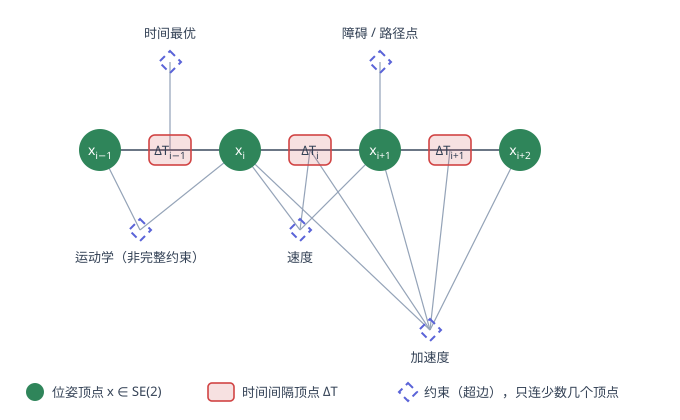

TEB（Timed Elastic Band，时间弹性带）把局部轨迹规划写成一个稀疏的非线性最小二乘问题。这篇从弹性带的来历讲起，到它怎么被建模成超图、不等式约束怎么塞进最小二乘、为什么能跑到 20 Hz，最后是参数表。

<!-- more -->

## 局部规划器在解决什么问题

导航栈里全局规划器给出的是一条**几何路径**：它知道地图长什么样，但不知道你的车能不能开出这条线。它可能让你从一条比车还窄的缝里穿过去，可能要求你原地横移，也可能在拐角处给出一个曲率大到底盘转不过来的折点。而且它是在**静态**地图上算的，规划完之后突然窜出来的人它一无所知。

局部规划器负责把这条路径落到地面上：只看前方一小段，结合实时的传感器数据和底盘自身的能力，产出可以直接下发给底盘的速度指令。

## 先看 DWA 是怎么做的

DWA（Dynamic Window Approach）的思路非常直接：既然最终要下发的就是一组 $(v, \omega)$，那就**直接在速度空间里采样**。

底盘的速度和角速度都有上下限，加上当前速度和加速度上限，下一个控制周期内可达的 $(v,\omega)$ 构成一个有限的矩形区域——这就是 "dynamic window"。在这个窗口里均匀采样若干组 $(v,\omega)$，假定每组在接下来 $T$ 秒内保持不变，就能推算出一条圆弧轨迹（匀速圆周运动，角速度为零时退化成直线）。然后逐条检查：撞障碍的直接扔掉，剩下的用一个加权评价函数打分——离全局路径多远、朝向目标的角度差多少、离最近障碍多远、速度多快——取分最高的那条，把它对应的 $(v,\omega)$ 发下去。



DWA 的问题在于它的搜索空间只有两维，而且只是**采样**不是**优化**：

- 整段 $T$ 秒内速度恒定，没法表达"先减速过弯再加速"这种需要变速的动作；
- 评价函数是各项加权求和，权重之间的量纲和尺度全靠手调，不同场景往往要重调；
- 窄通道和 U 形障碍里容易陷进局部极小——所有候选轨迹得分都很差，但它只能在里面挑一个最不差的；
- 倒车、多次往复调整这类需要"往后退一步再往前"的机动，很难自然地从采样里冒出来。

## 从弹性带到时间弹性带

TEB 的祖师爷是 Quinlan 和 Khatib 1993 年提出的 **Elastic Band（弹性带）**。它的想法是：把全局路径想象成一根橡皮筋，橡皮筋自身有收缩的**内力**（让路径尽量短、尽量光滑），障碍物对它施加排斥的**外力**（把它推开）。两种力平衡下橡皮筋变形到一个新形状，这就是修正后的路径。障碍物移动，橡皮筋跟着实时变形——不需要重新规划。

但弹性带有个根本缺陷：**它只是一条路径，没有时间**。路径上任意两点之间要花多久走完、走到那里时速度是多少，弹性带一概不知。所以速度上限、加速度上限、非完整约束这些和时间有关的东西，它统统表达不了，只能事后再单独算一个速度剖面套上去——而这个速度剖面未必和路径形状相容。

Rösmann 等人 2012 年的改动，本质上只有一句话：**把相邻两个位姿之间的时间间隔也变成待优化的变量**。

于是"路径"升级成了"轨迹"，$v$、$\omega$、$a$ 都可以直接从变量里算出来，运动学和动力学约束终于有了容身之处；而且既然时间是变量，就可以把"总时间尽量短"直接写进目标函数——TEB 天然是时间最优的。

## 形式化

一条 TEB 由两部分组成。**位姿序列**：

$$
Q = \{\mathbf{x}_i\}_{i=0}^{n-1},\qquad
\mathbf{x}_i = (x_i,\ y_i,\ \beta_i)^{\mathsf T} \in \mathbb{R}^2 \times S^1
$$

和**时间间隔序列**：

$$
\tau = \{\Delta T_i\}_{i=0}^{n-2}
$$

其中 $\Delta T_i$ 是机器人从 $\mathbf{x}_i$ 运动到 $\mathbf{x}_{i+1}$ 所花的时间。两者合起来：

$$
\mathcal{B} = (Q,\ \tau)
$$

规划问题就是求解

$$
\mathcal{B}^{*} = \arg\min_{\mathcal{B}} \; \sum_{k} \gamma_k \, f_k(\mathcal{B})
$$

每一项 $f_k$ 是一类约束（速度、加速度、障碍、时间……）的代价，$\gamma_k$ 是对应的权重。注意起点 $\mathbf{x}_0$ 和终点 $\mathbf{x}_{n-1}$ 是固定的，不参与优化。

关键在于**每一项都被写成平方形式** $f_k = \sum e_k^2$，于是整个问题是一个非线性最小二乘，可以直接交给 g2o 用 Levenberg–Marquardt 求解。权重 $\gamma_k$ 在 g2o 里就是每条边的信息矩阵。

### 不等式约束怎么塞进最小二乘

最小二乘天生只能处理"等于零"的残差，而"速度不超过 0.4"是个不等式。TEB 的处理是引入**分段线性惩罚函数**：约束满足时残差恒为零（对目标函数没有任何贡献），违反时残差随违反量线性增长。

下界约束 $x > a$：

$$
e_{>}(x, a, \varepsilon) =
\begin{cases}
a + \varepsilon - x, & x < a + \varepsilon \\[2pt]
0, & \text{否则}
\end{cases}
$$

区间约束 $a < x < b$：

$$
e_{[\,]}(x, a, b, \varepsilon) =
\begin{cases}
a + \varepsilon - x, & x < a + \varepsilon \\[2pt]
0, & a + \varepsilon \le x \le b - \varepsilon \\[2pt]
x - (b - \varepsilon), & x > b - \varepsilon
\end{cases}
$$

这里的 $\varepsilon$（参数 `penalty_epsilon`）是把边界往区间**内部**挪的安全裕度。因为惩罚法本质上是软约束，解只会收敛到边界附近而不是严格在边界内，留一点裕度可以让最终结果真的落在合法区间里。代价是 $\varepsilon$ 调大了会让机器人开不到标称最大速度。

## 各项约束

### 速度

速度由相邻两个位姿和它们之间的时间间隔决定。记

$$
\Delta \mathbf{p}_i = \begin{pmatrix} x_{i+1} - x_i \\ y_{i+1} - y_i \end{pmatrix},
\qquad
\Delta \beta_i = \mathrm{normalize}(\beta_{i+1} - \beta_i)
$$

最朴素的做法是把两点间距离当作行进距离，即 $\lVert \Delta\mathbf{p}_i \rVert$。但机器人实际上是沿圆弧走的，所以还有一个"精确弧长"选项（`exact_arc_length`）：两个位姿唯一确定一段圆弧，其半径和弧长为

$$
r_i = \frac{\lVert \Delta\mathbf{p}_i \rVert}{2\sin(\Delta\beta_i / 2)},
\qquad
s_i = \lvert \Delta\beta_i \cdot r_i \rvert
$$

于是

$$
v_i = \frac{s_i}{\Delta T_i} \cdot \operatorname{sgn}\!\left(
\Delta\mathbf{p}_i^{\mathsf T}
\begin{pmatrix}\cos\beta_i \\ \sin\beta_i\end{pmatrix}
\right),
\qquad
\omega_i = \frac{\Delta \beta_i}{\Delta T_i}
$$

那个符号项是判断这一步是前进还是倒车：把位移投影到当前航向上，同向为正、反向为负。实现里没有用真正的 $\operatorname{sgn}$，而是用了一个陡峭的 sigmoid 近似——因为 $\operatorname{sgn}$ 在零点不可导，会把梯度弄坏。

残差就是

$$
e_v = e_{[\,]}(v_i,\ -v_{\text{back,max}},\ v_{\max},\ \varepsilon),
\qquad
e_\omega = e_{[\,]}(\omega_i,\ -\omega_{\max},\ \omega_{\max},\ \varepsilon)
$$

注意前进和后退的上限是分开的（`max_vel_x` 和 `max_vel_x_backwards`）。

### 加速度

加速度需要**三个位姿和两个时间间隔**——先算出前后两段的速度，再做差分：

$$
a_i = \frac{2\,(v_{i+1} - v_i)}{\Delta T_i + \Delta T_{i+1}},
\qquad
\dot\omega_i = \frac{2\,(\omega_{i+1} - \omega_i)}{\Delta T_i + \Delta T_{i+1}}
$$

分母是两段时间之和的一半（$v_i$ 是第 $i$ 段的平均速度，可以认为发生在该段中点，两个中点相距 $(\Delta T_i + \Delta T_{i+1})/2$）。同样套区间惩罚。

首尾两端还有单独的边，用来把轨迹起点的加速度和**当前实际速度**衔接上——否则规划出来的第一步可能要求底盘瞬间变速。

### 非完整运动学约束

这是 TEB 里最有意思的一项。差速底盘不能横向平移，所以相邻两个位姿必须能被一段**等曲率圆弧**连起来。这个条件写出来是：

$$
\left[
\begin{pmatrix}\cos\beta_i \\ \sin\beta_i\end{pmatrix}
+
\begin{pmatrix}\cos\beta_{i+1} \\ \sin\beta_{i+1}\end{pmatrix}
\right]
\times \Delta\mathbf{p}_i = 0
$$

展开成标量（二维叉积）：

$$
h_i = \big\lvert (\cos\beta_i + \cos\beta_{i+1})\,\Delta y_i - (\sin\beta_i + \sin\beta_{i+1})\,\Delta x_i \big\rvert = 0
$$

几何意义：两端航向向量之和的方向就是它们的角平分线方向，要求它和位移向量 $\Delta\mathbf{p}_i$ 平行，等价于**弦平分两端的航向角**——这正是圆弧的性质。满足它，这一步就是底盘真能开出来的；不满足，就意味着中间要横着挪一下。

这是一个**等式**约束，不需要惩罚函数，直接把残差写成绝对值即可。它的权重 `weight_kinematics_nh` 默认高达 1000，比其他项大两三个数量级——因为它不是"偏好"，是物理上的硬性不可能。

同一条边上还挂了第二个残差，要求 $\Delta\mathbf{p}_i$ 在航向上的投影为正，即倾向于前进而非倒车，权重是 `weight_kinematics_forward_drive`。这一项默认权重只有 1，所以需要倒车时它让得开。

阿克曼底盘（`min_turning_radius > 0`）则把第二个残差换成最小转弯半径约束：

$$
e_r = e_{>}\!\left(\left\lvert \frac{\lVert \Delta\mathbf{p}_i \rVert}{2\sin(\Delta\beta_i/2)} \right\rvert,\ r_{\min},\ 0\right)
$$

### 障碍

对每个位姿和每个障碍：

$$
e_{\text{obs}} = e_{>}\big(d(\mathbf{x}_i,\ \mathcal{O}_j),\ d_{\min},\ \varepsilon\big)
$$

$d(\cdot)$ 由机器人外形模型给出（点、圆、两圆、线段、多边形），$d_{\min}$ 就是 `min_obstacle_dist`。距离大于安全距离时代价为零，小于时线性增长，把控制点往外顶。



只有硬约束的话，机器人会贴着安全距离的边缘走——因为再远一点也不会让代价更低。所以还有一条"膨胀"边（`inflation_dist`，默认 0.6 > `min_obstacle_dist` 0.5），在更大的范围内施加一个小的非零代价，让轨迹倾向于离障碍再远一点。这一项权重（`weight_inflation`）很小，属于偏好而非约束。

另一个工程上的细节：把**每个**障碍关联到**每个**位姿会让边数爆炸。实现上只把障碍关联到轨迹上离它最近的那个位姿，外加左右各若干个邻居（`obstacle_poses_affected`，默认 30）。

### 全局路径引导

TEB 只优化前方一小段（`max_global_plan_lookahead_dist`，默认 3 米），但不能想怎么变形就怎么变形——它得跟着全局路径走，否则绕开障碍之后可能就偏到另一条路上去了。

实现方式是从全局路径上按 `global_plan_viapoint_sep` 的间隔抽取一串**路径点**（via-points），然后惩罚轨迹离这些点的距离。这个参数默认是 $-0.1$，负值表示**关闭**——也就是说默认情况下这项引导是不开的，靠的是轨迹起终点被钉死加上时间最优项自然产生的"抄近路"倾向。需要贴着全局路径走时（比如走廊、车道）才把它打开。

### 时间最优

最简单的一项：每个时间间隔自己就是一条一元边，残差直接等于它。

$$
f_{\text{time}} = \sum_i \Delta T_i^{\,2}
$$

平方之后有两个效果：**总时间变短**（每一项都想变小），以及**各段时间趋于均匀**（在总和固定的情况下，平方和在各项相等时最小）。后者正好对应"不要一脚油门一脚刹车"——各段时间均匀，意味着速度变化平缓。

## 超图与稀疏性

上面每一项约束都只涉及**少数几个**变量：时间最优 1 个，障碍 1 个，运动学 2 个，速度 3 个，加速度最多 5 个。没有任何一项需要把整条轨迹一起看。

把位姿和时间间隔当作顶点、把每条约束当作连接若干顶点的**超边**，整个问题就是一张超图：



这正是 g2o 的输入格式。而且因为边只连接**序号相邻**的顶点，这张图的海塞矩阵是**带状稀疏**的——绝大部分元素恒为零。g2o 用稀疏 Cholesky 分解求解，复杂度基本随轨迹长度线性增长，而不是稠密求解的立方增长。这是 TEB 能在嵌入式平台上跑到 20 Hz 的直接原因。

## 优化循环

一次 `optimizeTEB` 是双层循环：外层 `no_outer_iterations`（默认 4），内层 `no_inner_iterations`（默认 5）。每一轮外层循环做三件事：

1. **autosize**：调整位姿数量。如果某个 $\Delta T_i$ 大于 `dt_ref + dt_hysteresis`，就在中间插入一个位姿；小于 `dt_ref - dt_hysteresis`，就删掉一个。这样时间分辨率始终维持在 `dt_ref` 附近（默认 0.3 s），而轨迹长度可以自由伸缩。
2. **重建图**：位姿数量变了，障碍的最近邻关联也变了，所以每轮都要重新建图。
3. **跑 LM**：内层迭代若干次，然后清图。

还有一个容易忽略的细节：每轮外层循环结束后，障碍项的权重会乘以 `weight_adapt_factor`（默认 2.0）。也就是说障碍约束是**逐轮收紧**的——一开始松，让轨迹先大致成形，后面几轮再把它从障碍旁边推开。这比一上来就用大权重更容易收敛。

最后，下发的速度指令是从轨迹**最开头**取的：由 $\mathbf{x}_0$、$\mathbf{x}_k$ 和它们之间的时间之和反解出 $(v, \omega)$，$k$ 由 `control_look_ahead_poses` 决定。整条轨迹的其余部分下个周期就被重新优化掉了——这是典型的滚动时域（receding horizon）做法。

## 局部极小与同伦类

到这里 TEB 还有一个绕不过去的问题：**它是局部优化**。前面有一根柱子，从左边绕还是从右边绕，是两条拓扑上不同的路径，它们之间隔着一个代价的山峰。梯度下降只会把你带到当前所在那个"山谷"的谷底，永远不会翻过山头去看另一边是不是更好。

TEB 的解法是**同时优化多条**。做法是：

1. 在起点和目标之间撒点建图（类似 PRM），搜出若干条拓扑上不同的候选路径；
2. 用 **H-signature** 判断两条路径是否属于同一个同伦类。这是一个来自复分析的不变量——把平面看成复平面，每个障碍的中心 $\zeta_l$ 当作一个极点，沿轨迹做线积分：

$$
\mathcal{H} = \int_{\mathcal{T}} \sum_{l} \frac{A_l}{z - \zeta_l}\ \mathrm{d}z,
\qquad
A_l = \frac{f_0(\zeta_l)}{\prod_{j \ne l}(\zeta_l - \zeta_j)}
$$

由留数定理，这个积分的值只取决于轨迹如何绕过各个极点，与轨迹的具体形状无关。两条轨迹的 $\mathcal{H}$ 相等，就说明它们能连续地互相变形得到，属于同一类，留一条就够了。实现上是沿轨迹线段累加 $A_l\left[\ln(z_{m+1}-\zeta_l) - \ln(z_m-\zeta_l)\right]$；复对数多值，取辐角差绝对值最小的那个分支。

3. 每个类保留一条，分别跑完整的 TEB 优化（最多 `max_number_classes` 条），最后比较总代价选一条执行。

考虑动态障碍时（`include_dynamic_obstacles`），同伦类要在 $x$-$y$-$t$ 三维空间里判断——从障碍的**前面**穿过去和从**后面**绕过去，在平面上投影可能是同一条，在时空里却完全不同。

这套东西默认是开着的（`enable_homotopy_class_planning`，注意它是静态 ROS 参数，不在 dynamic_reconfigure 里，改了要重启）。代价是计算量成倍增长——`HCPlanning` 那一组 18 个参数基本都是在控制这部分的开销。

## 跑一下

功能包自带一个不需要机器人的测试节点，可以拖着障碍看轨迹实时变形：

```shell
roslaunch teb_local_planner test_optim_node.launch
```

调参用 rqt：

```shell
rosrun rqt_reconfigure rqt_reconfigure
```

## 参数速查

`teb_local_planner` 的 dynamic_reconfigure 暴露了 **95 个参数，分成 12 组**：

| 分组 | 个数 | 管什么 |
| --- | --- | --- |
| Trajectory | 15 | 时间分辨率、位姿自动增删、前瞻距离、精确弧长开关 |
| ViaPoints | 2 | 从全局路径抽取路径点的间隔与朝向 |
| Robot | 8 | 速度/加速度上限、机器人外形模型 |
| Carlike | 3 | 最小转弯半径、转向角与转向角速率 |
| Omnidirectional | 3 | 全向底盘的 y 向、斜向速度上限 |
| GoalTolerance | 5 | 到点判据（位置、朝向容差） |
| Obstacles | 10 | 安全距离、膨胀、代价地图关联、动态障碍预测 |
| Reduce velocity near obstacles | 3 | 贴近障碍时自动降速 |
| Optimization | 24 | 各项权重、内外层迭代次数、惩罚裕度 |
| HCPlanning | 18 | 同伦类并行规划的图搜索与筛选 |
| Recovery | 2 | 卡住时临时收缩机器人外形以脱困 |
| Divergence Detection | 2 | 检测优化发散并中止 |

按前面讲过的几类约束，挑出最常动的参数（默认值取自 noetic-devel 分支的 `TebLocalPlannerReconfigure.cfg`，实际生效的是你 yaml 里写的值）：

| 约束 | 参数 | 默认 | 说明 |
| --- | --- | --- | --- |
| 时间分辨率 | `dt_ref` | 0.3 | 相邻位姿的目标时间间隔，通常设成控制周期的量级 |
| | `dt_hysteresis` | 0.1 | 增删位姿的滞回带，一般取 `dt_ref` 的 10% |
| | `teb_autosize` | True | 是否在优化过程中自动增删位姿 |
| 前瞻范围 | `max_global_plan_lookahead_dist` | 3.0 | 参与优化的全局路径长度上限（米），0 表示不限 |
| 障碍 | `min_obstacle_dist` | 0.5 | 期望的最小离障距离 |
| | `inflation_dist` | 0.6 | 膨胀带宽度，需大于 `min_obstacle_dist` 才起作用 |
| | `obstacle_poses_affected` | 30 | 每个障碍关联到最近位姿左右各多少个邻居 |
| | `weight_obstacle` | 50 | 障碍项权重（每轮外层迭代还会再乘 `weight_adapt_factor`） |
| 运动学 / 动力学 | `max_vel_x` | 0.4 | 前进最大线速度 |
| | `max_vel_x_backwards` | 0.2 | 倒车最大线速度 |
| | `max_vel_theta` | 0.3 | 最大角速度 |
| | `acc_lim_x` | 0.5 | 最大线加速度 |
| | `acc_lim_theta` | 0.5 | 最大角加速度 |
| | `min_turning_radius` | 0.0 | 最小转弯半径，差速底盘填 0 |
| | `weight_kinematics_nh` | 1000 | 非完整约束权重，物理硬约束，不要调小 |
| | `weight_kinematics_forward_drive` | 1 | 惩罚倒车；调大则尽量不倒车 |
| 全局路径引导 | `global_plan_viapoint_sep` | -0.1 | 路径点抽取间隔，负值表示关闭 |
| | `weight_viapoint` | 1 | 贴合路径点的权重 |
| 最快路径 | `weight_optimaltime` | 1 | 时间最优项权重，调大则更激进 |
| 求解器 | `no_inner_iterations` | 5 | 每轮外层迭代里 LM 跑几次 |
| | `no_outer_iterations` | 4 | 外层迭代次数（每轮重新 autosize 并重建图） |

## 和 DWA 摆在一起

| | DWA | TEB |
| --- | --- | --- |
| 决策变量 | 一组 $(v, \omega)$，2 维 | 整条轨迹的位姿与时间间隔，$3n + (n-1)$ 维 |
| 求解方式 | 在速度空间采样后打分 | 非线性最小二乘优化 |
| 时间 | 固定的仿真时长，段内速度恒定 | 时间间隔是决策变量 |
| 时间最优 | 只能通过"速度快得分高"间接鼓励 | 直接写在目标函数里 |
| 倒车 / 多次调整 | 很难自然产生 | 支持，可通过权重调节倾向 |
| 阿克曼底盘 | 需要额外处理 | 内建最小转弯半径约束 |
| 局部极小 | 没有专门机制 | 同伦类并行规划 |
| 计算量 | 小且恒定 | 大但可控（稀疏结构 + 迭代次数封顶） |

一句话：DWA 是在很小的搜索空间里**挑**一个还行的，TEB 是在很大的搜索空间里**优化**出一个好的。代价是参数多了一个量级，调起来也麻烦一个量级。

## 参考

- S. Quinlan, O. Khatib. *Elastic bands: connecting path planning and control.* ICRA 1993.
- C. Rösmann et al. *Trajectory modification considering dynamic constraints of autonomous robots.* ROBOTIK 2012.
- C. Rösmann et al. *Efficient trajectory optimization using a sparse model.* ECMR 2013.
- C. Rösmann et al. *Integrated online trajectory planning and optimization in distinctive topologies.* Robotics and Autonomous Systems, 2017.
- S. Bhattacharya et al. *Search-based path planning with homotopy class constraints.* AAAI 2010.
- R. Kümmerle et al. *g2o: A general framework for graph optimization.* ICRA 2011.
- 源码：[rst-tu-dortmund/teb_local_planner](https://github.com/rst-tu-dortmund/teb_local_planner)（文中公式对应 `noetic-devel` 分支的 `g2o_types/` 目录）
- 文档：[teb_local_planner — ROS Wiki](https://wiki.ros.org/teb_local_planner)
