> 这是一篇有关如何使用 VirtualBox 安装 Ubuntu 虚拟机的快速入门指南
> 主要包含的内容包括一些计算机/虚拟机常识的普及, 以及如何用 VirtualBox 安装一个 Ubuntu 虚拟机
> 由于写的比较仓促, 内容看起来比较暴躁, 所以叫暴躁入门指南
> 希望能够有所帮助

> **关于这篇文章**：原文写于 2021 年, 用的是 VirtualBox 6.1 和 Ubuntu 20.04。
> 2026 年重写了一遍, 现在对应 **VirtualBox 7.2** 和 **Ubuntu 26.04.1 LTS（Resolute Raccoon）**。
> 链接里的版本号该换就换, 别傻乎乎照抄。文章的 URL 里还留着 `20-04`, 那是为了不让老链接失效, 不用在意。

## 虚拟机 Overview

先看电脑的分层结构。核心就是系统内核（Kernel），往上是系统调用（System call），再往上才是你平时用的应用程序。

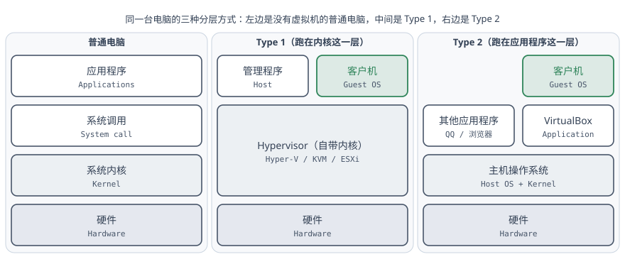

虚拟机的两个基本概念，主机（Host）是你正在用的主要操作系统，和客户机（Guest）也就是你虚拟机里装的操作系统。

目前市面上常见的虚拟机有两种，第一种 (type 1) 是跑在 System Call 这一层，就是 Kernel 上，虚拟机先放了一层 Kernel, 然后在 Kernel 上跑管理程序 (主机 Host) 和虚拟机 (客户机 Guest). 主流常见的有 Windows 上的 Hyper-V，Linux 上的 KVM，VMWare 的 ESXi（一款服务器用的操作系统）. 此时主机和客户机是平级的，共同跑在 Kernel 上。

第二种 (type 2) 是在应用程序层，也就是在操作系统上作为一个普通的应用程序去跑，常见的有 VirtualBox，VMWare Workstation。此时 Guest 在 Host 上，是 Host 上的一个应用程序。

如果你使用第一种虚拟机，会导致系统上所有依赖于第二种虚拟化技术的软件用不了，比如各种安卓模拟器，一些安全软件的安全沙箱功能等等。但第一种虚拟机运行效率更高。

> 顺便补一句 2021 年的原文里没有的事：现在 Windows 上这个"二选一"已经没那么绝对了。VirtualBox 7.x 在检测到 Hyper-V 开着的时候，会自动改走 Windows 的 Hypervisor Platform 接口（界面上会出现一个小乌龟图标），虽然慢一些，但不至于起不来。如果你装了 WSL2、Docker Desktop 或者开了"内核隔离"，那你的 Hyper-V 就是开着的，看到乌龟不用慌。真嫌慢就去"启用或关闭 Windows 功能"里把 Hyper-V 和虚拟机平台关掉重启，但那样 WSL2 也一起没了，自己权衡。

考虑到咱们只是为了学习，所以我们选一个免费，开源，并且在 Windows 上比较好用的第二种虚拟机，也就是 VirtualBox。

官网: [www.virtualbox.org](https://www.virtualbox.org)

但是由于一些众所周知的原因, 很多国外的软件下载起来都比较痛苦. 不一定是需要使用魔法, 有可能只是来回路线不太顺畅. 这时候我们需要用一些其他的手段. 在国内有一些大公司他们的做法是, 把一些常用的软件定期下载到部署在国内的服务器上制作成镜像 (Mirrors), 然后你作为用户从这些 Mirrors 上下载就会快很多. 把这个下载地址从原网站换成 Mirrors 的过程我们叫做换源, 因为你要换一个下载的源头嘛.

国内常见的软件源包括以下几个, 你开心用哪个都行

- 清华源: `mirrors.tuna.tsinghua.edu.cn` 清华 TUNA 协会学生运营的源, 技术相当不错, 速度也 OK
- 中科大源: `mirrors.ustc.edu.cn` 同样是学生组织在维护, 东西很全
- 阿里云的源: `mirrors.aliyun.com`
- 腾讯云的源: `mirrors.cloud.tencent.com`

原文里我说我比较喜欢腾讯云的源, 因为齐全。**这句话现在得收回一半**：腾讯云的 VirtualBox 目录和 `ubuntu-releases`（就是放 ISO 的那个目录）都已经下线了, 只剩下 apt 用的 `/ubuntu/` 还在。所以下面 ISO 我给的是清华源和中科大源的地址。

厦大原先也有自己的软件源, 后来年久失修, 也没人维护, 就凉了. 希望后辈们有能力的话能重振雄风.:smiley:

### 下载 VirtualBox

VirtualBox 现在没有国内镜像了, 直接去官网的下载服务器拿就行, 一般不至于下不动。我写这版的时候最新版本是 **7.2.18**, 你们不要偷懒直接复制粘贴下面的地址, 可以自己动动脑子换一下版本号, 东西都是差不多的.

- 主程序：<https://download.virtualbox.org/virtualbox/7.2.18/VirtualBox-7.2.18-175117-Win.exe>
- 扩展包: 这个东西的功能是让你能够直接从主机复制粘贴到虚拟机里, 以及给虚拟机提供 USB3.0 的支持. 所以还是有必要的, 下载地址就在主程序隔壁.
  <https://download.virtualbox.org/virtualbox/7.2.18/Oracle_VirtualBox_Extension_Pack-7.2.18.vbox-extpack>

> 注意扩展包从 7.1 开始改名了, 以前叫 `Oracle_VM_VirtualBox_Extension_Pack-*`, 现在中间的 `VM_` 没了, 叫 `Oracle_VirtualBox_Extension_Pack-*`。你搜到的老教程截图里是老名字, 不是你下错了。
>
> 另外扩展包的许可证是 PUEL, 个人学习和教学用免费, **公司里商用是要付钱的**。你自己在家玩随便用。

下载后，一路 next **先安装主程序**即可. 7.x 的安装程序中间会问你要不要装 Python 支持、要不要建桌面快捷方式之类的, 默认就行。

然后你会看到你的那个扩展包图标变成了绿色方块, 直接双击安装. 安装扩展包的时候, 要把那个许可协议拉到最底下才能点同意.

装好之后大概长这样, 一台虚拟机都没有的时候它会给你一个「Get started with VirtualBox」的引导页。你安装完之后跟我图片里一定会有区别, 包括但不限于我的是英文版 (你可以调), 以及我之前装过一些虚拟机而你一个都没有. 不要因为这个地方不一样了就不懂怎么回事了, 要学会举一反三.

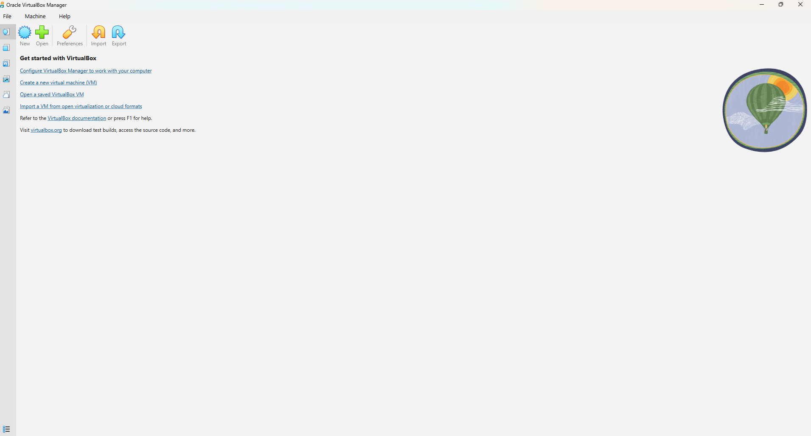

然后，做一点小小的设置。7.x 的菜单栏精简到只剩 File / Machine / Help 三个，全局设置在工具栏上那个 **Preferences** 按钮里（或者 File 菜单里的同一项）。

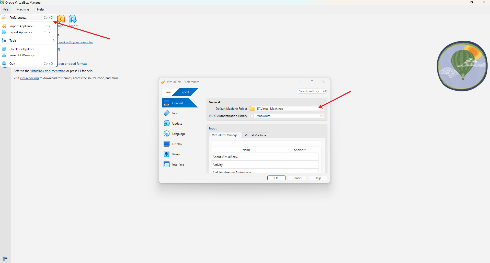

「常规」里这个「默认虚拟电脑位置」改成一个你空间比较大，硬盘读写比较快的地方。如果你 C 盘够大，最好是在 C 盘某处。这个地方保存了你虚拟机的文件和虚拟硬盘，在虚拟机运行的时候会频繁读写，如果这个地方读写慢，会导致你的虚拟机非常卡，所以不要放在 U 盘/SD 卡/机械硬盘之类的地方。

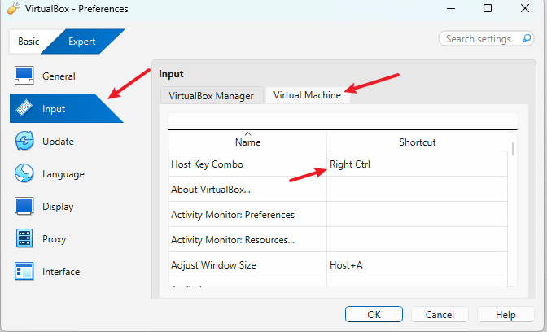

「输入」→「虚拟电脑」里这个「主机组合键 (Host Key)」, 选一个你电脑键盘上有但是你又不常按到的一个键。之所以说要改掉这个地方，是因为有些笔记本电脑键盘上是没有右边的 Ctrl 的（比如我的电脑），所以得换成一个你有的键。

到这儿基本够了。

### 准备系统镜像

然后我们来创建虚拟机。首先我们准备一个虚拟机用的系统镜像，Ubuntu 是 Linux 的一个发行版。

这里解释一下发行版的概念。首先，Linux 不是一个操作系统，而是一个操作系统内核（Kernel），然后不同的厂商可以在这个内核基础上定制内核之上的那一整套东西（系统调用、用户态工具、包管理器、桌面环境），形成不同的发行版。常见的 Linux 发行版有 Ubuntu, Debian, RHEL (RedHat Enterprise Linux), Rocky Linux, Alma Linux, Arch 等等.

国内的话早些年比较常用的是 CentOS, 你在网上搜到的绝大部分 CSDN 的东西都是 CentOS 的. 但后来 CentOS 凉了 (其实也不是凉了, 简单说来就是原先比较稳定省钱大家都愿意用, 后来官方把 CentOS Stream 当作 RHEL 的上游实验平台了, 很多新功能会先加上去, 这对于追求稳定性不追求新功能的企业生产环境来说是不喜欢的, 所以大家就不用了). CentOS 7 已经在 2024 年 6 月彻底结束支持, 现在接它班的是 Rocky Linux 和 Alma Linux. 所以你需要很仔细地留意 RHEL 系和 Ubuntu 之间的各种差别, 不要拿着 Ubuntu 问我为什么 `yum install` 这种命令跑不起来, 也不要问我为什么不加 `sudo` 会 permission denied, 因为 RHEL 系的教程默认是 root 用户, Ubuntu 为了安全把 root 用户禁用掉了. 具体的后面会讲. 总之, 上网搜是好事, 但看答案要带脑子.

对于 Ubuntu，其每年发行两个大版本，其中每两年发行一个 LTS (Long Term Support，长期支持) 版本，长期支持版本会在更长的时间周期内提供安全修复和功能更新的补丁。我刚才说过, 公司之类的生产环境其实追求的是稳定, 这也是为什么你到了公司会很神奇地发现很多公司还在用几十年前的技术, 因为"又不是不能用, 换新的出问题了你负责嘛?"

我们现在下载的是 Ubuntu 最新的 LTS 版本，**Ubuntu 26.04 LTS，代号 Resolute Raccoon，2026 年 4 月发行**，标准支持到 2031 年 4 月。我们拿的是 **26.04.1** 这个小版本, 也就是发行半年后的第一次打包更新 —— 一般建议等 `.1` 出来再用, 前面几个月的坑都给别人踩过了。

> 如果你手头的教程、课程或者公司环境还绑在 24.04 上, 那就装 **24.04.5 LTS（Noble Numbat）**, 支持到 2029 年, 下面的步骤基本一模一样, 只是后面换源那里的代号从 `resolute` 换成 `noble`。

Ubuntu 分为服务器版本和桌面版本，服务器版本针对服务器场景强化了开机自检等流程，且不会提供图形化的桌面界面。所以我们使用桌面版本, 提供了图形界面。

装系统都要有一个安装介质的, 把系统拷贝到你的电脑 (也可能是虚拟出来的电脑) 上, 顺便做一些其他工作, 基本配置啊, 格式化硬盘啊啥的. 这个安装介质通常是 `.iso` 文件. ISO 文件原本的意思是光盘镜像, 就是那种 CD 光盘, 把它拷贝出来, 就是一个 ISO 文件. 你要往虚拟机里装系统, 需要这样一个 ISO 文件. 你可以去[官网](https://ubuntu.com)上下载, 但我这儿直接给镜像下载链接了.

- 清华源：<https://mirrors.tuna.tsinghua.edu.cn/ubuntu-releases/26.04.1/ubuntu-26.04.1-desktop-amd64.iso>
- 中科大源：<https://mirrors.ustc.edu.cn/ubuntu-releases/26.04.1/ubuntu-26.04.1-desktop-amd64.iso>

文件大概 6 GB 出头, 比当年 20.04 的 2.7 GB 胖了一圈, 下之前看一眼硬盘。

## 创建虚拟机

点主界面上的「新建 (New)」。**VirtualBox 7.x 的新建向导跟 6.1 长得完全不一样了**, 这是这篇文章重写的主要原因。

向导左下角有个「专家模式 (Expert Mode)」按钮，**建议一上来就点它**。引导模式 (Guided Mode) 是一页一页翻的，而且有些选项（比如虚拟硬盘格式）它根本不给你看；专家模式则是把 Name and Operating System / Unattended Install / Hardware / Hard Disk 四节折叠在同一个窗口里，点开哪节改哪节，改完直接一个 **Finish** 完事。**专家模式没有"摘要"这一页**，别找了。下面的截图都是专家模式。

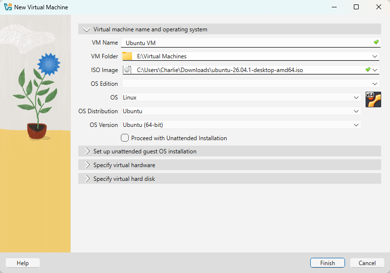

第一节 **Name and Operating System**：取个名字，选一下你要把这个虚拟机放在哪里（默认是我们刚才配置好的那个位置），然后在 **ISO Image** 那一栏里直接把刚才下载的 ISO 选进来。选完之后下面的「类型 (Type)」和「版本 (Version)」它会自己认出来是 Ubuntu (64-bit)，不用你手动选了。

紧接着的 **Unattended Install** 一节里有个 **「Proceed with Unattended Installation」**，**保持不勾**。

这是 7.x 新加的功能：勾上之后 VirtualBox 会自己接管整个安装过程，帮你把用户名密码时区全填好，全自动装完。听起来很爽，但是：

1. 你什么都没学到，这篇文章就白看了；
2. 它填进去的东西跟你以为的经常不一样，出了问题你不知道从哪儿查；
3. 它会顺手把 Guest Additions 也装了，版本对不上的时候反而更麻烦。

所以我们不勾它，老老实实自己装。顺便说一句，**这一节在你没选 ISO 之前整个是灰的**，点不动很正常，先选 ISO。

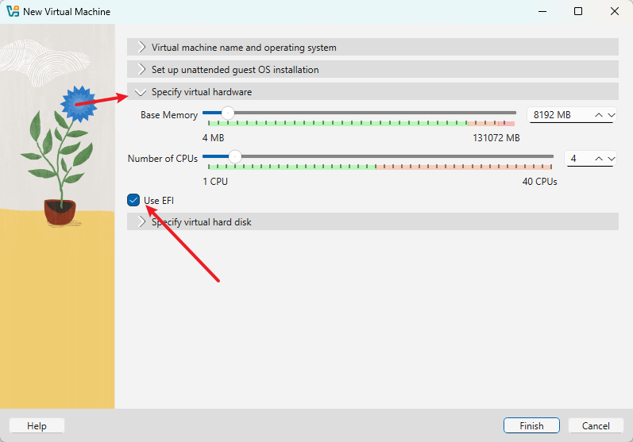

第三节 **Hardware** 设置虚拟机的内存和 CPU。

内存这里要说一下：当年 20.04 我说 2G 够用, **那个建议现在过期了**。Ubuntu 26.04 桌面版官方最低要求是 6 GB 内存, GNOME 50 也确实比当年的 GNOME 3.36 重。所以：

- 你的物理机 16 GB 内存：给虚拟机 **8192 MB**
- 你的物理机 8 GB 内存：给 **4096 MB**, 能跑, 但别指望流畅, 开浏览器会吃紧
- 你的物理机只有 8 GB 以下：别装桌面版了, 装 Ubuntu Server 吧, 那个 2 GB 真能跑

滑块下面那条绿色/黄色/红色的刻度是 VirtualBox 给的建议范围, **别把滑块拖进红色区域**, 那意味着你把宿主机饿死了, 结果是 Windows 和虚拟机一起卡。

处理器核心数调成跟你的电脑物理核心数一样或者一半。我的电脑是 4 核的，所以调成 4。如果你不知道你电脑处理器有几个核心，可以打开任务管理器（开始菜单按钮上右键 - 任务管理器），看「性能」→「CPU」那一页的「内核」。

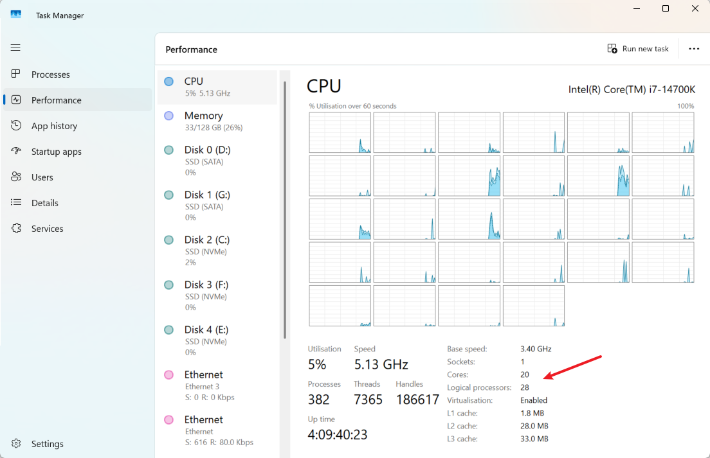

同一节上还有一个 **「Use EFI (special OSes only)」** 的勾选框, **把它勾上**。别被 "special OSes only" 吓着, 现在的电脑早就不用传统 BIOS 引导了, Ubuntu 在 EFI 下装出来的分区布局也更接近真机, 以后你想折腾双系统之类的东西会顺手很多。

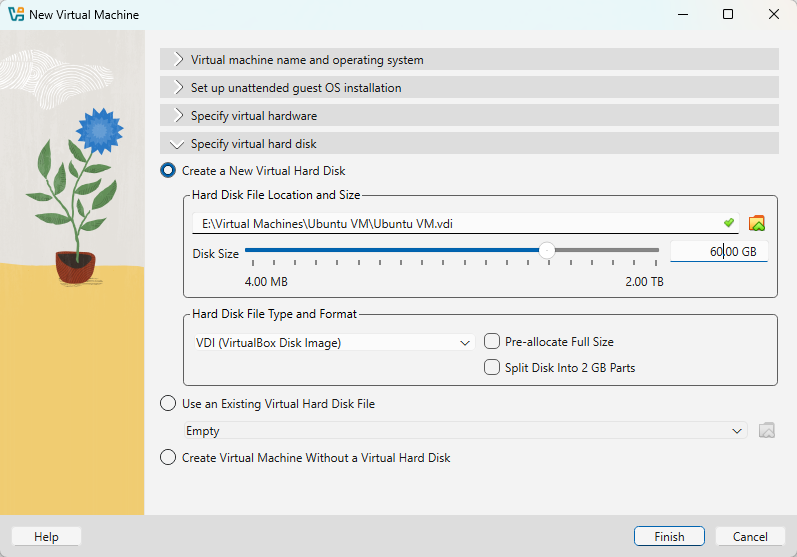

最后一节 **Hard Disk** 是虚拟硬盘。给 **60 GB** 就行 —— Ubuntu 26.04 光系统本身就要 25 GB, 当年那个 50 GB 现在有点紧。

右边的「硬盘文件类型 (Hard Disk File Type)」保持默认的 **VDI** 就好。这一栏是专家模式才有的，引导模式下 VirtualBox 直接替你定成 VDI 不给你看；只有当你要跟 VMware 共用虚拟硬盘、或者想把虚拟硬盘挂到 Host 上的时候才需要改成 VMDK/VHD。

下面三个勾选框：

- **Pre-allocate Full Size**：不要勾。不勾就是动态分配，"用多少，硬盘就开多大"，边用边开；勾上就是 Fixed size，一上来就把 60 GB 全占了。预分配在读写性能上略胜一筹，但对我们现在的工作意义不大。
- **Split Into 2GB Parts**：不要勾。这是给 FAT32 之类单文件不能超过 4 GB 的老文件系统用的，你的 NTFS 不需要。
- 剩下那个 Attach 之类的保持默认。

四节都填完，点右下角的 **Finish**。没有摘要页，点完就直接建好了，在界面左边能看到。

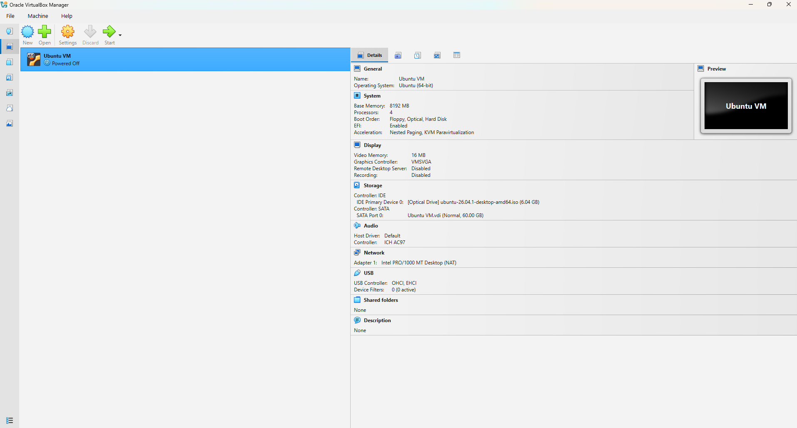

## 做一些调整

创建完先别急着开机，选中虚拟机点「设置 (Settings)」，还有两个地方要调。

7.2 的设置窗口顶上多了 **Basic / Expert** 两个页签：Basic 把每一类设置压成一屏可以滚的卡片，只留最常用的那几项；Expert 才是老版本那种左边一列分类、右边一堆子页签的完整界面。我们要调的东西 Basic 里都有。

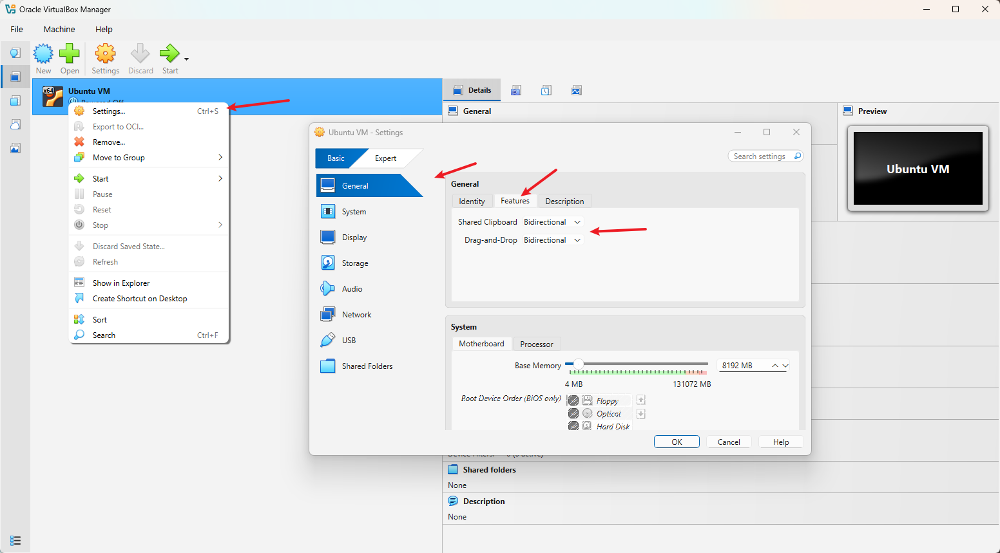

**General** 一节里，Shared Clipboard 和 Drag'n'Drop 这两个都选 **Bidirectional（双向）**，这样可以在 Host 复制，Guest 里粘贴。

> 这两个功能要等系统装好、并且装上 Guest Additions 之后才真的生效, 现在先设上。

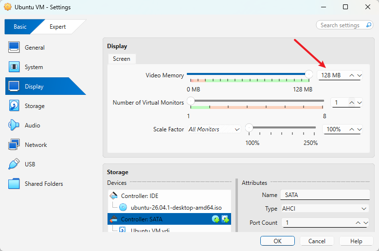

**Display** 一节里把 Video Memory 拉满到 **128 MB**。显卡控制器 (Graphics Controller) 和 3D 加速这两项在 Basic 页签里是看不到的，要去 Expert 页签的「显示」分类里改 —— 不过 VirtualBox 认出客户机是 Linux 之后默认就会给你 VMSVGA，一般不用动它。

再往下滚就是 **Storage**。如果你刚才在新建向导里选了 ISO，那 IDE 控制器的光驱上应该已经挂好了（截图里那个 `ubuntu-26.04.1-desktop-amd64.iso` 就是）。要是没有，点一下那个空的光盘图标，从下拉里选「Choose a disk file」，把你下载的那个 ISO 挑出来。

> **关于嵌套虚拟化**：老版本的文章会让你去「系统 → 处理器」里注意一下 Nested VT-x/AMD-V 那个勾。现在多半不用管了 —— Windows 11 默认开着「内核隔离 / 内存完整性」，这时候整台机器实际上已经跑在 Hyper-V 上，VirtualBox 走的是 Hyper-V 后端，**这个选项压根不会出现**。它不出现不代表出了问题，虚拟机照跑，只是性能比原生后端略差一点而已。

差不多了，点下面的 OK，然后就可以点「启动 (Start)」了。

## 现在开始装系统

> 这一节基本没配图，是故意的。26.04 的安装器已经傻瓜化到"一路 Next 就能装完"的程度，每一页顶上都用大字写着它要干什么，配二十张截图除了把文章撑长没别的用。你照着文字走，对着屏幕上的标题找对应段落就行。

开机之后第一个看到的是 GRUB 引导菜单。这一步选第一个就行，不过还是一行行解释一下满足一些朋友的好奇心：

- **Try or Install Ubuntu** —— 正常标准没毛病的安装 Ubuntu
- **Ubuntu (safe graphics)** —— 以一个比较安全的图形界面来执行第一项, 之所以说比较安全, 是因为它在执行的时候图形界面会稍微收敛一点, 牺牲一些性能什么的换取一个比较好的兼容性, 防止在一些奇奇怪怪的显卡上出现图形界面跑到一半崩掉的情况。**如果你开机之后卡在紫色屏幕或者花屏, 就回来选这个**
- **OEM install (for manufacturers)** —— 如果你是一个电脑制造商, 你要给你卖的电脑装系统, 然后装完系统之后要把电脑卖给你真正的用户, 你真正的用户虽然不用自己装系统, 但需要一个创建自己账户的过程. 那你作为电脑制造商肯定要把这个过程留给客户, 所以就走这个模式
- **Boot from next volume** —— 不安装, 从下一个磁盘启动
- **UEFI Firmware Settings** —— 进虚拟机的 UEFI 设置, 这个以后会专门说

> 26.04 的安装器跟 20.04 那个 Ubiquity 已经不是同一个东西了, 现在这个是用 Flutter 重写的新安装器, 界面更干净, 步骤顺序也略有调整。下面我按现在的顺序讲, 但**不同小版本之间页面顺序可能有出入, 以你屏幕上实际看到的为准**, 别死记。

第一步会让你选语言，这里强烈建议选英文，强烈建议选英文，强烈建议选英文！！！

因为 Linux 系统绝大部分的设计都是契合着英文的输入和使用方式，如果系统用中文，很多操作会面临奇奇怪怪的问题 —— 最直接的一个：你的家目录下面会生成 `桌面`、`下载`、`文档` 这种中文目录名，以后在终端里 `cd` 进去你就知道什么叫痛苦了。

再往后一步是无障碍设置 (Accessibility)，用不上就直接 Next。

键盘布局也选 English (US)，点继续。

然后是联网。虚拟机默认走 NAT，一般已经通了，直接下一步。

接着它会问你是要「试用 (Try Ubuntu)」还是「安装 (Install Ubuntu)」，选安装。

「你想怎么装」这一页选 **Interactive installation**（交互式安装）。旁边那个 Automated installation 是读一个 autoinstall 的 YAML 配置自动装, 不是我们现在要干的事。

下一页问你装哪些软件, 选 **Default selection** 就够了。Extended selection 会把 LibreOffice 那一整套办公软件都装上, 虚拟机里用不太着, 占地方还拖慢安装。

再下一页是「优化你的电脑」, 有两个勾：一个是装第三方图形和 Wi-Fi 驱动, 一个是装多媒体解码器。

**这两个勾建议先都取消掉。** 因为在默认情况下，Ubuntu 包括 Ubuntu 的安装程序，下载软件都是从 Ubuntu 的官方仓库（`http://archive.ubuntu.com`）去下载。但由于官方仓库的服务器在国外，国内访问的话非常慢, 勾上之后安装进度条能卡你半小时。所以我们先继续，等我们装好系统之后，把软件的安装源换成国内镜像，再回头来装这些东西就很快了。

顺便说一句，虚拟机里也没有什么第三方显卡驱动和 Wi-Fi 网卡可装，本来就用不上。

磁盘这一步，除非你知道自己在干什么, 否则选默认的 **Erase disk and install Ubuntu**。

这里可能会有同学慌：擦除磁盘？我的 Windows 呢？—— 放心，这个"磁盘"是刚才我们创建的那块 60 GB 的虚拟硬盘，在 Host 看来它就是一个文件，你的真实硬盘它碰不到。这也正是我们用虚拟机学 Linux 的原因：随便你怎么折腾，删了重建就是。

页面下面那个「高级功能 (Advanced features)」里有 LVM 和全盘加密的选项，现在别动。

这一步要填的东西比较多，一个个来：

- **Your name** —— 你的名字，显示在各个出现你账户名字的场合，类似你的 Q 名之类的昵称
- **Your computer's name** —— 选一个简短的，可以代表你的这台虚拟机设备的名字，有时候从别的地方连接这个虚拟机，就要用这个名字
- **Username** —— 你的用户名，也是简短的，一个单词就好, **全小写、别带空格**
- **Password** —— 输入两次，最好容易记而且很容易输入。因为这个密码以后会经常用（每次 `sudo` 都要敲），所以最好是比较容易输入那种

选个时区，`Shanghai` 就行。

最后是一个确认页，告诉你要格式化硬盘（虚拟的硬盘），然后给你装系统，让你确认一下，点 Install 就可以。

等，等它装好之后会提示你重启虚拟机，跟着它提示重启就好。重启的时候它可能会让你「按回车移除安装介质」, 直接按回车, VirtualBox 会自己把 ISO 弹出来。

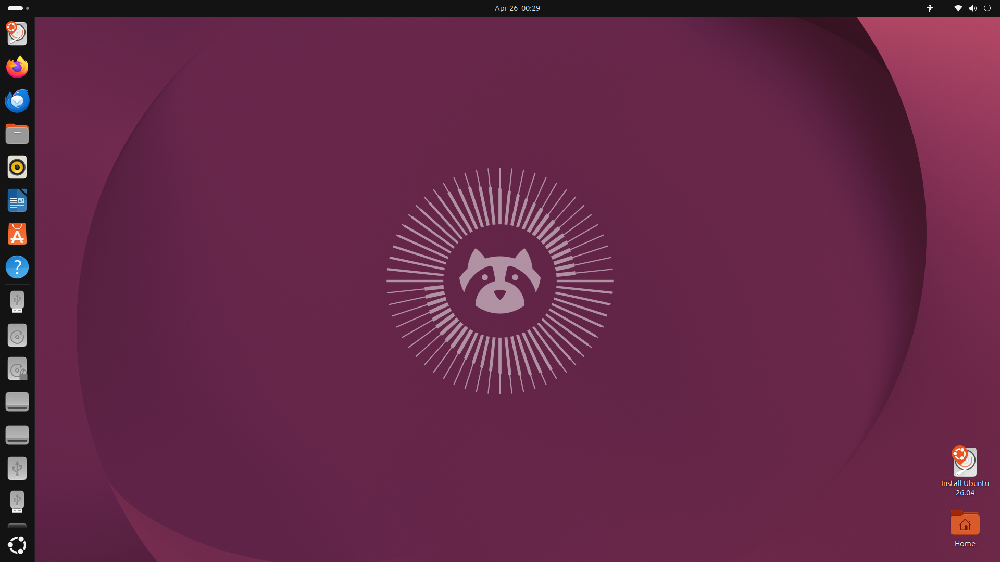

装好之后大概长这样（这张和下一张是 Canonical 官方发布的 26.04 宣传截图，以 GPL 授权，比我自己在虚拟机里截的干净，就直接拿来用了）。左边那条是 Dock，右上角是系统菜单。

## 换国内软件源

如我们之前所言，把软件的安装源换成国内镜像。首先从应用列表里找到 Terminal（终端），或者直接在桌面按 <kbd>Ctrl</kbd>+<kbd>Alt</kbd>+<kbd>T</kbd> 就可以打开终端。

> 26.04 的默认终端换成了 **Ptyxis**（原来是 GNOME Terminal），图标和标签页的样子跟以前不一样，不用管，一样用。

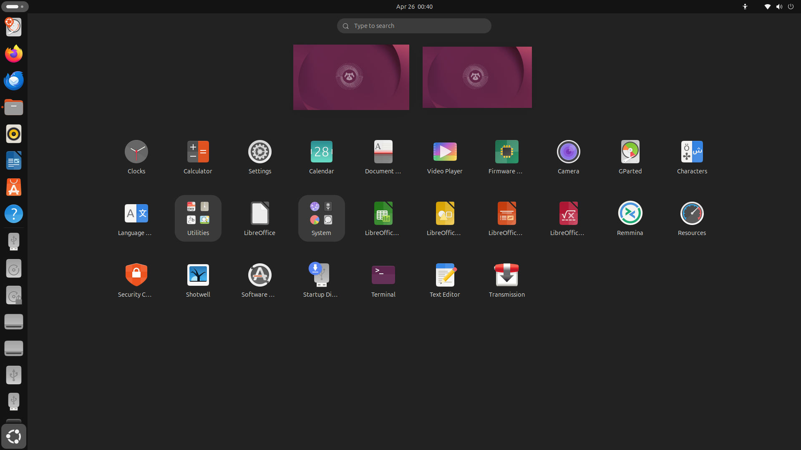

应用程序列表长这样，点 Dock 最下面那个九宫格图标打开，直接打字就能搜。

打开终端之后，第一行大概是这样：

```text
charlie@ubuntu-vm:~$
```

`charlie` 是你的用户名，`ubuntu-vm` 是你刚才起的电脑名，冒号后面的 `~` 是当前工作目录，表示你的家目录（home）。最后那个 `$` 表示你现在是普通用户；如果哪天你看到的是 `#`，那说明你正在用 root 身份，说话做事都得小心点。

这里说一下 Linux 的用户系统。

早些年电脑还没那么普及的时候，并不是像现在这样人人都有电脑。有时候一个实验室只有一台电脑，大家都要用，所以就有了不同用户。不同用户在电脑上相对隔离，有自己的空间，也有自己的权限。你不能访问你没有权限访问的东西。

除了用户，还有用户组，比如这一组人都有权限访问这个文件，但其他人又不行，所以就搞了个用户组。

此外还有一个超级用户，在这个电脑里无所不能为所欲为，可以随意查看任何文件，也可以添加、删除用户，修改其他用户的密码。之前说过, 这个超级用户其实就是 root, 它是电脑里的天神, 权力很大也很危险, 如果坏人拿到这个账户你电脑就凉了. 所以 Ubuntu 默认禁用了这个用户. 当你需要这个用户的权限的时候, 就需要在命令前面加一个 `sudo`。

比如你需要修改的软件源列表是个很重要的东西, 一般只有 root 用户才能修改 (谁都能决定你从哪里下载软件挺可怕的不是吗), 所以你需要用 sudo 权限来打开它。

**这里是这篇文章里变化最大的一处**：20.04 的软件源列表是 `/etc/apt/sources.list`，一行一个源的老格式。从 24.04 开始 Ubuntu 换成了 **DEB822 格式**，文件挪到了 `/etc/apt/sources.list.d/ubuntu.sources`，长得像一段配置文件。你去网上搜到的那些"改 sources.list"的教程，在 26.04 上**改了也没用**，因为那个文件已经是空的了。

先备份一份，出事了好还原：

```bash
sudo cp /etc/apt/sources.list.d/ubuntu.sources /etc/apt/sources.list.d/ubuntu.sources.bak
```

然后打开它。**原文这里用的是 `sudo gedit`，现在这条命令已经不能用了**，两个原因：一是 gedit 早就不是 Ubuntu 的默认编辑器了（现在叫 `gnome-text-editor`），二是 26.04 的 GNOME 会话是纯 Wayland 的，用 `sudo` 跑图形程序根本起不来。所以老老实实用终端里的编辑器：

```bash
sudo nano /etc/apt/sources.list.d/ubuntu.sources
```

这个文件一共四十来行，但**开头三十多行全是 `#` 开头的注释**，告诉你这文件是干什么的、升级发行版该看哪个文档。真正起作用的只有末尾那两段，长这样：

```text
Types: deb
URIs: http://cn.archive.ubuntu.com/ubuntu/
Suites: resolute resolute-updates resolute-backports
Components: main universe restricted multiverse
Signed-By: /usr/share/keyrings/ubuntu-archive-keyring.gpg

Types: deb
URIs: http://security.ubuntu.com/ubuntu/
Suites: resolute-security
Components: main universe restricted multiverse
Signed-By: /usr/share/keyrings/ubuntu-archive-keyring.gpg
```

要改的只有 **第一段的 `URIs:` 那一行**，把地址换成国内镜像：

```text
URIs: https://mirrors.tuna.tsinghua.edu.cn/ubuntu
```

几个注意点：

- `Suites:` 里的 `resolute` 是 26.04 的代号。你要是装的 24.04，那就是 `noble`，**别照抄**。不确定的话跑一下 `lsb_release -cs` 它会告诉你。
- 原来的地址不一定是 `cn.archive.ubuntu.com`。安装的时候你要是选了别的时区/位置，或者是 WSL、Server 这类镜像，可能就是光秃秃的 `archive.ubuntu.com`。**以你文件里实际写的为准**，别照抄我这行去 `sed`。
- **第二段 `security` 的那个不要改。** 镜像站同步有延迟，安全更新走官方源更稳妥，反正安全更新的包不大。
- 用 `https` 的镜像地址，不要 `http`。
- `Components:` 那行别动。四个词的顺序无所谓，`apt` 不在乎。

nano 里改完之后按 <kbd>Ctrl</kbd>+<kbd>O</kbd> 回车保存，<kbd>Ctrl</kbd>+<kbd>X</kbd> 退出。

嫌手改麻烦的话，一条命令也行（但你得先看懂上面那段它在改什么，而且左边那个地址要跟你文件里的一致）：

```bash
sudo sed -i 's|http://cn.archive.ubuntu.com/ubuntu/|https://mirrors.tuna.tsinghua.edu.cn/ubuntu|' /etc/apt/sources.list.d/ubuntu.sources
```

改完在刚才的终端里执行：

```bash
sudo apt update
```

输出大概是这个样子：

```text
Hit:1 https://mirrors.tuna.tsinghua.edu.cn/ubuntu resolute InRelease
Get:2 https://mirrors.tuna.tsinghua.edu.cn/ubuntu resolute-updates InRelease [126 kB]
Get:3 https://mirrors.tuna.tsinghua.edu.cn/ubuntu resolute-backports InRelease [126 kB]
Get:4 http://security.ubuntu.com/ubuntu resolute-security InRelease [126 kB]
...
Fetched 28.1 MB in 4s (7,021 kB/s)
Reading package lists... Done
All packages are up to date.
```

前面几行的地址变成清华的、而且速度是几 MB/s 而不是几十 kB/s，就说明换源成功了。顺手升个级：

```bash
sudo apt upgrade
```

这次你应该能感受到什么叫国内镜像。

## 最后：装一下 Guest Additions

换完源之后建议把 Guest Additions 装上，这是让虚拟机窗口能自适应分辨率、能双向复制粘贴、能共享文件夹的那个东西。

在虚拟机窗口的菜单里点「设备 (Devices)」→「安装增强功能 (Insert Guest Additions CD image)」，然后在虚拟机里：

```bash
sudo apt install -y build-essential dkms linux-headers-$(uname -r)
cd /media/$USER/VBox_GAs_*/
sudo ./VBoxLinuxAdditions.run
```

装完重启虚拟机。这时候你把 VirtualBox 的窗口一拉，Ubuntu 的桌面分辨率会跟着变，刚才设的双向粘贴板也开始工作了。

> Ubuntu 仓库里也有一个 `virtualbox-guest-utils` 包，但版本跟你装的 VirtualBox 不一定对得上，还是用光盘镜像里的那份更保险。

---

**图片来源**：VirtualBox 和 Windows 的截图是我自己截的。Ubuntu 桌面和应用程序列表那两张来自 Wikimedia Commons，作者 Canonical Limited，以 GPL 授权（[default desktop](https://commons.wikimedia.org/wiki/File:Ubuntu_26.04_LTS_default_desktop_-_English.png)、[applications menu](https://commons.wikimedia.org/wiki/File:Ubuntu_26.04_LTS_applications_menu_-_English.png)）。
