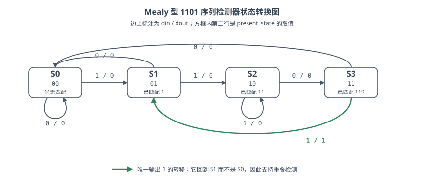
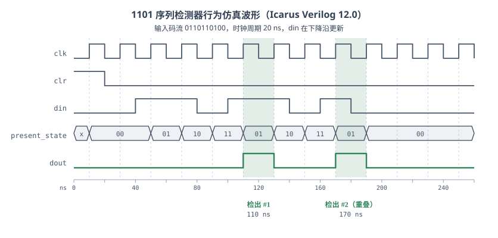
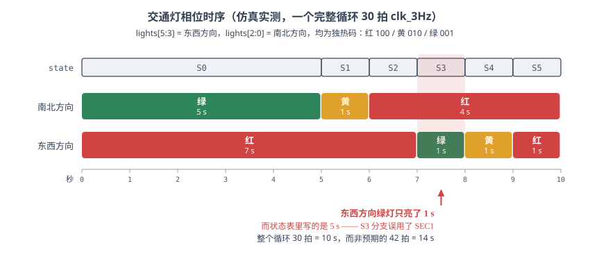

用 Mealy 状态机在 FPGA 上做两个小设计：1101 序列检测器和交通信号灯。
<!--more-->

> 这篇是 2020 年数字电路实验课的笔记。2026 年重新整理时，原来挂在对象存储上的三张仿真截图早就失效了，于是我把当年的代码和测试文件用 [Icarus Verilog](https://steveicarus.github.io/iverilog/) 12.0 重新跑了一遍，图全部按仿真结果重画。顺带跑出来两个当年没注意到的问题，一并写在下面。

## Mealy 状态机

有限状态机的输出怎么来，有两种约定：

- **Moore 型**：输出只由当前状态决定，$y = \lambda(S)$。输出跟着状态寄存器走，天然无毛刺，但往往要多几个状态。
- **Mealy 型**：输出由当前状态**和当前输入**共同决定，$y = \lambda(S, x)$。同样的功能通常能少用几个状态，代价是输出里有一条从输入直通到输出的组合路径，输入上的毛刺会原样传到输出。

以 1101 序列检测器为例：用 Moore 型需要第五个状态专门表示「刚刚检出」，而 Mealy 型不用 —— 「检出」这件事标在**边**上，不占状态。

本文的写法还多走了一步：输出 `dout` 也过了一级寄存器（下面代码里的 C2 模块用的是 `always @(posedge clk)`）。这样既保留了 Mealy 少一个状态的好处，又把组合路径切断了，没有毛刺；代价是 `dout` 比「检出」这一拍晚一个时钟周期才拉高。这种写法一般叫**寄存器输出的 Mealy 机**，在实际工程里比裸 Mealy 常见得多。

## 1101 序列检测器

### 状态编码

四个状态各自代表「目前已经匹配上了 1101 的哪一段前缀」：

| 状态 | `present_state` | 含义 |
| ---- | --------------- | ---- |
| S0   | `00`            | 尚无匹配 |
| S1   | `01`            | 已匹配 `1` |
| S2   | `10`            | 已匹配 `11` |
| S3   | `11`            | 已匹配 `110` |

把状态转换图画出来：



几条容易画错的边值得单独说一下：

- **S2 收到 `1` 时自环**，不回 S0。因为码流 `111` 的末尾仍然是 `11`，前缀匹配长度没有退化。
- **S3 收到 `1` 时回 S1 而不是 S0**，并且这是全图唯一输出 `1` 的边。回 S1 的意思是：刚刚匹配成功的 `1101` 里，最后那个 `1` 可以当作下一次匹配的开头。正是这条边让检测器支持**重叠检测** —— 码流 `1101101` 里有两个 `1101`。
- **S1 收到 `0` 时回 S0**，因为 `10` 的任何后缀都不是 `1101` 的前缀。

### 设计代码

```verilog
`timescale 1ns / 1ps

module seqdetb(
    input wire clk,
    input wire clr,
    input wire din,
    output reg dout
    );

    reg [1:0] present_state, next_state;
    parameter S0=3'b00, S1=3'b01,S2=3'b10,S3=3'b11;
    //状态寄存器
    always @ (posedge clk or posedge clr)
        begin
            if (clr==1)
                present_state <= S0;
            else
                present_state <= next_state;
        end
        //C1模块
        always@ (*)
            begin
                case(present_state)
                    S0: if(din == 1)
                            next_state <= S1;
                        else
                            next_state <= S0;
                    S1: if(din == 1)
                            next_state <= S2;
                        else
                            next_state <= S0;
                    S2: if(din == 0)
                            next_state <= S3;
                        else
                            next_state <= S2;
                    S3: if(din == 1)
                            next_state <= S1;
                        else
                            next_state <= S0;
                    default
                        next_state <= S0;
                endcase
            end

        //C2模块
        always @ (posedge clk or posedge clr)
            begin
                if(clr==1)
                    dout <= 0;
                else if( (present_state == S3) && (din == 1))
                    dout <=1;
                else
                    dout <= 0;
            end
endmodule
```

代码本身是对的，功能仿真和综合都没问题，但有两处写法今天看会被 lint 工具念叨：

- C1 是纯组合逻辑，里面应该用阻塞赋值 `=`。这里用了 `<=`，在只有一个 `always` 块驱动 `next_state` 的情况下结果碰巧一样，但一旦组合逻辑分成多块就会踩到竞争。
- `parameter S0=3'b00, ...` 声明成了 3 位，而 `present_state` 是 `reg [1:0]`。比较和赋值时高位被截掉，恰好不出错，但位宽应该对齐成 2 位。

### 原来的测试文件跑不出东西

当年写的测试文件是这样的：

```verilog
`timescale 1ns / 1ps

module seqdetb_test(
    );
    reg clk;
    reg clr;
    reg din;
    wire dout;
    parameter period = 100;
    seqdetb seqdetb1(
    .clk(clk), .clr(clr), .din(din), .dout(dout)
    );
    initial
        begin
            clk = 0;
            clr = 1;
            din = 0;
        end

    always #(period/2)  begin clk = ~clk;  end
    always #(period*2)  begin din = ~din;  end
    always #period      begin clr = ~clr;  end
endmodule
```

时钟周期是 100 ns，而 `clr` 每 100 ns 翻转一次 —— **复位信号有一半时间是拉高的**，状态机每走一拍就被清回 S0。同时 `din` 每 200 ns 才翻转一次，也就是每两个时钟周期才换一个码元，根本凑不出 `1101` 这样的图案。

把它挂到 Icarus Verilog 上跑满 1000 ns，结果是：

- `dout` 从 0 ns 起就是 `0`，全程一次都没变过；
- `present_state` 只在 350 ns 和 750 ns 短暂到过 `01`（S1），从没进过 S2、S3。

所以原文那张仿真截图上其实什么也没有 —— `dout` 是一条平的低电平。当时没看出来，就直接往下走去综合了。

### 修正后的测试文件

要验证检测器，得让 `clr` 只在开头拉高一拍，再按时钟节拍逐位喂码流。这里喂 `0110110100`，中间含有两个**重叠**的 `1101`：

```verilog
`timescale 1ns / 1ps

module seqdetb_tb;
    reg clk = 0;
    reg clr = 1;
    reg din = 0;
    wire dout;
    integer i;
    reg [0:9] stream = 10'b0110110100;

    seqdetb uut(.clk(clk), .clr(clr), .din(din), .dout(dout));

    always #10 clk = ~clk;          // 20 ns 周期

    initial begin
        clr = 1;
        @(negedge clk);             // 复位只保持一拍
        clr = 0;
        for (i = 0; i < 10; i = i + 1) begin
            din = stream[i];        // 在下降沿换码元，避开建立/保持窗口
            @(negedge clk);
        end
        din = 0;
        repeat (2) @(negedge clk);
        $finish;
    end
endmodule
```

跑出来的波形：



逐拍对一下（`din` 列是上升沿采到的值，`present_state` 列是这个上升沿之后的新状态）：

| 上升沿 | `din` | `present_state` | 转移 | `dout` |
| ------ | ----- | --------------- | ---- | ------ |
| 30 ns  | 0 | `00` | S0 → S0 | 0 |
| 50 ns  | 1 | `01` | S0 → S1 | 0 |
| 70 ns  | 1 | `10` | S1 → S2 | 0 |
| 90 ns  | 0 | `11` | S2 → S3 | 0 |
| 110 ns | 1 | `01` | S3 → S1 | **1** |
| 130 ns | 1 | `10` | S1 → S2 | 0 |
| 150 ns | 0 | `11` | S2 → S3 | 0 |
| 170 ns | 1 | `01` | S3 → S1 | **1** |
| 190 ns | 0 | `00` | S1 → S0 | 0 |

两次检出正好对应码流里的两个 `1101`，而且第二次是重叠的 —— 第一个 `1101` 的末位 `1` 同时是第二个 `1101` 的首位。110 ns 那一拍状态从 S3 跳回 S1 而不是 S0，重叠检测就是靠这个。

`dout` 各自只高一个时钟周期，并且比「最后一个 `1` 被采样」晚一拍出现，这就是前面说的寄存器输出带来的延迟。

> 顺便提一个仿真里的坑：如果在 `always @(posedge clk)` 里用 `$display` 打印 `dout`，打出来的会是**上一拍**的值。因为 `dout` 是非阻塞赋值，更新发生在 `$display` 执行之后。上面这张表和图都是从 VCD 波形文件里读的，不是从 `$display` 读的。

对工程进行综合后，可以成功生成 BitStream 文件。

## 结合状态机实现交通信号灯

### 状态转换表

| 状态 | 南北方向 | 东西方向 | 延迟/s |
| ---- | -------- | -------- | ------ |
| 0    | 绿       | 红       | 5      |
| 1    | 黄       | 红       | 1      |
| 2    | 红       | 红       | 1      |
| 3    | 红       | 绿       | 5      |
| 4    | 红       | 黄       | 1      |
| 5    | 红       | 红       | 1      |

S2 和 S5 的灯色完全一样（两个方向全红），是十字路口的清空间隔；它们靠状态区分，因为「下一步该谁绿」不同。

### 实现程序

```verilog
`timescale 1ns / 1ps

module traffic(
    input wire clk_3Hz,
    input wire clr,
    output reg [5:0] lights
    );

    reg [2:0] state;
    reg [3:0] count;
    parameter S0=3'b000, S1=3'b001, S2=3'b010,//states
                S3=3'b011, S4=3'b100, S5=3'b101;
    parameter SEC5=4'b1110, SEC1=4'b0010;
    always @ (posedge clk_3Hz or posedge clr)
        begin
            if(clr==1)
                begin
                    state <= S0;
                    count <= 0;
                end
            else
                case(state)
                    S0:
                        if(count<SEC5)
                            begin state <= S0; count <= count +1; end
                        else
                            begin state <= S1; count <= 0; end
                    S1:
                        if(count<SEC1)
                            begin state <= S1; count <= count +1; end
                        else
                            begin state <= S2; count <= 0; end
                    S2:
                        if(count<SEC1)
                            begin state <= S2; count <= count +1; end
                        else
                            begin state <= S3; count <= 0; end
                    S3:
                        if(count<SEC1)                  // ← 这里应该是 SEC5
                            begin state <= S3; count <= count +1; end
                        else
                            begin state <= S4; count <= 0; end
                    S4:
                        if(count<SEC1)
                            begin state <= S4; count <= count +1; end
                        else
                            begin state <= S5; count <= 0; end
                    S5:
                        if(count<SEC1)
                            begin state <= S5; count <= count + 1; end
                        else
                            begin state <= S0; count <= 0; end
                    default state <= S0;
                    endcase
                end
            always @(*)
                begin
                    case(state)
                        S0: lights=6'b100001;
                        S1: lights=6'b100010;
                        S2: lights=6'b100100;
                        S3: lights=6'b001100;
                        S4: lights=6'b010100;
                        S5: lights=6'b100100;
                        default lights=6'b100001;
                    endcase
                end
endmodule
```

### `lights` 的位分配

原文没交代这 6 位怎么排，回头看代码才对出来：高 3 位是东西方向，低 3 位是南北方向，每组内部是**独热码**。

| 位段 | 方向 | `100` | `010` | `001` |
| ---- | ---- | ----- | ----- | ----- |
| `lights[5:3]` | 东西 | 红 | 黄 | 绿 |
| `lights[2:0]` | 南北 | 红 | 黄 | 绿 |

拿 S3 的 `6'b001100` 核对一下：高 3 位 `001` = 东西绿，低 3 位 `100` = 南北红，和状态表对得上。

顶层模块把 `lights` 直接接到 `ld[5:0]`，也就是开发板上的六个 LED。

### 计数常数

`SEC5 = 4'b1110 = 14`，`SEC1 = 4'b0010 = 2`。判断条件是 `count < SECn` 才继续停留，所以实际停留的拍数是 $\text{SECn} + 1$：`SEC5` 停 15 拍，`SEC1` 停 3 拍。时钟是 3 Hz，于是 15 拍 = 5 s、3 拍 = 1 s，和状态表里的秒数对得上。

### 仿真结果，以及 S3 的问题

```verilog
`timescale 1ns / 1ps

module traffic_tb;
    reg clk_3Hz = 0;
    reg clr = 1;
    wire [5:0] lights;
    traffic uut(.clk_3Hz(clk_3Hz), .clr(clr), .lights(lights));

    always #10 clk_3Hz = ~clk_3Hz;

    initial begin
        clr = 1;
        @(negedge clk_3Hz);     // 让复位在下降沿撤除，避开与上升沿的竞争
        clr = 0;
        #1300 $finish;
    end
endmodule
```

仿真里的「3 Hz」只是个记号，时钟周期取 20 ns 跑得快些；下图的秒数是按 3 拍 = 1 s 折算的。



一个完整循环实测是 `S0` 15 拍、`S1`～`S5` 各 3 拍，合计 **30 拍 = 10 s**。可是按状态表，S0 和 S3 都该是 5 s，整个循环应该是 $15 + 3 + 3 + 15 + 3 + 3 = 42$ 拍 $= 14$ s。

差在 S3 上：**S3 的分支里写的是 `count < SEC1`，应该是 `SEC5`**。结果东西方向的绿灯只亮 1 秒，南北方向绿灯却有 5 秒，路口是偏的。改一行就好：

```verilog
                    S3:
                        if(count<SEC5)
                            begin state <= S3; count <= count +1; end
                        else
                            begin state <= S4; count <= 0; end
```

当年那张失效的仿真截图上大概也能看出这个问题，只是没去数拍数。这也说明「仿真波形看起来在动」离「仿真结果是对的」还差一步 —— 得拿波形去核对设计文档里的数字。

> 还有个小地方：原来的测试文件写的是 `clr=1; #10; clr=0;`，而 `always #10 clk_3Hz=~clk_3Hz;` 的第一个上升沿也正好在 10 ns，两者同时发生，属于竞争。Icarus 跑出来第一个 S0 只有 14 拍，之后稳定在 15 拍。把 `clr` 的撤除挪到下降沿就没这个问题了。

### 分频器

开发板的晶振是 100 MHz，要凑出 3 Hz 得分频：

```verilog
`timescale 1ns / 1ps

module clkdiv(
    input wire clk_100MHz,
    input wire clr,
    output wire clk_3Hz
    );
    reg [24:0] q;
    //25bit counter
    always @ (posedge clk_100MHz or posedge clr)
        begin
            if(clr==1)
                q <= 0;
            else
                q <= q + 1;
        end
    assign clk_3Hz=q[24] ;//3Hz
endmodule
```

`q[24]` 每 $2^{24}$ 个输入周期翻转一次，一个完整周期是 $2^{25}$ 个输入周期：

$$
f = \frac{100\ \text{MHz}}{2^{25}} = \frac{10^8}{33554432} \approx 2.98\ \text{Hz}
$$

对交通灯来说这个误差无所谓。需要注意的是，这样分出来的 `clk_3Hz` 是**组合逻辑的一位计数器输出**，直接拿去当时钟用会走普通布线资源而不是全局时钟网络，在大一点的设计里会有时钟偏斜问题。规范做法是生成一个时钟使能信号，让所有寄存器都跑在 100 MHz 上，靠使能去降速。实验板上这么写没事，真做项目别学。

### 顶层模块

```verilog
`timescale 1ns / 1ps

module traffic_lights_top(
    input wire clk_100MHz,
    input wire [4:4] s,
    output wire [5:0] ld
    );
    wire clr, clk_3Hz;
    assign clr=s;
    clkdiv U1(.clk_100MHz(clk_100MHz),
                .clr(clr),
                .clk_3Hz(clk_3Hz)
              );
    traffic U2(.clk_3Hz(clk_3Hz),
                .clr(clr),
                .lights(ld)
              );
endmodule
```

`input wire [4:4] s` 是个只有一位的切片，写成这样是为了在约束文件里直接对上开发板的拨码开关 `SW4`，让它当复位用。

经过综合，可以生成 BitStream 文件。

## 复现

上面两张波形图是这样跑出来的（Icarus Verilog 12.0，Ubuntu 24.04）：

```bash
iverilog -g2012 -o seqdet.vvp seqdetb.v seqdetb_tb.v && vvp seqdet.vvp
```

在测试文件里加上 `$dumpfile("x.vcd"); $dumpvars(0, 模块名);` 就能导出 VCD，用 [GTKWave](https://gtkwave.sourceforge.net/) 或 [Surfer](https://surfer-project.org/) 看波形。Vivado 自带的仿真器结果是一样的，只是不用手写这两句。
