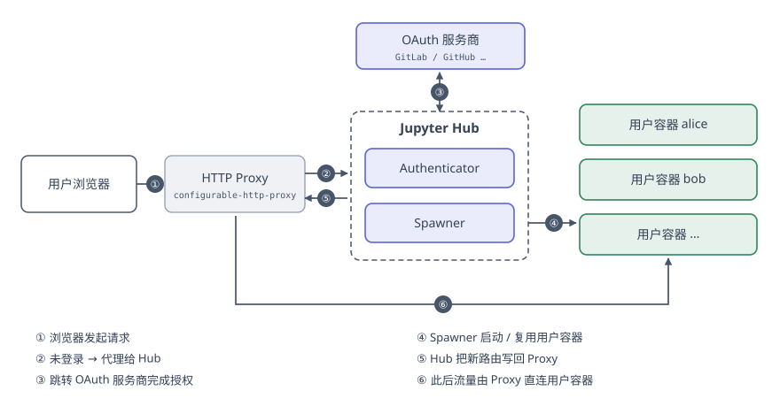

> 本文介绍基于Docker搭建 Jupyter Hub 平台并实现GPU共享, 同时包括使用多种方式实现身份验证

<!--more-->

> **写在前面**：这篇文章写于 2021 年，是当时给实验室搭共享 GPU 环境时留下的记录。文中用到的私有 GitLab、私有镜像仓库如今都已经下线了，相关部分我改成了通用写法——换成你自己的 OAuth 服务商和镜像仓库即可，思路是一样的。CUDA 版本号、驱动安装方式这些也请以官方最新文档为准。

## 环境准备

首先, 需要确保[安装Docker](https://docs.docker.com/get-docker/)

```bash
curl -fsSL https://get.docker.com -o get-docker.sh
sudo sh get-docker.sh --mirror Aliyun # 可以借助这个参数使用阿里云镜像源
sudo usermod -aG docker $USER # 将当前用户加入docker用户组, 以实现在非sudo下调用docker命令
```

其次, 需要安装NVIDIA 显卡驱动和NVIDIA Container Toolkit

显卡驱动可以直接使用ubuntu-drivers进行安装

```bash
sudo ubuntu-drivers install
```

安装NVIDIA Container Toolkit可以直接按照官方文档进行安装

```bash
distribution=$(. /etc/os-release;echo $ID$VERSION_ID) \
   && curl -s -L https://nvidia.github.io/nvidia-docker/gpgkey | sudo apt-key add - \
   && curl -s -L https://nvidia.github.io/nvidia-docker/$distribution/nvidia-docker.list | sudo tee /etc/apt/sources.list.d/nvidia-docker.list
   
sudo apt update

sudo apt install -y nvidia-docker2

sudo systemctl restart docker
```

可以通过在使用`docker run` 时加入`--gpus all`参数来实现GPU的透传. 我们可以通过这样一个命令来测试是否安装成功

```bash
sudo docker run --rm --gpus all nvidia/cuda:11.2-base nvidia-smi
```

得到类似如下结果说明安装成功

```bash
+-----------------------------------------------------------------------------+
| NVIDIA-SMI 450.51.06    Driver Version: 450.51.06    CUDA Version: 11.0     |
|-------------------------------+----------------------+----------------------+
| GPU  Name        Persistence-M| Bus-Id        Disp.A | Volatile Uncorr. ECC |
| Fan  Temp  Perf  Pwr:Usage/Cap|         Memory-Usage | GPU-Util  Compute M. |
|                               |                      |               MIG M. |
|===============================+======================+======================|
|   0  Tesla T4            On   | 00000000:00:1E.0 Off |                    0 |
| N/A   34C    P8     9W /  70W |      0MiB / 15109MiB |      0%      Default |
|                               |                      |                  N/A |
+-------------------------------+----------------------+----------------------+

+-----------------------------------------------------------------------------+
| Processes:                                                                  |
|  GPU   GI   CI        PID   Type   Process name                  GPU Memory |
|        ID   ID                                                   Usage      |
|=============================================================================|
|  No running processes found                                                 |
+-----------------------------------------------------------------------------+
```

## 构建需要的镜像

Jupyter Hub本身不承担计算任务, 只是一个代理和管理平台, 但我们希望每个用户分配到的容器可以使用GPU, 所以我们需要自己构建能够使用GPU的镜像. 

一个满足要求的用户镜像至少应该有如下的特点:

* 基于nvidia/cuda构建
* 安装了 `python3-pip`
* 安装了 `jupyterlab`,  `jupyterhub`,  `jupyter-notebook`

当时为了方便, 我自己写了一套 Dockerfile 放在实验室的私有仓库里, 现在那个仓库已经不在了. 不过官方维护的 [jupyter/docker-stacks](https://github.com/jupyter/docker-stacks) 已经足够好用, 在它的基础上换成 `nvidia/cuda` 的基础镜像即可; 后文出现的 `registry.example.com/your-org/jupyter-docker/...` 都请替换成你自己构建并推送的镜像名. 

## 选择安装方式

你可以将 Jupyter Hub 部署在一个Docker 容器中, 也可以部署在裸机上. Juypyter Hub 本身只是一个代理, 他会将Web请求根据身份验证结果代理到正确的 Jupyter Lab 服务器上. 所以其实真正意义上你需要做出两个选择, 一个是如何安装 Jupyter Hub, 另一个是如何安装 Jupyter Hub所代理的 Jupyter Lab. 由于我们需要考虑环境之间的隔离, 所以我们这次选择Docker, Jupyter Hub和 Jupyter Lab都安装在Docker中.  

对于更大规模的Hub服务, 比如你有多个服务器, 并且用户数量庞大, 可以使用Kubernetes来搭建Jupyter Hub. 但这对于通常实验室内部的需求来说太臃肿, 而且造成了额外的资源开销, 比较浪费. 

用户登录Hub后, 根据Hub的配置 ( 定义在`Config.py`中) 会先对其进行身份验证, 没有登录或者注册的用户, Hub会重定向到指定的身份验证的地址. 完成登录流程后, 再重定向回到Hub. 随后, Hub会根据身份验证的结果, 使用`Spawner` 给用户分配一个 Jupyter Lab 服务器. 相对应的映射数据等会保存在Hub的数据库中. 



这里有一点值得留意：**登录完成之后，Hub 就退出了数据通路**。用户后续的所有请求都由 Proxy 直接转发到自己的容器，Hub 只在登录、启停容器时才参与。所以 Hub 短暂重启并不会打断正在写代码的用户。

Jupyter Hub 本身需要维护一些数据, 包括用户ID与对应容器的映射关系等. 这些数据本身在用户不是很多, 负载不是很大的情况下可以使用默认的SQLite来存储, 如果你对高可用(比如定期备份, 分布式存储, 灾后重建恢复等)功能有要求, 可以使用MySQL或者其他数据库来进行存储. 这里不多赘述, 直接使用默认的SQLLite. 

## 选择身份验证方式

Jupyter Hub是一个可以实现多用户分配不同 Jupyter Notebook 的平台. 首先它需要实现一个身份验证的功能, 来区分不同用户. 官方默认的身份验证模式是基于PAM的, 也就是使用 Jupyter Lab 所运行的那个 Linux 服务器上的用户的用户名和密码进行认证. 

除了PAM的身份验证方式以外, 我更加推荐的是 OAuth. OAuth 是一种身份认证协议, 它由一个 OAuth 服务器提供用户的身份信息. 很多网站和应用都提供这样的认证方式, 包括 Github, Gitlab 以及谷歌账户. 

考虑到基于PAM的用户认证模式难以维护, 也不方便注册和登录, 这里使用 OAuth 来实现身份验证. 

## 填写配置文件

这一章节主要介绍 Jupyter Hub 的配置文件一些常用的选项。可以根据自己的需要进行修改。

### 身份验证

理论上任何支持 OAuth 协议的身份提供方都可以完成认证工作, 而 `oauthenticator` 这个插件对 GitLab 和 GitHub 的支持最为完善, 下面就以这两者为例.

#### 先配好 Jupyter Hub 的对外地址

无论用哪家 OAuth 服务商, 第一步都是确定 Jupyter Hub 的对外 URL——因为注册应用时要填的回调地址就是由它拼出来的, 两边必须完全一致, 否则登录会被拒绝.

默认情况下 Jupyter Hub 使用本机的对外 IP, 但如果你把 Hub 跑在容器里, 拿到的会是容器的内网 IP, 外部根本访问不到. 所以这里留一个环境变量 `JUPYTERHUB_URL` 作为覆盖, 运行容器时用 `-e JUPYTERHUB_URL=<你的地址>` 传进去:

```python
import os
from jupyter_client.localinterfaces import public_ips

jupyterhub_url = os.environ.get("JUPYTERHUB_URL", "http://" + public_ips()[0] + ":8888")

c.JupyterHub.hub_ip = public_ips()[0]
```

#### 注册一个 OAuth 应用

接下来去你选定的服务商那里注册应用, 这一步应该由 Jupyter Hub 的管理员完成. 各家的界面不太一样, 但要填的东西是固定的这么几项:

| 要填的字段 | 填什么 |
| --- | --- |
| 应用名称 | 随意, 用户授权时会看到它 |
| 回调地址 (Callback / Redirect URI) | `<你的 Jupyter Hub URL>/hub/oauth_callback` |
| 权限范围 (Scope) | GitLab 勾 `read_user`; GitHub 留空或 `read:user` 即可 |

保存之后, 服务商会给你一对 `client_id` 和 `client_secret`. **`client_secret` 等同于密码, 不要提交进代码仓库**——建议同样用环境变量传入, 而不是直接写死在配置文件里.

几个常见服务商的注册入口:

- GitHub: <https://github.com/settings/applications/new>
- GitLab.com 或自建 GitLab: 用户设置 → Applications
- 其他支持 OAuth 2.0 / OIDC 的服务商 (Google、Azure AD、Keycloak 等): 见 [oauthenticator 文档](https://oauthenticator.readthedocs.io/)

#### 使用 GitLab

GitLab 可以是 `gitlab.com`, 也可以是任何一台自建的私有 GitLab. 两者配置完全一样, 区别只在于要不要告诉插件 GitLab 装在哪:

```python
import os

c.JupyterHub.authenticator_class = 'oauthenticator.gitlab.GitLabOAuthenticator'
c.GitLabOAuthenticator.client_id = os.environ["OAUTH_CLIENT_ID"]
c.GitLabOAuthenticator.client_secret = os.environ["OAUTH_CLIENT_SECRET"]
c.GitLabOAuthenticator.scope = ['read_user']
c.GitLabOAuthenticator.oauth_callback_url = jupyterhub_url + "/hub/oauth_callback"
```

如果用的是自建 GitLab, 运行容器时还要多传一个 `-e GITLAB_HOST="https://gitlab.example.com"`, 告诉认证组件去哪台机器做认证; 用 `gitlab.com` 的话这一项可以省略.

#### 使用 GitHub

GitHub 更简单一些, 省去了指定服务器地址这一步:

```python
import os

# OAuth with GitHub
c.JupyterHub.authenticator_class = 'oauthenticator.GitHubOAuthenticator'
c.GitHubOAuthenticator.client_id = os.environ["OAUTH_CLIENT_ID"]
c.GitHubOAuthenticator.client_secret = os.environ["OAUTH_CLIENT_SECRET"]
c.GitHubOAuthenticator.oauth_callback_url = jupyterhub_url + "/hub/oauth_callback"
```

#### 限制谁能登录

只配到这里的话, **任何一个在该服务商有账号的人都能登进你的 Hub**——对公有 GitHub 来说这显然不是你想要的. 记得再加一层白名单:

```python
c.Authenticator.allowed_users = {'alice', 'bob'}
c.Authenticator.admin_users = {'alice'}
```

GitHub 还可以按组织或团队来放行, 比实验室逐个加人方便得多:

```python
c.GitHubOAuthenticator.allowed_organizations = {'your-lab'}
```

## 数据和文件储存位置

这一步是配置数据储存的位置, 首先是数据库和Cookie文件, 这个关系到 Jupyter Hub所维护的用户信息和每个用户对应的容器信息, 其次是配置文件的位置, 最后是每个用户所使用的工作目录.  为了方便维护和管理, 我们可以把这个数据存在一个统一的位置, 创建容器时可以将这个位置持久化到Host机器上. 对于配置文件, 我们放在`/etc/jupyterhub/`这个目录下, 而数据文件放在`/srv/jupyterhub/`下

```python
c.JupyterHub.config_file = '/etc/jupyterhub/jupyterhub_config.py'

c.JupyterHub.cookie_secret_file = "/srv/jupyterhub/jupyterhub_cookie_secret"
c.JupyterHub.db_url = 'sqlite:////srv/jupyterhub/jupyterhub.sqlite' 
```

每个用户的工作文件储存位置将在下一节介绍

## 用户容器的配置

### Spawner

当用户登录 Jupyter Hub 时, Jupyter Hub会为每个用户分配一个自己的容器. 这个过程是通过如下原理实现的:  `Jupyter Hub` 所在的容器透传了Host机器上的`/var/run/docker.sock`, 这使得该容器可以操作Host上的docker. 此时Jupyter Hub 通过一个`Spanwner` 来管理用户容器的分配. 特别地, 使用Docker进行用户容器分配的`Spawner`就是`DockerSpawner`. 

当用户需要分配容器时, `DockerSpawner`会调用透传进来的`/var/run/docker.sock`创建一个新的容器. 这个新的容器的镜像可以在配置文件中指定, 也可以指定多个镜像形成一个列表供用户选择. 于此同时, `DockerSpawner`还将处理包括用户工作文件目录等. 由于这个部分的配置与所指定的用户容器的镜像高度相关, 具有一定的特异性. 由于我们自定义了用户镜像, 所以我们需要针对我们在自定义用户镜像中的特点对其进行配置. 

```python
c.JupyterHub.spawner_class = 'dockerspawner.DockerSpawner'
c.DockerSpawner.use_internal_ip = True
```

### 用户数据目录

首先, 根据我们构建的用户镜像, 配置用户名称. 此外, 我们还需要决定将用户文件目录存在哪里. 默认来说, 用户文件目录会在运行创建容器这个命令的目录下创建一个叫`user-notebooks`的文件夹, 并给每个用户创建一个`jupyterhub-user-{username}`这样一个目录, 所有的用户工作文件都将保存在这里.

```python
notebook_user = os.environ.get('USER', 'ubuntu')
system_path = os.path.abspath(os.curdir)
notebook_dir = os.environ.get('USER_NOTEBOOK_DIR', '/home/{notebook_user}/work')
# 指定用户文件保存位置
c.DockerSpawner.notebook_dir = notebook_dir
c.DockerSpawner.volumes = { os.environ.get("USER_NOTEBOOK_DATA_DIR", os.path.join(system_path, "user-notebooks"))+'/jupyterhub-user-{username}': notebook_dir }
```

`notebook_dir`是指**在用户容器中, Jupyter Lab起始的位置** 

而`volumes`是指**在Host机器上, 用户文件保存的位置, 与`notebook_dir`对应**

### 用户容器所使用的镜像

用户容器所使用的镜像指定了给每个用户分配容器的时候从哪个镜像开始创建. 由于我们需要使用GPU, 所以我们需要使用自己创建的镜像. 

```python
c.DockerSpawner.image = os.environ.get('DOCKER_NOTEBOOK_IMAGE', "registry.example.com/your-org/jupyter-docker/singleuser:20.04")
```

如果你有多个镜像可供用户选择, 可以使用`allowed_images`配置. 传进去的是一个字典, 字典的key是展示给用户的镜像名称, value是实际使用的镜像名称(和注册表目录). 

```python
c.DockerSpawner.allowed_images = {
    "Base 18.04": "registry.example.com/your-org/jupyter-docker/singleuser:18.04",
    "Base 20.04": "registry.example.com/your-org/jupyter-docker/singleuser:20.04",
    
 }
```

### 传递给用户镜像的参数

用户镜像启动时会启动`Jupyter Lab`， 为了传递配置文件所在的参数，我们可以通过`args`来传递

```python
c.DockerSpawner.args=["--config=/etc/jupyterlab/jupyter_lab_config.py"]
```

### 启用GPU

为了使用户镜像能够调用GPU, 我们在此传递一个特定的参数进去. 这个部分可以参阅相应的Issue:

```python
import docker
c.DockerSpawner.extra_host_config = {
    "device_requests": [
        docker.types.DeviceRequest(
            count=-1,
            capabilities=[["gpu"]],
        ),
    ],
}
```

### 指定启动的 Jupyter Lab 而非 Notebook

Jupyter Lab 比 Notebook 使用更友好, 所以我们需要配置一个指定的启动命令, 使用户容器启动起来之后是 Jupyter Lab

```python
c.Spawner.cmd=["jupyter-labhub"]
```

#### 完整的配置文件示例

```python
# /etc/jupyterhub_config.py
## 获取容器IP并设置回调URL
import os
from jupyter_client.localinterfaces import public_ips
jupyterhub_url = os.environ.get("JUPYTERHUB_URL","http://"+public_ips()[0]+":8888")

## 使用 GitLab 进行身份验证
c.JupyterHub.authenticator_class = 'oauthenticator.gitlab.GitLabOAuthenticator'
## client_id / client_secret 通过环境变量传入, 不要写死在配置文件里
c.GitLabOAuthenticator.client_id = os.environ["OAUTH_CLIENT_ID"]
c.GitLabOAuthenticator.client_secret = os.environ["OAUTH_CLIENT_SECRET"]
c.GitLabOAuthenticator.scope = ['read_user']
## 如果使用Github认证，则注释以上部分，取消注释下面几行
# c.JupyterHub.authenticator_class = 'oauthenticator.GitHubOAuthenticator'
# c.GitHubOAuthenticator.oauth_callback_url = jupyterhub_url+"/hub/oauth_callback"

c.GitLabOAuthenticator.oauth_callback_url = jupyterhub_url+"/hub/oauth_callback"

## 只允许白名单内的用户登录, 否则该服务商的任何账号都能进来
c.Authenticator.allowed_users = {'alice', 'bob'}
c.Authenticator.admin_users = {'alice'}
## 配置文件所在位置
c.JupyterHub.config_file = '/etc/jupyterhub/jupyterhub_config.py'
## Cookie和SQLite数据库文件所在位置

## File in which to store the cookie secret.
#  Default: 'jupyterhub_cookie_secret'
# data_dir = os.environ.get('DATA_VOLUME', '/jupyter-data')
c.JupyterHub.cookie_secret_file = "/srv/jupyterhub/jupyterhub_cookie_secret"


## 如果你还有其他的参数需要传递给数据库, 可以在这里填写进去
#  sqlalchemy.create_engine for details.
#  Default: {}
# c.JupyterHub.db_kwargs = {}

## url for the database. e.g. `sqlite:///jupyterhub.sqlite`
#  Default: 'sqlite:///jupyterhub.sqlite'
c.JupyterHub.db_url = 'sqlite:////srv/jupyterhub/jupyterhub.sqlite' 
## Spanwer 相关设置
# 使用Docker Spawner
c.JupyterHub.spawner_class = 'dockerspawner.DockerSpawner'
# 由于 Jupyter Hub也运行在Docker 容器内， 所以使用内部IP
c.DockerSpawner.use_internal_ip = True
# 确定用户容器所使用的路径
notebook_user = os.environ.get('USER', 'ubuntu')
system_path = os.path.abspath(os.curdir)
notebook_dir = os.environ.get('USER_NOTEBOOK_DIR', '/home/{notebook_user}/work')
# 用户容器内的Notebook启动位置
c.DockerSpawner.notebook_dir = notebook_dir
# 用户容器内的Notebook启动位置所映射的 Host 目录
c.DockerSpawner.volumes = { os.environ.get("USER_NOTEBOOK_DATA_DIR", os.path.join(system_path, "user-notebooks"))+'/jupyterhub-user-{username}': notebook_dir }
# 用户容器所使用的镜像
# 如果只允许使用单个镜像，则使用`image`， 否则使用`allowed_images`
# c.DockerSpawner.image = os.environ.get('DOCKER_NOTEBOOK_IMAGE', "registry.example.com/your-org/jupyter-docker/singleuser")
# 允许用户选择多个镜像
c.DockerSpawner.allowed_images = {
    "Base 18.04": "registry.example.com/your-org/jupyter-docker/singleuser:18.04",
    "Base 20.04": "registry.example.com/your-org/jupyter-docker/singleuser:20.04",
 }

# 根据所使用的镜像不同，如果镜像默认使用root用户启动（比如Tensorflow提供的notebook镜像），则需要加入 "--allow-root" 参数
# c.DockerSpawner.args=["--allow-root", "--config=/etc/jupyterlab/jupyter_lab_config.py"]
c.DockerSpawner.args=["--config=/etc/jupyterlab/jupyter_lab_config.py"]

## 为用户容器启用GPU
import docker
c.DockerSpawner.extra_host_config = {
    "device_requests": [
        docker.types.DeviceRequest(
            count=-1,
            capabilities=[["gpu"]],
        ),
    ],
    
}

##### 非常重要 #####
## 确保启动的是Jupyter Lab 而非 Notebook
c.Spawner.cmd=["jupyter-labhub"]
##### 非常重要 #####

## SSL/TLS设置
# c.JupyterHub.ssl_key = '/cert/jupyterhub.key'
# c.JupyterHub.ssl_cert = '/cert/jupyterhub.crt'

## 给Jupyter Hub设置管理员, 填入管理员的用户名(用户名, 不是邮箱, 就是github.com/中间这个/)
c.Authenticator.admin_users = admin_users = set()
admin_users.add("root")
```


## 启用SSL(HTTPS)

使用HTTPS的话, 需要配置SSL证书, 只需要将证书目录透传到 Jupyter Hub 所在的容器内, 并填写下面的配置就可以了

```python
c.JupyterHub.ssl_cert = '/path/to/cert.crt'
c.JupyterHub.ssl_key = '/path/to/cert.key'
```

## 启动部署

首先导航到 Jupyter Hub专用的一个目录，并在这个目录下建立`config`文件夹，将填写好的配置文件`jupyterhub_config.py` 放在这个`config`目录里面. 

然后运行下面这个命令即可启动 Jupyter Hub 

```bash
docker run --name JupyterHub -d \
-v /var/run/docker.sock:/var/run/docker.sock \
-v $(pwd)/log:/var/log \
-v $(pwd)/data:/srv/jupyterhub \
-v $(pwd)/config:/etc/jupyterhub \
-v $(pwd)/cert:/cert \
-e USER_NOTEBOOK_DATA_DIR=/home/charlie/JupyterHub/UserNotebook \
-e JUPYTERHUB_URL=https://jupyterhub.example.com \
-p 8000:8000 \
registry.example.com/your-org/jupyter-docker/jupyterhub:latest; \
docker logs -f JupyterHub
```

其中， `/var/run/docker.dock`是必须要透传的， 其他可以选择性透传. 如果在配置文件中选择了SSL, 则需要在容器中提供`/cert`目录, 否则会出现启动错误. 

在环境变量上, 主要需要设置:

* 一个是`USER_NOTEBOOK_DATA_DIR`, 决定了每个登录JupyterHub的用户他们工作目录中的数据存储在哪里. 
* 另一个是`JUPYTERHUB_URL`, 决定了这个Jupyter Hub访问时所使用的URL, 会影响到身份验证的回调问题. 如果没有使用SSL/TLS证书，记得使用`http://` 而非`https://`. 

最后, 暴露默认的8000端口, 也可以通过配置文件调整. 

最后有一句`docker logs -f JupyterHub` 可以查看启动时期的日志. 确定启动正常之后使用`ctrl+c`退出跟踪日志即可，Jupyter Hub容器会继续运行. 
