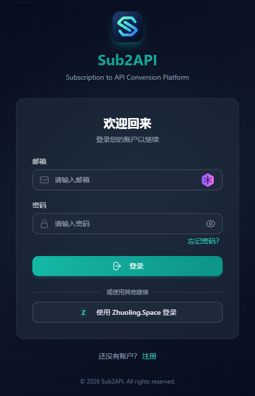
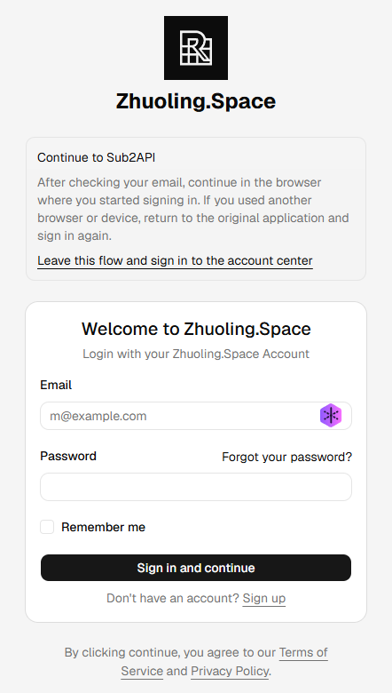

## 账号入口

本服务统一使用 [auth.zhuoling.space](https://auth.zhuoling.space) 账号，通过 OIDC 注册并登录。请在 Sub2API 登录页选择 **Zhuoling.Space**，不要使用 Sub2API 自带的账号密码注册或登录。

OIDC 是这里的统一登录方式：认证页面确认身份后，将你带回 Sub2API。账号密码只在认证站点输入。

选择图中下方的 **使用 Zhuoling.Space 登录** 按钮。页面底部的“注册”链接属于 Sub2API 本地账号流程；统一账号注册请在跳转后的认证页面进行。

## 首次使用

1. 打开 [Sub2API](https://sub2api.zhuoling.space) 的登录页，选择 **Zhuoling.Space**。
2. 检查浏览器已跳转到 `auth.zhuoling.space`。
3. 已有统一账号时直接登录；新用户选择认证站点的注册入口，并按页面提示完成所需信息与验证。
4. 若出现授权提示，核对应用为你刚打开的服务，完成授权。
5. 等待页面返回 `sub2api.zhuoling.space`，检查已进入个人控制台。
6. 查看分组与额度，再按照 [API Key 指南](/zh/projects/sub2api/docs/api-keys/)配置客户端。

注册所需字段与验证要求以认证站点当前界面为准。统一账号登录成功后，服务权限仍需以 Sub2API 控制台中的实际状态为准。

认证页顶部的 **Continue to Sub2API** 表示本次登录将返回服务。新用户选择 **Sign up**；已有账号填写邮箱与密码后选择 **Sign in and continue**。完成邮箱验证后，应回到最初发起登录的浏览器继续；若在另一台设备或浏览器中验证，回到 Sub2API 重新发起统一登录。

## 后续登录

每次都从 Sub2API 的 **Zhuoling.Space** 入口进入。若认证站点已有有效会话，可能直接返回服务；否则按提示重新登录。忘记统一账号密码时，使用认证站点提供的恢复流程。

## 网页账号与 API Key

| 凭据 | 用途 |
| --- | --- |
| auth.zhuoling.space 账号 | 在浏览器中注册、登录和管理身份 |
| Sub2API API Key | 让 Codex、Claude Code 或 Claude Desktop 发起 API 请求 |

客户端需要填写 API Key。不要把统一账号密码、浏览器 Cookie 或 OIDC 令牌作为 API Key。

## 常见问题

- **没有看到 Zhuoling.Space 入口**：检查是否进入正确的服务域名，刷新后仍无入口时联系管理员。
- **授权后没有返回服务**：记录报错文字和发生时间，重新从服务登录页开始；不要分享完整授权回调 URL，其中可能含临时授权码。
- **登录成功但不能调用模型**：查看分组、Key 状态和额度，继续阅读 [API Key 与接入参数](/zh/projects/sub2api/docs/api-keys/)。
