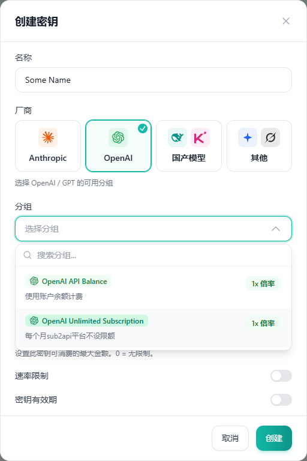

## 创建与管理 Key

通过 [统一登录](/zh/projects/sub2api/docs/account/)进入控制台，打开 API Key 管理页面，创建一个用途明确的 Key，例如“笔记本 Codex”。按控制台可用选项选择分组、有效期和额度限制，保存后将 Key 填入自己的客户端。

各 Key 可见的模型可能不同。没有分组或额度时，先联系管理员获取使用权限；账号注册成功本身不代表已获分配额度。

先选择厂商，再选择该厂商下可用的分组：Codex 使用 **OpenAI**；Claude Code 和 Claude Desktop 使用 **Anthropic**。图中是 OpenAI 的分组示例，实际分组及计费安排以自己账号显示的选项为准。按需设置速率限制与密钥有效期，然后点击 **创建**。

Key 应保存在自己的设备中，不放入代码仓库、截图或公开文档。怀疑泄露时，在控制台撤销该 Key，创建新 Key 并重新运行配置脚本。

## 地址填写

服务域名为 `https://sub2api.zhuoling.space`。下面按标准协议路径填写；若控制台针对你的分组提供专用前缀，应使用控制台给出的完整 Base URL。

| 场景 | Base URL | 客户端请求 |
| --- | --- | --- |
| Codex / OpenAI compatible | `https://sub2api.zhuoling.space/v1` | 在 Base URL 后追加 `/responses` |
| Claude Code / Anthropic | `https://sub2api.zhuoling.space` | 在 Base URL 后追加 `/v1/messages` |
| Claude Desktop Gateway | `https://sub2api.zhuoling.space` | 按 Anthropic 协议发送请求 |

填写 Base URL 时不要附加 `/messages` 或 `/responses`。Claude 客户端通常自行追加 `/v1`；重复追加会产生错误路径。

## 获取模型列表

[配置脚本](/zh/projects/sub2api/docs/downloads/)会用刚输入的 Key 请求模型列表，并让你选择 ID：

- OpenAI compatible：对 API Base URL 下的 `/models` 发起 Bearer 认证请求。
- Anthropic：请求 `/v1/models`，附带 `x-api-key` 与 `anthropic-version`，读取分页结果。

Anthropic 的模型列表协议见[官方 Models API](https://platform.claude.com/docs/en/api/models/list)。服务实际返回的模型由当前 Key 和分组决定。若模型列表端点不可用、为空或未返回完整模型，脚本允许手动输入控制台提供的模型 ID。

选择模型时使用完整 ID。列表可见不保证每一种工具调用或桌面功能都已兼容，需要在所用客户端进一步验证。

## 排查请求错误

| 现象 | 优先检查 |
| --- | --- |
| DNS 或连接失败 | 域名是否为 `sub2api.zhuoling.space`、网络与代理配置 |
| 401 | Key 是否完整、已撤销或过期；认证字段是否正确 |
| 403 | Key 所属分组和模型权限 |
| 404 | Base URL 是否重复包含 `/v1`，或误填了完整请求路径 |
| 429 | 额度、速率限制和并发限制 |
| 模型不存在 | 完整模型 ID、当前分组和最新模型列表 |
| 响应中断 | 网络、代理、服务状态及流式响应支持 |

求助时提供客户端版本、模型 ID、错误状态码与带时区的发生时间。移除日志中的 Key、Cookie 和授权码。
