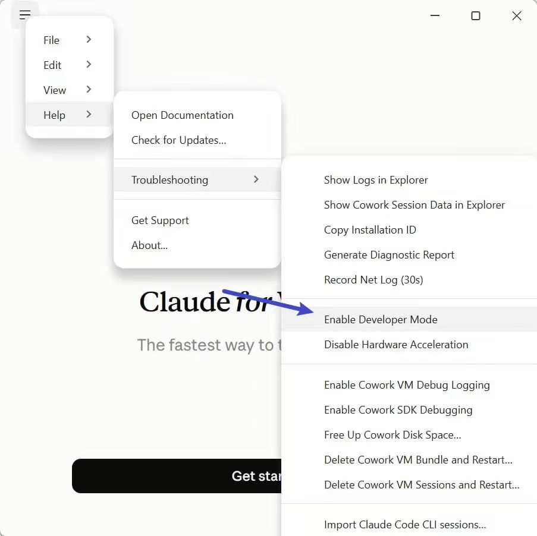
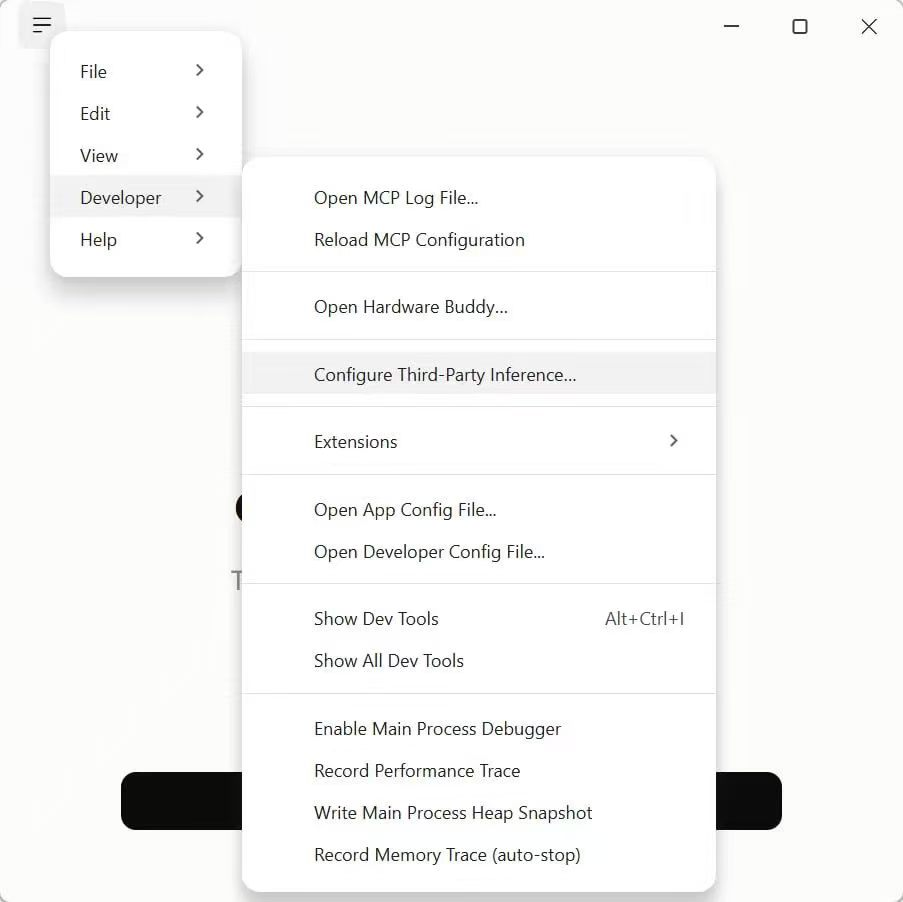
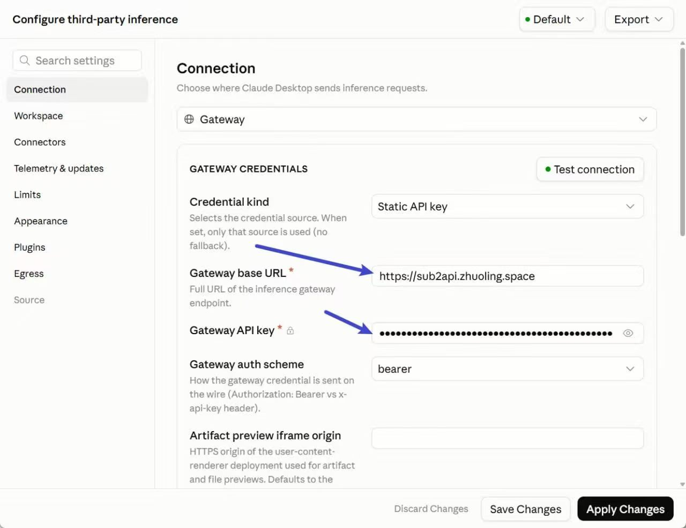

## 准备

在 Windows 或 macOS 上安装并更新 Claude Desktop。先通过 [Zhuoling.Space 统一登录](/zh/projects/sub2api/docs/account/)进入 Sub2API，准备 API Key 和完整模型 ID。

第三方推理的菜单及字段可参考 [Cloudflare 官方 Claude Desktop 集成指南](https://developers.cloudflare.com/ai-gateway/integrations/coding-agents/claude-desktop/)。下面将网关参数替换为本站实例；具体客户端版本、模型和功能组合需要按文末步骤验证。

## 打开第三方推理设置

1. 在客户端选择 **Help → Troubleshooting → Enable Developer Mode**。
2. 如客户端提示重启，先完成重启。
3. 打开 **Developer → Configure Third-Party Inference**。
4. 新建网关配置。保存前记录当前配置，以便恢复。

中文界面的菜单名称可能随版本调整，可对应查找“帮助”“疑难解答”“开发者模式”“第三方推理”。

启用后，主菜单会出现 **Developer**。在其中选择第三方推理设置：

## 填写网关参数

| 字段 | 填写内容 |
| --- | --- |
| Connection type | `Gateway` |
| Credential kind | `Static API key` |
| Gateway API key | 自己的 Sub2API API Key |
| Gateway auth scheme | `Bearer` |
| Gateway base URL | `https://sub2api.zhuoling.space`；有专用前缀时使用控制台给出的地址 |

这是客户端调用 API 的凭据配置。网页注册、登录仍使用 auth.zhuoling.space 的 OIDC 入口。

上图为已完成的 Sub2API 网关配置。确认地址与凭据后，使用 **Save Changes** 保存，并按界面提示选择 **Apply Changes** 应用设置。

## 设置模型并连接

在 Models 中添加当前 Key 可用的完整模型 ID，填写便于识别的显示名称，并按所选模型及客户端要求设置 tier alias。多个档位的映射应分别指向实际可用的模型。

使用 **Test connection** 检查连接，保存后按提示重新载入客户端。发起一个简短对话，在 Sub2API 控制台核对模型、时间及用量。

## 验证功能范围

连接成功后，分别验证你需要的普通对话、文件处理、Code 或 Cowork 功能。连接测试只说明该测试请求成功，不代表所有桌面功能都已兼容。各功能的可用性取决于客户端版本、操作系统、模型能力和网关实现。

本文配图展示了已完成的 Windows 客户端网关配置。截图未记录具体客户端版本、模型 ID 或对话结果；各项功能请按自己的客户端与模型组合验证。

## 常见问题与恢复

- **没有菜单**：检查客户端版本和开发者模式状态，完全退出并重启后再次查看。
- **401 / 403**：检查 Key、Bearer 认证、分组和模型权限。
- **404**：检查 Base URL 是否误填完整请求路径或重复包含 `/v1`。
- **模型列表与界面档位不一致**：检查完整模型 ID 和档位映射。
- **切回原配置**：回到第三方推理设置，恢复之前记录的配置或按客户端界面关闭该配置，然后重启验证。

本文的操作对象是 Claude Desktop。命令行工具的配置见 [Claude Code CLI](/zh/projects/sub2api/docs/claude-code/)。
